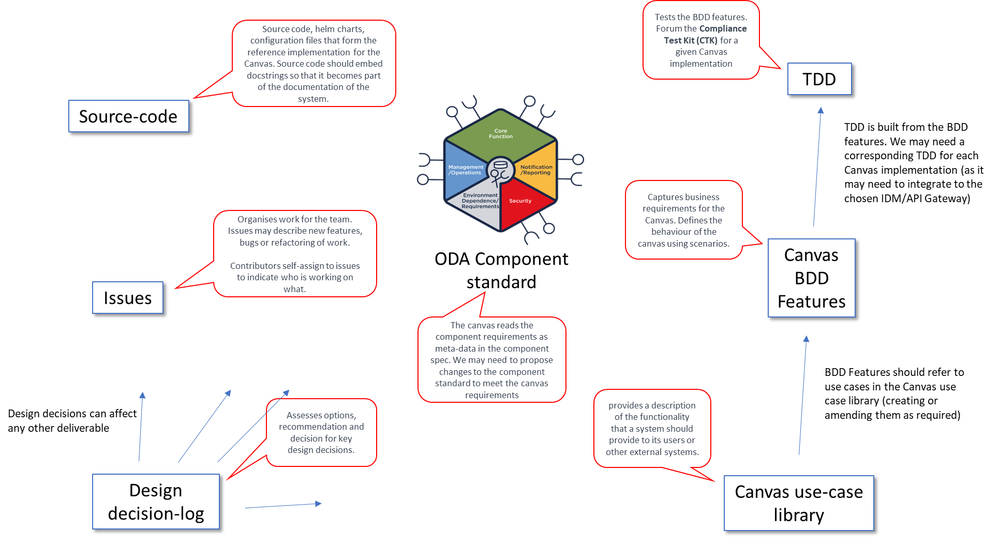

# ODA Canvas Design

This is an outline of how the Canvas design is documented, and a pointer to the different design artefacts:
* The highest level documentation describing the services a canvas should provide to an ODA Component is in the [Canvas use case library](usecase-library/README.md). The use case library outlines the assumptions for each use case and sequence diagrams for the interactions between an example ODA Component and the ODA Canvas.
* The next level of details of the features required to be a fully compliant ODA Canvas is in the [Compliance Test Kit](compliance-test-kit/README.md). These are documented as business-friendly pseudo-code in the form of BDD (Behaviour-Driven Development) features and scenarios. BDD Features should refer to use cases in the Canvas use case library (creating or amending them as required). There is a style guide for creating BDDs at [TAC-353 BDD Style Guide](https://projects.tmforum.org/jira/browse/TAC-353).
* The use cases and features are Level 2 standards and should be implementation agnostic. For the Level 3 Reference Implementation, to turn the BDD features into executable compliance tests, there are a set of TDD (Test-Driven Development) tests that define tests for each BDD scenario (embedded within each BDD). These are in the [Compliance Test Kit](compliance-test-kit/README.md).
* Specific design decisions where we assess options and make a decision are documented in the [Architecture Decision Log](https://github.com/tmforum-oda/oda-ca-docs/tree/master/Decision-Log/README.md).
* To organise the backlog of work for the team, we use [GitHub issues](https://github.com/tmforum-oda/oda-canvas/issues). Issues may describe new features, bugs or refactoring of work. Contributors self-assign to issues to indicate who is working on what. 
* Finally, the [source code](../source/README.md) contains the source code, helm charts and configuration files that form the reference implementation for the Canvas. Source code should embed [docstrings](https://en.wikipedia.org/wiki/Docstring) so that it becomes part of the documentation of the system. The source code comprises of:
1. [Software operators](/source/operators) - this is the key part of the canvas. Operators manage ODA components by reading the component's requirements as meta-data in the component spec and then executing whatever lifecycle process is required to meet those requirements. Operators execute the initial deployment of a component, as well as ongoing maintenance and upgrade processes. Operators are responsible for monitoring the health of the component and taking remedial action if required. The Reference Implementation implements operators following the [Kubernetes Operator Pattern](https://kubernetes.io/docs/concepts/extend-kubernetes/operator/). Operators could be described as management-plane functions, and are the cloud-native equivalent of Network Element Managers.
2. [Webhooks](/source/webhooks) - The Reference implementation Canvas utilizes webhooks to integrate with the Kubernetes Control Plane. The initial use of this is for the Canvas to support multiple versions of the ODA Component Standard, allowing seamless upgrades of components and appropriate deprecation warnings.
3. [Utilities](/source/utilities) - The reference implementation includes some simple utilities to help with the development of the Canvas. These are not part of the Canvas itself, but are useful for development and troubleshooting. We may in the future support a command-line interface to the Canvas, similar to [kubectl](https://kubernetes.io/docs/reference/kubectl/) (for Kubernetes) or [istioctl](https://istio.io/latest/docs/ops/diagnostic-tools/istioctl/) (for Istio).

## Interaction with ODA Component standard

The canvas reads the component requirements as meta-data in the component spec. We may need to propose changes to the component standard to meet the canvas requirements. The canvas should be able to support any component that meets the component standard, but every component may not use all the features of the canvas. The component design guidelines are documented at [ODA Component Design Guidelines](../oda-ca-docs/ODAComponentDesignGuidelines.md).

## Summary

The documentation approach for the Canvas is summarised in the diagram below:

## Design Epics

The Canvas design is split into the following epics:

* [Epic 1: Authentication](Authentication-design.md)
* [Epic 2: Event based integration](Event-based-integration-design.md)
* [Epic 3: Observability](Observability-design.md)