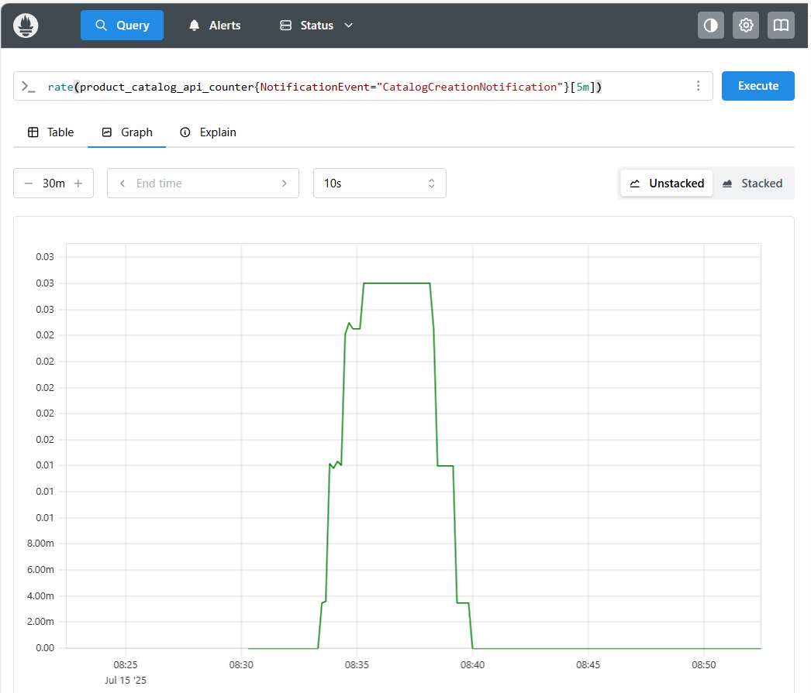
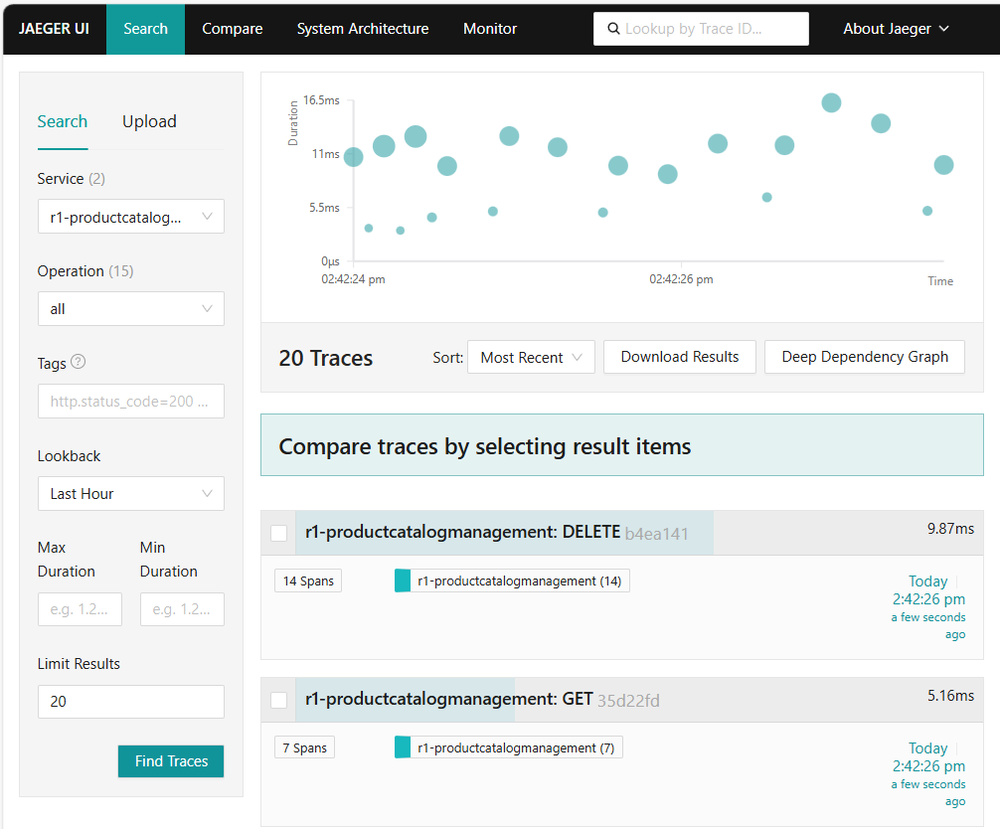
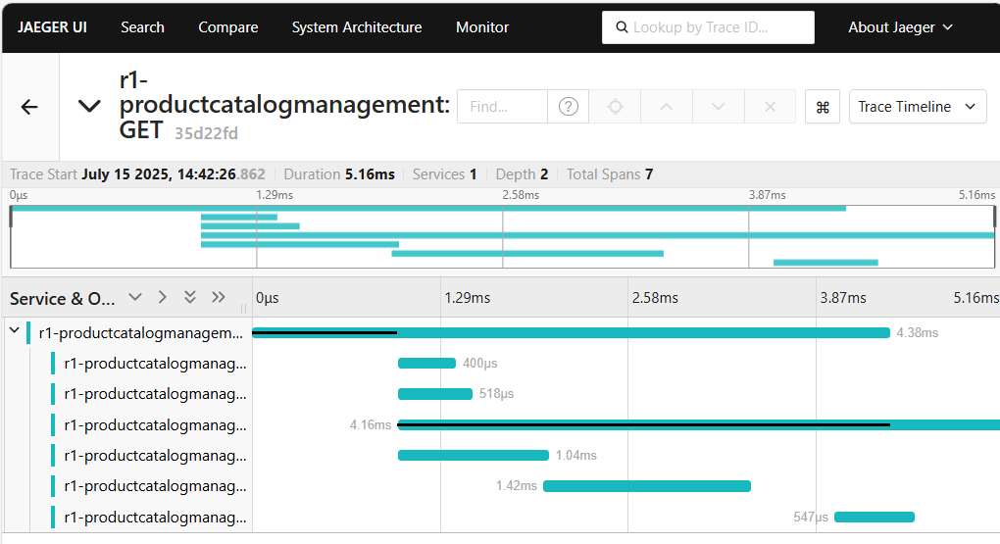

# ODA Canvas Observability Stack

This Helm chart deploys a complete open-source observability stack for the TM Forum ODA Canvas, providing monitoring, alerting, and distributed tracing capabilities for ODA Components.

## Components

This chart-of-charts includes:

- **Prometheus**: Metrics collection and storage
- **Grafana**: Visualization and dashboards
- **Jaeger**: Distributed tracing
- **OpenTelemetry Collector**: Telemetry data processing and forwarding

## Prerequisites

- Kubernetes 1.19+
- Helm 3.0+
- At least 4GB of available memory for the observability stack

## Installation

### Quick Start

```bash
# Add the required Helm repositories
helm repo add prometheus-community https://prometheus-community.github.io/helm-charts
helm repo add opentelemetry https://open-telemetry.github.io/opentelemetry-helm-charts  
helm repo add jaegertracing https://jaegertracing.github.io/helm-charts
helm repo update

# Install the observability stack
cd /charts
helm install observability ./observability-stack --create-namespace --namespace monitoring
```

### Custom Installation

```bash
# Install with custom values
helm install observability ./observability-stack \
  --create-namespace \
  --namespace monitoring \
  --values my-values.yaml
```

## Configuration

The following table lists the configurable parameters and their default values:

| Parameter | Description | Default |
|-----------|-------------|---------|
| `global.namespace` | Namespace for observability components | `monitoring` |
| `prometheus.enabled` | Enable Prometheus and Grafana | `true` |
| `opentelemetry.enabled` | Enable OpenTelemetry Collector | `true` |
| `jaeger.enabled` | Enable Jaeger | `true` |
| `kube-prometheus-stack.prometheus.prometheusSpec.retention` | Metrics retention period | `15d` |
| `kube-prometheus-stack.grafana.adminPassword` | Grafana admin password | `admin` |
| `jaeger.allInOne.args` | Jaeger configuration arguments | Memory storage with 50000 traces |

## Accessing the Services

### Prometheus
```bash
kubectl port-forward svc/observability-prometheus-prometheus 9090:9090 -n monitoring
```
Visit: http://localhost:9090

### Grafana
```bash
kubectl port-forward svc/observability-grafana 3000:80 -n monitoring
```
Visit: http://localhost:3000

Get admin password:
```bash
kubectl get secret observability-grafana -n monitoring -o jsonpath="{.data.admin-password}" | base64 -d
```

### Jaeger
```bash
kubectl port-forward svc/observability-jaeger-query 16686:16686 -n monitoring
```
Visit: http://localhost:16686

## ODA Component Integration

### Metrics Collection

When you install a component with a openmetrics ExposedAPI, the Canvas will configure whatever Observability services you have installed. The reference implementation using Prometheus, Grafana, Jaeger amd OpenTelemetry Collector will create a ServiceMonitor resource in your component namespace. Something like:

```yaml
apiVersion: monitoring.coreos.com/v1
kind: ServiceMonitor
metadata:
  name: my-component-metrics
  namespace: components
spec:
  selector:
    matchLabels:
      app: my-component
  endpoints:
  - port: metrics
    path: /metrics
    interval: 30s
```

### Distributed Tracing

Configure your ODA Component with these environment variables:

```yaml
env:
- name: OTEL_EXPORTER_OTLP_ENDPOINT
  value: "http://observability-opentelemetry-collector.monitoring.svc.cluster.local:4318"
- name: OTEL_RESOURCE_ATTRIBUTES
  value: "service.name=my-component"
```

## Storage Considerations

This chart uses in-memory storage for Jaeger and default storage for Prometheus. For production deployments, consider:

- Configuring persistent storage for Prometheus
- Using external storage backends for Jaeger (Elasticsearch, Cassandra)
- Implementing proper backup strategies

## Scaling

To scale the observability stack:

1. **Prometheus**: Configure multiple replicas and sharding
2. **Grafana**: Configure multiple replicas behind a load balancer
3. **Jaeger**: Switch to distributed deployment with external storage
4. **OpenTelemetry**: Scale the collector as a DaemonSet or increase replicas

## Troubleshooting

### Common Issues

1. **Pods stuck in Pending state**: Check resource requirements and node capacity
2. **Metrics not appearing**: Verify ServiceMonitor labels and selectors
3. **Traces not showing**: Check OpenTelemetry collector logs and endpoint configuration

### Useful Commands

```bash
# Check all pods
kubectl get pods -n monitoring

# Check services
kubectl get svc -n monitoring

# Check ServiceMonitor resources
kubectl get servicemonitor -A

# View logs
kubectl logs -n monitoring deployment/observability-opentelemetry-collector
```

## Uninstallation

```bash
helm uninstall observability -n monitoring
kubectl delete namespace monitoring
```


## Demonstration

Using the example [Product Catalog](https://github.com/tmforum-oda/reference-example-components/tree/master/charts/ProductCatalog) component, you can observe the metrics and telemetry as follows:

### Open-Metrics 

The example component implements an *optional* metrics API supporting the open metrics standard (formerly the prometheus de-facto standard). This metrics endpoint provides business metrics about all the Create/Update/Delete events for all the Product Catalog resources (Catalog, Category, Product Offering, Product Offering Price, Product Specification).

The observability-stack includes a Prometheus observability service that can scrape the metrics API and report on these business events. For example the screenshot below shows a graph of the rate of Catalog Create events with the query `rate(product_catalog_api_counter{NotificationEvent="CatalogCreationNotification"}[5m])`. 



### Open-Telemetry

The component also generates Open-Telemetry events that can either be logged to the console using `otlp.console.enabled:true` or sent to an Open-Telemetry protobuffCollector. You can set this in the `values.yaml` file as follows:

```
  otlp:
    console:
      enabled: false
    protobuffCollector:
      enabled: true
      url: http://otel-collector.monitoring.svc.cluster.local:4318/v1/traces
```

With telemetry enabled, you can view traces of executions in Jaeger:



And drill down into an individual trace:



## Contributing

Please read the [CONTRIBUTING.md](../../CONTRIBUTING.md) file for details on how to contribute to this project.

## Support

For support, please create an issue in the [ODA Canvas repository](https://github.com/tmforum-oda/oda-canvas/issues).
