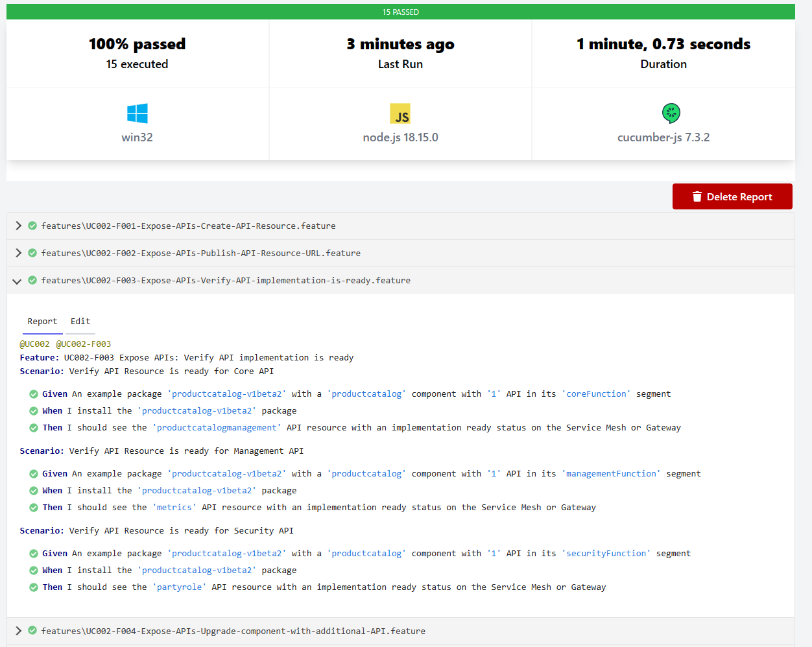

# ODA Canvas Compliance Test Kit (CTK)

The compliance test kit for an ODA Canvas consists of:

* [BDD (Behaviour-Driven Development) features and scenarios](BDD-and-TDD/README.md) that describe every interaction in each use-case using examples. The use-case library is at: [usecase-library](../usecase-library/README.md).
* TDD (Test-Driven Development) that defines tests for each BDD scenario (embedded within each BDD).

This is *WORK IN PROGRESS* and the compliance test kit for an ODA Canvas implementation is not yet complete. 

When you run the CTK (following the instructions in [BDD (Behaviour-Driven Development) features and scenarios](BDD-and-TDD/README.md)), a series of test are executed against the ODA Canvas implementation. The test results are reported in the console and in a HTML report. The console output is shown below:

And the cucumber report will look like this:

The original MVP canvas CTK is referenced below - the plan is to integrate this as level 1 of the CTK, with the BDD/TDD being level 2.

## ODA Canvas - Phase 1 (MVP) CTK

For details of the work done in Phase 1 for a MVP of a Canvas CTK, see [Phase 1 MVP Canvas CTK](Phase-1-CTK.md)