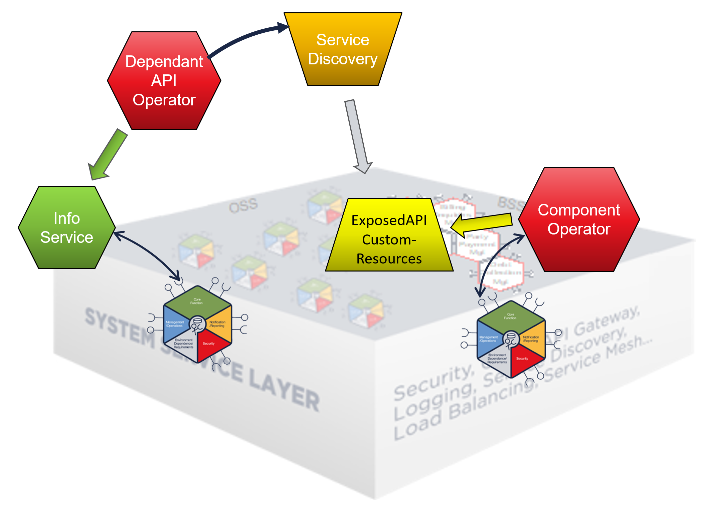
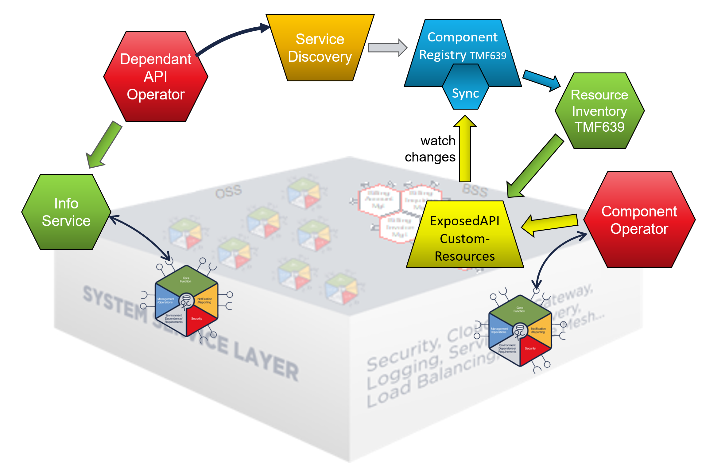
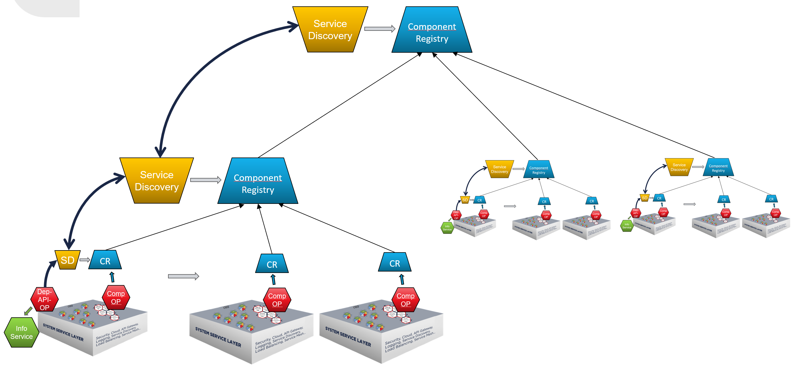
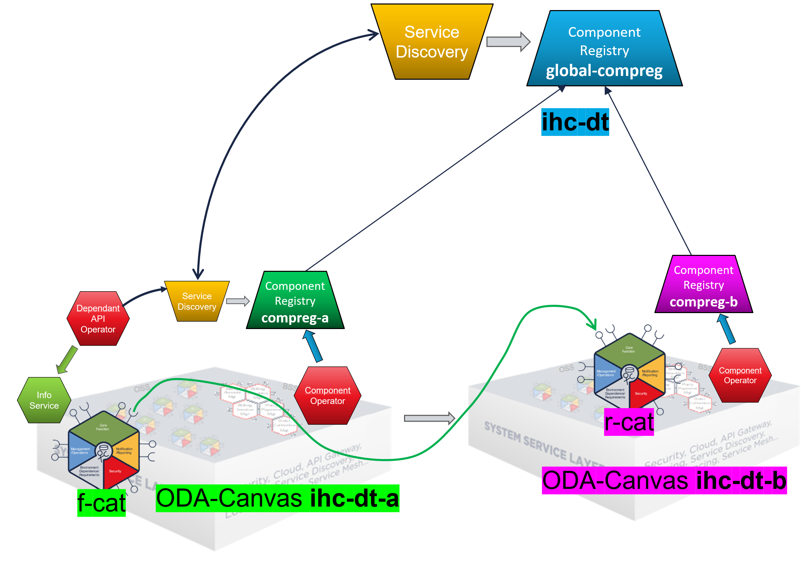

# Live-Demo Dependent API Resolution in a Multi-Canvas Scenario using TMF639

The feature was requested in [GitHub Issue #384](https://github.com/tmforum-oda/oda-canvas/issues/384) and is currently still in development.


# Service Discovery in Single-Canvas Environment

The current implementation supports service discovery in a single canvas environment.
Service discovery happens by introspecting the Kubernetes Custom-Resources (ExposedAPI) deployed into the local Kubernetes cluster by the Component-Operator:




# Service Discovery in Multi-Canvas Environment

For a Multi-Canvas environment the information stored locally in the the Kubernetes CustomResources are made accessible 
as an TMF639 OpenAPI by the Canvas-Resource-Inventory, which is part of the default ODA-Canvas Referenc Implementation.

To make the information accessible outside the own cluster, the information can be replicated and stored into an Component-Registry.
This Component-Registry can be queried from the service discovery.



The Component-Registry also supports syncing upstream Component-Registries which allows building up a hierarchy.
The Service-Discovery can now follow the upstream Component-Registries, if the service can not be found in the local ODA-Canvas
it looks in the upstream Component-Registry for an implementation in another ODA Canvas:




## Setup Environment


### Cluster IHC-DT (blue)

```
# [blue] - IHC-DT
set PROMPT=$_[IHC-DT] $g$s
set KUBECONFIG=%USERPROFILE%\.kube\config-ihc-dt
set DOMAIN=ihc-dt.cluster-2.de
REM set COMPREG_EXTNAME=compreg-ihc-dt
set TLS_SECRET_NAME=domain-tls-secret
tmfihcdt
```


## Cleanup

### [blue] - IHC-DT

```
# [blue] - IHC-DT
helm uninstall -n compreg global-compreg
kubectl delete ns compreg

helm uninstall -n components f-cat
kubectl rollout restart -n canvas deployment canvas-depapi-op

helm uninstall -n components r-cat
kubectl rollout restart -n canvas deployment canvas-depapi-op
```

unregister Component-Registries

```
# [blue] - IHC-DT
curl -sX DELETE "https://canvas-compreg.ihc-dt.cluster-2.de/hub/global-compreg" -H "accept: */*" | jq
```


## Show state of IHC-DT-A [GREEN]

```
helm list -A
```

plain canvas installation (from branch)

```
kubectl get deployments -n canvas
```

new: canvas-compreg (+ canvas-resource-inventory)

```
kubectl canvaslogs depapi
```

new: `COMPONENT_REGISTRY_URL=http://canvas-compreg.canvas.svc.cluster.local`

```
kubectl get vs -n canvas
```

additional public routes have been installed to expose internal services

* https://canvas-compreg.ihc-dt.cluster-2.de
* https://canvas-info.ihc-dt.cluster-2.de/api-docs/
* canvas-resource-inventory.ihc-dt.cluster-2.de

### show COMPREG

https://canvas-compreg.ihc-dt.cluster-2.de

Show info:

* NAME "canvas-compreg"
* watched namespaces: "components,odacompns-*"
* ODA Components: empty
* Event Subscriptions: empty
* Links: Swagger-UI


## static roles

```
cd %USERPROFILE%\git\oda-canvas
helm upgrade --install statr -n components --create-namespace feature-definition-and-test-kit/testData/productcatalog-static-roles-v1
```


## Install Global Component-Registry

```
# [blue] - IHC-DT
cd %USERPROFILE%/git/oda-canvas
helm upgrade --install -n compreg global-compreg --create-namespace charts/component-registry --set=domain=%DOMAIN% --set=canvasResourceInventory= --set=keycloak.url=https://canvas-keycloak.%DOMAIN%/auth/realms/odari
helm upgrade --install -n compreg global-compreg-vs demos/multi-canvas-service-discovery/helm/component-registry-vs --set=domain=%DOMAIN%  --set=fullNameOverride=global-compreg
```

```
# [blue] - IHC-DT
cd %USERPROFILE%/git/oda-canvas
helm upgrade --install -n compreg upup-compreg --create-namespace charts/component-registry --set=domain=%DOMAIN% --set=canvasResourceInventory=
helm upgrade --install -n compreg upup-compreg-vs demos/multi-canvas-service-discovery/helm/component-registry-vs --set=domain=%DOMAIN%  --set=fullNameOverride=upup-compreg
```

open in browser:

* http://global-compreg.ihc-dt.cluster-2.de/


## Link registries (in Browser)

open in browser

* https://canvas-compreg.ihc-dt-a.cluster-2.de

Click Register-Upstream-URL: https://global-compreg.ihc-dt.cluster-2.de

alternative using curl

```
curl -sX POST https://canvas-compreg.ihc-dt-a.cluster-2.de/hub -H "accept: application/json" -H "Content-Type: application/json" -d "{\"id\":\"global-compreg\",\"callback\":\"https://global-compreg.ihc-dt.cluster-2.de/sync\",\"query\":\"source=compreg-a\"}" | jq
```


For compreg-b use swagger/curl to do the same:

```
curl -sX POST https://canvas-compreg.ihc-dt-b.cluster-2.de/hub -H "accept: application/json" -H "Content-Type: application/json" -d "{\"id\":\"global-compreg\",\"callback\":\"https://global-compreg.ihc-dt.cluster-2.de/sync\",\"query\":\"source=compreg-b\"}" | jq
```


## Manually run BDD UC007-F002

https://github.com/tmforum-oda/oda-canvas/blob/feature/384_mainly_simple_dependent_operator/feature-definition-and-test-kit/features/UC007-F002-Dependent-APIs-Configure-Dependent-APIs-Single-Downstream.feature




```
Scenario Outline: Configure DependentAPI for single downstream productcatalog component
    # Install a downstream retail productcatalog component as release r-cat
    Given I install the 'productcatalog-v1' package as release 'r-cat'
    And the 'productcatalogmanagement' component has a deployment status of 'Complete'
    And I should see the 'productcatalogmanagement' ExposedAPI resource on the 'productcatalogmanagement' component with a url on the Service Mesh or Gateway
    # Install the federated productcatalog component that has a dependency on a downstream  productcatalog as release f-cat
    When I install the 'productcatalog-dependendent-API-v1' package as release 'f-cat'
    Then I should see the 'downstreamproductcatalog' DependentAPI resource on the 'productcatalogmanagement' component with a ready status
    And the 'productcatalogmanagement' component has a deployment status of 'Complete'

  Scenario Outline: Populate and verify data in federated product catalog
    # Populate the retail product catalog with sample data
    Given the 'productcatalogmanagement' component in the 'r-cat' release has the following 'category' data:
      | name                      | description                                       |
      | Internet line of product  | Fiber and ADSL broadband products                 |
      | Mobile line of product    | Mobile phones and packages                        |
      | IoT line of product       | IoT devices and solutions                         |
    # Verify that the federated product catalog exposes the populated catalogs
    When I query the 'productcatalogmanagement' component in the 'f-cat' release for 'category' data:
    Then I should see the following 'category' data in the federated product catalog:
      | name                      | description                                       |
      | Internet line of product  | Fiber and ADSL broadband products                 |
      | Mobile line of product    | Mobile phones and packages                        |
      | IoT line of product       | IoT devices and solutions                         |            
```

### Split actions into ODA Canvas IHC-DT-A and IHC-DT-B

r-cat --> ihc-dt-b [magenta]  
f-cat --> ihc-dt-a [green]


# BDD UC007-F002

## [magenta] Install a downstream retail productcatalog component as release r-cat

Given I install the 'productcatalog-v1' package as release 'r-cat'

```
# [magenta] IHC-DT-B
cd %USERPROFILE%\git\oda-canvas
helm upgrade --install r-cat -n components --create-namespace feature-definition-and-test-kit/testData/productcatalog-v1

  Release "r-cat" does not exist. Installing it now.
  NAME: r-cat
  LAST DEPLOYED: Sat Oct  4 17:44:05 2025
  NAMESPACE: components
  STATUS: deployed
  REVISION: 1
  TEST SUITE: None
```

And the 'productcatalogmanagement' component has a deployment status of 'Complete'

```
# [magenta] IHC-DT-B
kubectl get component r-cat-productcatalogmanagement -n components

  NAMESPACE     NAME                             DEPLOYMENT_STATUS
  components   r-cat-productcatalogmanagement   Complete
```

And I should see the 'productcatalogmanagement' ExposedAPI resource on the 'productcatalogmanagement' component with a url on the Service Mesh or Gateway

```
# [magenta] IHC-DT-B
kubectl get exposedapi -n components

  NAME                                                      API_ENDPOINT                                                                                                IMPLEMENTATION_READY
  r-cat-productcatalogmanagement-metrics                    https://components.ihc-dt.cluster-2.de/r-cat-productcatalogmanagement/metrics                               true
  r-cat-productcatalogmanagement-partyrole                  https://components.ihc-dt.cluster-2.de/r-cat-productcatalogmanagement/tmf-api/partyRoleManagement/v4        true
  r-cat-productcatalogmanagement-productcatalogmanagement   https://components.ihc-dt.cluster-2.de/r-cat-productcatalogmanagement/tmf-api/productCatalogManagement/v4   true
```


## [green] Install the federated productcatalog component that has a dependency on a downstream  productcatalog as release f-cat

When I install the 'productcatalog-dependendent-API-v1' package as release 'f-cat'

```
# [green] IHC-DT-A
cd %USERPROFILE%\git\oda-canvas
helm upgrade --install f-cat -n components --create-namespace feature-definition-and-test-kit/testData/productcatalog-dependendent-API-v1

  Release "f-cat" does not exist. Installing it now.
  NAME: f-cat
  LAST DEPLOYED: Sat Oct  4 20:52:52 2025
  NAMESPACE: components
  STATUS: deployed
  REVISION: 1
  TEST SUITE: None
```


Then I should see the 'downstreamproductcatalog' DependentAPI resource on the 'productcatalogmanagement' component with a ready status

```
# [green] IHC-DT-A
kubectl get depapis -n components   f-cat-productcatalogmanagement-downstreamproductcatalog

  NAMESPACE     NAME                                                      READY   AGE   SVCINVID                               URL
  components   f-cat-productcatalogmanagement-downstreamproductcatalog   true    53s   0e16d068-fc39-4cf5-80a0-5e5826b02d10   https://components.ihc-dt.cluster-2.de/r-cat-productcatalogmanagement/tmf-api/productCatalogManagement/v4
```

And the 'productcatalogmanagement' component has a deployment status of 'Complete'

```
# [green] IHC-DT-A
kubectl get components -n components   f-cat-productcatalogmanagement

  NAME                             DEPLOYMENT_STATUS
  f-cat-productcatalogmanagement   Complete
```


# From BDD UC007-F002 (data) -  [magenta] Populate and [green] verify data in federated product catalog

```
Scenario Outline: Populate and verify data in federated product catalog
  # Populate the retail product catalog with sample data
  Given the 'productcatalogmanagement' component in the 'r-cat' release has the following 'category' data:
    | name                      | description                                       |
    | Internet line of product  | Fiber and ADSL broadband products                 |
    | Mobile line of product    | Mobile phones and packages                        |
    | IoT line of product       | IoT devices and solutions                         |
  # Verify that the federated product catalog exposes the populated catalogs
  When I query the 'productcatalogmanagement' component in the 'f-cat' release for 'category' data:
  Then I should see the following 'category' data in the federated product catalog:
    | name                      | description                                       |
    | Internet line of product  | Fiber and ADSL broadband products                 |
    | Mobile line of product    | Mobile phones and packages                        |
    | IoT line of product       | IoT devices and solutions                         |   
```

## [magenta] Populate the retail product catalog with sample data

Given the 'productcatalogmanagement' component in the 'r-cat' release has the following 'category' data:

| name                      | description                                       |
| ------------------------- | ------------------------------------------------- |
| Internet line of product  | Fiber and ADSL broadband products                 |
| Mobile line of product    | Mobile phones and packages                        |
| IoT line of product       | IoT devices and solutions                         |

```
# [magenta] IHC-DT-B
curl -sX POST "http://components.ihc-dt-b.cluster-2.de/r-cat-productcatalogmanagement/tmf-api/productCatalogManagement/v4/category" -H  "accept: application/json;charset=utf-8" -H  "Content-Type: application/json;charset=utf-8" -d "{  \"name\": \"Internet line of product\",  \"description\": \"Fiber and ADSL broadband products\"  }" | jq

curl -sX POST "http://components.ihc-dt-b.cluster-2.de/r-cat-productcatalogmanagement/tmf-api/productCatalogManagement/v4/category" -H  "accept: application/json;charset=utf-8" -H  "Content-Type: application/json;charset=utf-8" -d "{  \"name\": \"Mobile line of product\",  \"description\": \"Mobile phones and packages\"  }" | jq

curl -sX POST "http://components.ihc-dt-b.cluster-2.de/r-cat-productcatalogmanagement/tmf-api/productCatalogManagement/v4/category" -H  "accept: application/json;charset=utf-8" -H  "Content-Type: application/json;charset=utf-8" -d "{  \"name\": \"IoT line of product\",  \"description\": \"IoT devices and solutions\"  }" | jq

```


## [green] Verify that the federated product catalog exposes the populated catalogs

When I query the 'productcatalogmanagement' component in the 'f-cat' release for 'category' data:  
Then I should see the following 'category' data in the federated product catalog:
  
| name                      | description                                       |
| ------------------------- | ------------------------------------------------- |
| Internet line of product  | Fiber and ADSL broadband products                 |
| Mobile line of product    | Mobile phones and packages                        |
| IoT line of product       | IoT devices and solutions                         |   

```
# [green] IHC-DT-A
curl -sX GET "http://components.ihc-dt-a.cluster-2.de/f-cat-productcatalogmanagement/tmf-api/productCatalogManagement/v4/category" -H  "accept: application/json;charset=utf-8" | jq

```


# [green] show access of r-cat in f-cat logs:

```
# [green] IHC-DT-A
kubectl logs deployment/f-cat-prodcatapi -n components

  ...
  listCategory :: GET /f-cat-productcatalogmanagement/tmf-api/productCatalogManagement/v4/category components.ihc-dt.cluster-2.de
  utils/downstreamAPI/listFromDownstreamAPI :: resourceType =  category
  utils/downstreamAPI/getDownstreamAPIs :: returning 1 downstream APIs
  utils/downstreamAPI/listFromDownstreamAPI :: getting data from downstream API at https://components.ihc-dt.cluster-2.de/r-cat-productcatalogmanagement/tmf-api/productCatalogManagement/v4/category
  utils/downstreamAPI/listFromDownstreamAPI :: received 5 records
```


## [green] look into Dependent-API Operator logs

```
# [green] IHC-DT-A
kubectl canvaslogs depapi
```


### [magenta] undeploy r-cat

```
# [magenta] IHC-DT-B
helm uninstall -n components r-cat
```

categories not visible any longer in [green] f-cat

```
# [green] IHC-DT-A
curl -sX GET "http://components.ihc-dt-a.cluster-2.de/f-cat-productcatalogmanagement/tmf-api/productCatalogManagement/v4/category" -H  "accept: application/json;charset=utf-8" | jq
```

also r-cat no longer visible in global-compreg


## [optional] Create an Up-Upstream compreg

```
# [blue] - IHC-DT
cd %USERPROFILE%/git/oda-canvas/source/services/ComponentRegistry/component-registry-service-tmf639
helm upgrade --install upup-compreg -n compreg --create-namespace helm/component-registry-standalone --set=domain=%DOMAIN% 
```

manually register in gloabl-compreg and sync


# cleanup all 


## cleanup IHC-DT (blue)

```
# [blue] - IHC-DT
helm uninstall -n compreg global-compreg
helm uninstall -n compreg upup-compreg
helm uninstall -n canvas component-gateway
kubectl delete ns canvas compreg
```


## cleanup IHC-DT-A (green)

```
# [green] - IHC-DT-A
helm uninstall -n components f-cat
helm uninstall -n canvas canvas canvas-vs
kubectl delete ns components canvas-vault canvas cert-manager
```


# cleanup all IHC-DT-B (magenta)

```
# [magenta] - IHC-DT-B
helm uninstall -n components r-cat
helm uninstall -n canvas canvas canvas-vs
kubectl delete ns components canvas-vault canvas cert-manager
```


# Canvas installation

```
cd %USERPROFILE%/git/oda-canvas

helm repo add jetstack https://charts.jetstack.io
helm repo add bitnami https://charts.bitnami.com/bitnami
helm repo add hashicorp https://helm.releases.hashicorp.com
helm repo update

helm dependency update ./charts/cert-manager-init
helm dependency update ./charts/kong-gateway
helm dependency update ./charts/apisix-gateway
helm dependency update ./charts/canvas-vault
helm dependency update ./charts/pdb-management-operator
helm dependency update ./charts/canvas-oda

helm upgrade --install canvas charts/canvas-oda -n canvas --create-namespace --set keycloak.service.type=ClusterIP --set api-operator-istio.deployment.hostName=*.%DOMAIN% --set api-operator-istio.deployment.credentialName=%TLS_SECRET_NAME% --set api-operator-istio.configmap.publicHostname=components.%DOMAIN% --set=api-operator-istio.deployment.httpsRedirect=false --set=canvas-info-service.serverUrl=https://canvas-info.%DOMAIN%  --set=component-registry.domain=%DOMAIN% --set=resource-inventory.serviceType=ClusterIP --set=resource-inventory.serverUrl=https://canvas-resource-inventory.%DOMAIN%/tmf-api/resourceInventoryManagement/v5 --set=component-registry.keycloak.url=https://canvas-keycloak.%DOMAIN%/auth/realms/odari --set=component-registry.ownRegistryName=%COMPREG_EXTNAME%
```

optional install canvas-vs

```
helm upgrade --install -n canvas canvas-vs %USERPROFILE%/git/oda-canvas-notes/virtualservices/canvas --set=domain=%DOMAIN%  

```


# Links

* this document:
  https://github.com/tmforum-oda/oda-canvas/blob/c0643cf463facf6b24dba8816e25dd5541a87921/source/services/ComponentRegistry/component-registry-service-tmf639/INFO/ELEVATE-DEMO.md
* GitHub Issue #384:
  https://github.com/tmforum-oda/oda-canvas/issues/384
* Clusters in GCP
  https://console.cloud.google.com/kubernetes/list/overview?project=tmforum-oda-component-cluster
* COMPREG-A
  https://canvas-compreg.ihc-dt-a.cluster-2.de
* COMPREG-B
  https://canvas-compreg.ihc-dt-b.cluster-2.de
* GLOBAL COMPREG
  https://global-compreg.ihc-dt.cluster-2.de
* Canvas-Info_Service IHC-DT-B
  https://canvas-info.ihc-dt-b.cluster-2.de/api-docs/
* UC007-F002
  https://github.com/tmforum-oda/oda-canvas/blob/feature/384_mainly_simple_dependent_operator/feature-definition-and-test-kit/features/UC007-F002-Dependent-APIs-Configure-Dependent-APIs-Single-Downstream.feature
* GitHub Copilot Benefits
  https://github.com/tmforum-oda/oda-canvas/blob/feature/384_mainly_simple_dependent_operator/source/services/ComponentRegistry/images/upstream-sync-compreg.png
* service-discovery switch in Dependent-API-Operator
  https://github.com/tmforum-oda/oda-canvas/blob/feature/384_mainly_simple_dependent_operator/source/operators/dependentApiSimpleOperator/docker/src/dependentApiSimpleOperator.py#L175-L179
  

  
# AUTH

commandline

```
set TOKEN_URL=https://canvas-keycloak.ihc-dt.cluster-2.de/auth/realms/odari/protocol/openid-connect/token
set CLIENT_ID=compreg-manager
set CLIENT_SECRET=qyWu...rZp8
curl -sX POST "%TOKEN_URL%" -H "Content-Type: application/x-www-form-urlencoded" -d "grant_type=client_credentials" -d "client_id=%CLIENT_ID%" -d "client_secret=%CLIENT_SECRET%" | jq -r .access_token
```

Python

```
import requests

KEYCLOAK_URL = "https://canvas-keycloak.ihc-dt.cluster-2.de/auth/realms/odari/protocol/openid-connect/token"
CLIENT_ID = "compreg-manager"
CLIENT_SECRET = "qyWu...rZp8"

data = {
    "grant_type": "client_credentials",
    "client_id": CLIENT_ID,
    "client_secret": CLIENT_SECRET
}

response = requests.post(KEYCLOAK_URL, data=data)
print(response.json())

```

## make request with auth

```
curl -sX GET -H "accept: application/json" -H "Authorization: Bearer %TOKEN%" https://global-compreg.ihc-dt.cluster-2.de/resource
```

## JWT 

Access-Token:

```
{
    "exp": 1766148958,
    "iat": 1766148658,
    "jti": "6050a0cd-11bc-44c5-9f28-a6bae088c0fe",
    "iss": "https://canvas-keycloak.ihc-dt.cluster-2.de/auth/realms/odari",
    "aud": [
        "account",
        "compreg-manager3"
    ],
    "sub": "bf3a2dc2-599c-467a-97c6-b359c23edbc4",
    "typ": "Bearer",
    "azp": "dependentapi-operator3",
    "acr": "1",
    "realm_access": {
        "roles": [
            "offline_access",
            "uma_authorization",
            "default-roles-odari"
        ]
    },
    "resource_access": {
        "account": {
            "roles": [
                "manage-account",
                "manage-account-links",
                "view-profile"
            ]
        },
        "compreg-manager3": {
            "roles": [
                "compreg_query3"
            ]
        }
    },
    "scope": "profile email",
    "clientId": "dependentapi-operator3",
    "email_verified": false,
    "clientHost": "10.92.0.1",
    "preferred_username": "service-account-dependentapi-operator3",
    "clientAddress": "10.92.0.1"
}
```


Cookie JWT payload:

```
{
    "exp": 1766149508,
    "iat": 1766149208,
    "auth_time": 1766149208,
    "jti": "b8a37df8-8eca-4b2c-afff-8d3eff2b1abf",
    "iss": "https://canvas-keycloak.ihc-dt.cluster-2.de/auth/realms/odari",
    "aud": [
        "account",
        "compreg-manager3"
    ],
    "sub": "4c0cb740-8c28-410e-a988-a0e92e9df718",
    "typ": "Bearer",
    "azp": "compreg-manager",
    "session_state": "57eca008-0127-413f-909a-7a85184d14b3",
    "acr": "1",
    "realm_access": {
        "roles": [
            "offline_access",
            "uma_authorization",
            "default-roles-odari"
        ]
    },
    "resource_access": {
        "account": {
            "roles": [
                "manage-account",
                "manage-account-links",
                "view-profile"
            ]
        },
        "compreg-manager3": {
            "roles": [
                "compreg_ui3"
            ]
        }
    },
    "scope": "openid profile email",
    "sid": "57eca008-0127-413f-909a-7a85184d14b3",
    "email_verified": false,
    "preferred_username": "compreg-admin3"
}
```

