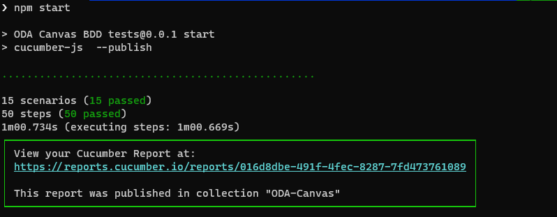

# ODA Canvas Features and Test Kit

The ODA Canvas takes a Behaviour Driven Design (BDD) approch to define the features of the canvas. BDD allows you to specify the desired behavior of software through examples in plain language that both business stakeholders and technical teams can understand. These examples are written in a format known as Gherkin, which uses Given-When-Then syntax to describe test scenarios.

* **Given:** This part of the syntax sets the scene for the scenario. It describes the initial context or the pre-conditions of the system before the key action is performed. 
Example: "Given the user is logged into their account"
* **When:**
This section describes the event or the action that triggers the scenario. It is the key action that the user performs or the event that occurs within the system.
Example: "When the user clicks on the delete account button"
* **Then:**
This final part specifies the expected outcome or the post-conditions following the action described in the When section. It clearly defines what success (or sometimes failure) looks like.
Example: "Then the user's account is deactivated and the user is redirected to the homepage"

By defining the desired behavior of the software through examples, you can then implement automated tests to verify that the software behaves as expected. This approach helps to ensure that the software meets the requirements of the business and that it continues to do so as it evolves over time. The automated tests are written in step definitions that map the plain language examples to code that interacts with the software under test.

## Linkage to use-cases

Each BDD feature is linked to the respective use-case in the [use-case library](../usecase-library/README.md). The use-case provides the context and details for the feature. This linkage ensures that the features and are aligned with the overall design of the ODA Canvas and that the tests are verifying the correct behavior.

## Work breakdown

For contributors contributing new features to the ODA Canvas, the expectation is that the contibuitor will define the features alongside implementing the software. Instead of having separate design, development and test teams, the approach is to separate work into different features and have the same contributor (or small team) work on the feature from design to implementation to testing. This approach is known as feature-driven development and is a key part of the agile methodology.

## List of BDD Features

The list below shows the features organized by use case, with their current test status indicated. ✅ indicates the corresponding test is ready, ⏳ indicates the test has yet to be defined.

### UC002 - Manage Components

* ✅ [F001 - Install Component](features/UC002-F001-Install-Component.feature)
* ✅ [F002 - Upgrade Component](features/UC002-F002-Upgrade-Component.feature)
* ✅ [F003 - Install Component from Reference Examples](features/UC002-F003-Install-Component-from-reference-examples.feature)
* ✅ [F004 - Uninstall Component from Reference Examples](features/UC002-F004-Uninstall-Component-from-reference-examples.feature)

### UC003 - Expose APIs for Component
* ✅ [F001 - Create API Resource](features/UC003-F001-Expose-APIs-Create-API-Resource.feature)
* ✅ [F002 - Publish API Resource URL](features/UC003-F002-Expose-APIs-Publish-API-Resource-URL.feature)
* ✅ [F003 - Verify API implementation is ready](features/UC003-F003-Expose-APIs-Verify-API-implementation-is-ready.feature)
* ✅ [F004 - Upgrade component with additional API](features/UC003-F004-Expose-APIs-Upgrade-component-with-additional-API.feature)
* ✅ [F005 - Upgrade component with removed API](features/UC003-F005-Expose-APIs-Upgrade-component-with-removed-API.feature)
* ⏳ [F006 - Component Specified Rate Limiting and Throttling of API Requests](features/UC003-F006-Expose-APIs-Component-Specified-Rate-Limiting-and-Throttling-of-API-Requests.feature)

### UC005 - Configure Users and Roles
* ✅ [F001 - Apply Standard Defined Role to Canvas Admin user](features/UC005-F001-Bootstrap-Apply-Standard-Defined-Role-to-Canvas-Admin-user.feature)
* ⏳ [F002 - Grouping Permission Specification Sets into Business Roles](features/UC005-F002-Bootstrap-Grouping-Permission-Specification-Sets-into-Business-Roles-in-Identity-Management-Solution.feature)
* ⏳ [F003 - Secure User and Role Information](features/UC005-F003-Bootstrap-Secure-User-and-Role-Information-Communication.feature)
* ⏳ [F004 - Component Exposes Permission Specification Set](features/UC005-F004-Bootstrap-Component-Exposes-Permission-Specification-Set-Towards-Canvas.feature)
* ⏳ [F005 - Add Permission Specification Sets in Component to Identity Platform](features/UC003-F005-Expose-APIs-Upgrade-component-with-removed-API.feature)
* ⏳ [F006 - Creation Update Removal of Technical Roles in the Identity Platform](features/UC005-F006-Bootstrap-Creation-Update-Removal-of-Technical-Roles-in-the-Identity-Platform.feature)
* ⏳ [F006 - Creation Update Removal of PartyRoles as Businees Roles and Mapping with Technical Roles in the Identity Platform](features/UC005-F007-Bootstrap-Creation-Update-Removal-of-PartyRoles-as-Business-Roles-and-Mapping-with-Technical-Roles-in-the-Identity-Platform.feature)

### UC007 - Dependent APIs
* ✅ [F001 - Create Dependent API Resource](features/UC007-F001-Dependent-APIs-Create-Dependent-API-Resource.feature)
* ✅ [F001 - Configure Dependent API Single Downstream](features/UC007-F002-Dependent-APIs-Configure-Dependent-APIs-Single-Downstream.feature)

### UC010 - Authentication External
* ⏳ [F001 - Logging and Monitoring of Authentication Activity](features/UC010-F001-External-Authentication-Logging-and-Monitoring-of-Authentication-Activity.feature)

### UC013 - Seamless upgrade
* ✅ [F001 - Installing components using prev version](features/UC013-F001-Seamless-upgrades-Installing-components-using-prev-version.feature)
* ✅ [F002 - Canvas Operators using prev version](features/UC013-F002-Seamless-upgrades-Canvas-Operators-using-prev-version.feature)

### UC015 - API Gateway configuration
* ✅ [F001 - Create Apisix Api Gateway Route](features/UC015-F001-Create-ApisixApiGateway-Route.feature)
* ✅ [F002 - Create Kong Api Gateway Route](features/UC015-F002-Create-KongApiGateway-Route.feature)
* ✅ [F003 - Create Apisix Api Gateway Plugin](features/UC015-F003-Create-ApisixApiGateway-Plugin.feature)
* ✅ [F004 - Create Kong Api Gateway Plugin](features/UC015-F004-Create-KongApiGateway-Plugin.feature)

## Executing the BDD tests

Follow the instructions in [executing tests](Executing-tests.md) to run the BDD tests.

When you run the tests, the test results are reported in the console and in a HTML report. The console output is shown below:

And the cucumber report will look like this:

