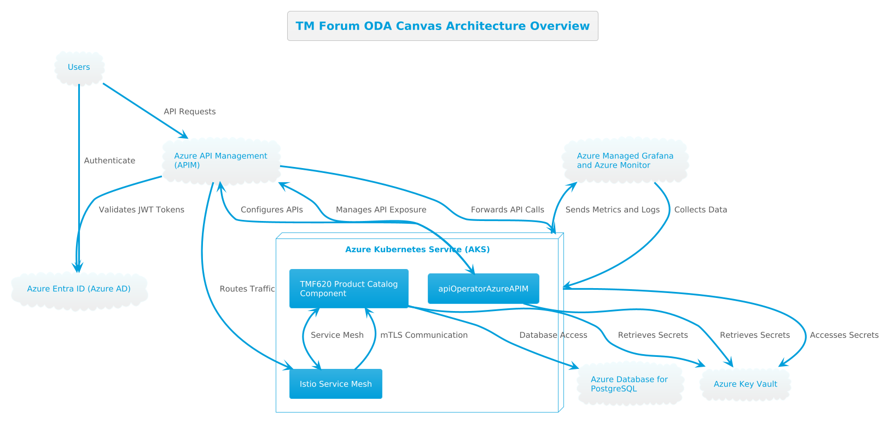

- [Deployment Guide for TM Forum ODA Canvas on Azure](#deployment-guide-for-tm-forum-oda-canvas-on-azure)
  - [Prerequisites](#prerequisites)
  - [Architecture Overview](#architecture-overview)
  - [Step 1: Set Up Azure Key Vault and Store Secrets](#step-1-set-up-azure-key-vault-and-store-secrets)
    - [1.1 Create an Azure Key Vault](#11-create-an-azure-key-vault)
    - [1.2 Store Required Secrets](#12-store-required-secrets)
  - [Step 2: Configure Azure Entra ID with App Registrations](#step-2-configure-azure-entra-id-with-app-registrations)
    - [2.1 Create Backend App Registration](#21-create-backend-app-registration)
    - [2.2 Create Frontend App Registration](#22-create-frontend-app-registration)
    - [2.3 Update apiOperatorAzureAPIM Configuration](#23-update-apioperatorazureapim-configuration)
  - [Step 3: Set Up Azure API Management (APIM)](#step-3-set-up-azure-api-management-apim)
    - [3.1 Create or Verify APIM Instance](#31-create-or-verify-apim-instance)
    - [3.2 Configure Networking for APIM](#32-configure-networking-for-apim)
    - [3.3 Enable Entra ID Integration](#33-enable-entra-id-integration)
  - [Step 4: Set Up Azure Database for PostgreSQL](#step-4-set-up-azure-database-for-postgresql)
    - [4.1 Create a Managed PostgreSQL Database](#41-create-a-managed-postgresql-database)
    - [4.2 Configure Networking](#42-configure-networking)
    - [4.3 Create TMF620 Database Structures](#43-create-tmf620-database-structures)
    - [4.4 Update Connection String](#44-update-connection-string)
  - [Step 5: Prepare the AKS Cluster](#step-5-prepare-the-aks-cluster)
    - [5.1 Verify AKS Cluster Accessibility](#51-verify-aks-cluster-accessibility)
    - [5.2 Enable Managed Identity](#52-enable-managed-identity)
    - [5.3 Grant Access to Key Vault](#53-grant-access-to-key-vault)
    - [5.4 Configure Network Policies](#54-configure-network-policies)
  - [Step 6: Deploy the TM Forum ODA Canvas (Including Istio)](#step-6-deploy-the-tm-forum-oda-canvas-including-istio)
    - [6.1 Clone the TM Forum ODA Canvas Repository](#61-clone-the-tm-forum-oda-canvas-repository)
    - [6.2 Deploy ODA Canvas with Istio](#62-deploy-oda-canvas-with-istio)
    - [6.3 Verify Istio Deployment](#63-verify-istio-deployment)
  - [Step 7: Configure Azure Managed Grafana and Azure Monitor](#step-7-configure-azure-managed-grafana-and-azure-monitor)
    - [7.1 Set Up Azure Monitor for Containers](#71-set-up-azure-monitor-for-containers)
    - [7.2 Create Azure Managed Grafana Instance](#72-create-azure-managed-grafana-instance)
    - [7.3 Configure Data Sources in Azure Managed Grafana](#73-configure-data-sources-in-azure-managed-grafana)
    - [7.4 Import Dashboards](#74-import-dashboards)
  - [Step 8: Deploy the Operator (apiOperatorAzureAPIM)](#step-8-deploy-the-operator-apioperatorazureapim)
    - [8.1 Build the Operator Docker Image](#81-build-the-operator-docker-image)
    - [8.2 Push the Image to a Container Registry](#82-push-the-image-to-a-container-registry)
    - [8.3 Create Kubernetes Resources for the Operator](#83-create-kubernetes-resources-for-the-operator)
    - [8.4 Apply the Resources](#84-apply-the-resources)
    - [8.5 Verify Operator Status](#85-verify-operator-status)
  - [Step 9: Apply the Custom Resource Definition (CRD)](#step-9-apply-the-custom-resource-definition-crd)
  - [Step 10: Deploy the TMF620 Product Catalog Component](#step-10-deploy-the-tmf620-product-catalog-component)
    - [10.1 Clone the Repository](#101-clone-the-repository)
    - [10.2 Build the Docker Image](#102-build-the-docker-image)
    - [10.3 Push the Image to a Container Registry](#103-push-the-image-to-a-container-registry)
    - [10.4 Create Kubernetes Manifests](#104-create-kubernetes-manifests)
    - [10.5 Apply the Manifests](#105-apply-the-manifests)
  - [Step 11: Create ExposedAPI Custom Resource for Product Catalog](#step-11-create-exposedapi-custom-resource-for-product-catalog)
  - [Step 12: Configure AKS RBAC and Network Policies](#step-12-configure-aks-rbac-and-network-policies)
    - [12.1 Restrict Access to Services from APIM](#121-restrict-access-to-services-from-apim)
    - [12.2 Implement RBAC](#122-implement-rbac)
  - [Step 13: Ensure TLS Communication](#step-13-ensure-tls-communication)
    - [13.1 TLS within Istio Service Mesh](#131-tls-within-istio-service-mesh)
    - [13.2 TLS Termination at Ingress](#132-tls-termination-at-ingress)
  - [Step 14: Monitor and Verify the Deployment](#step-14-monitor-and-verify-the-deployment)
    - [14.1 Check Operator Logs](#141-check-operator-logs)
    - [14.2 Verify Istio Resources](#142-verify-istio-resources)
    - [14.3 Check Azure APIM Configuration](#143-check-azure-apim-configuration)
    - [14.4 Use Azure Managed Grafana](#144-use-azure-managed-grafana)
  - [Step 15: Test the Product Catalog API](#step-15-test-the-product-catalog-api)
    - [15.1 Obtain the APIM Gateway URL](#151-obtain-the-apim-gateway-url)
    - [15.2 Test API Endpoints via APIM](#152-test-api-endpoints-via-apim)
    - [15.3 Test Authentication](#153-test-authentication)
    - [15.4 Verify Rate Limiting and CORS](#154-verify-rate-limiting-and-cors)
  - [Additional Considerations](#additional-considerations)
  - [Helpful Resources](#helpful-resources)

# Deployment Guide for TM Forum ODA Canvas on Azure

This guide provides detailed steps to deploy the TM Forum Open Digital Architecture (ODA) canvas into an Azure environment. It focuses on deploying the **TMF620 Product Catalog component**, integrating with **Azure Entra ID** for authentication, utilizing **Istio** (deployed as part of the ODA Canvas process) as the service mesh, securing communication with **TLS**, and ensuring that only **Azure API Management (APIM)** can access the services in **Azure Kubernetes Service (AKS)**. Additionally, it covers configuring a managed **Azure Database for PostgreSQL**, including setting up the TMF620 database structures, and using **Azure Managed Grafana** and **Azure Monitor for monitoring**.

## Prerequisites

Before you begin, ensure you have the following:

- **Azure Subscription**: With permissions to create and manage resources.
- **Azure Kubernetes Service (AKS) Cluster**: A running AKS cluster for deploying ODA components.
- **Azure API Management (APIM)** Instance: For managing and securing your APIs.
- **Azure Key Vault**: To securely store secrets accessed by the operator.
- **Azure Entra ID (Azure AD)**: For authentication and authorization.
- **Azure Database for PostgreSQL**: Managed PostgreSQL service for database needs.
- **Ingress Controller**: Deployed in your AKS cluster (though Istio's ingress will be used).
- **Istio Service Mesh**: Deployed as part of the TM Forum ODA Canvas process.
- **Azure Managed Grafana and Azure Monitor**: For monitoring and visualization.
- **Development Tools**: Docker, Kubernetes CLI (*kubectl*), Helm, Git, and Azure CLI installed on your local machine.

## Architecture Overview
The architecture includes:

- **AKS Cluster**: Hosting the TMF620 Product Catalog component.
- **Istio Service Mesh**: Managing internal service communication with mutual TLS (mTLS).
- **Azure API Management (APIM)**: Exposing and securing the API with policies and integration with Entra ID.
- **Azure Entra ID**: Providing authentication via OAuth2 and JWT tokens.
- **Azure Database for PostgreSQL**: Hosting the TMF620 database structures.
- **Azure Key Vault**: Storing secrets and certificates securely.
- **apiOperatorAzureAPIM**: A Kubernetes operator managing API exposure and APIM configuration.
- **Azure Managed Grafana and Azure Monitor**: For monitoring AKS and application performance.



## Step 1: Set Up Azure Key Vault and Store Secrets

### 1.1 Create an Azure Key Vault

```bash 
az keyvault create --name <YourKeyVaultName> --resource-group <YourResourceGroup> --location <YourLocation
```

### 1.2 Store Required Secrets
Store the following secrets:

- ```apim-service-name```
- ```resource-group```
- ```subscription-id```
- ```aad-tenant-id```
- ```aad-client-id``` (for backend app registration)
- ```aad-client-id-frontend``` (for frontend app registration)
- ```db-connection-string```

```bash
# APIM and Azure details
az keyvault secret set --vault-name <YourKeyVaultName> --name apim-service-name --value "<YourAPIMServiceName>"
az keyvault secret set --vault-name <YourKeyVaultName> --name resource-group --value "<YourResourceGroup>"
az keyvault secret set --vault-name <YourKeyVaultName> --name subscription-id --value "<YourSubscriptionID>"
az keyvault secret set --vault-name <YourKeyVaultName> --name aad-tenant-id --value "<YourAADTenantID>"
az keyvault secret set --vault-name <YourKeyVaultName> --name aad-client-id --value "<YourAADClientID>"
az keyvault secret set --vault-name <YourKeyVaultName> --name aad-client-id-frontend --value "<YourAADClientIDFrontend>"

# Database connection string
az keyvault secret set --vault-name <YourKeyVaultName> --name db-connection-string --value "<YourDBConnectionString>"
```

## Step 2: Configure Azure Entra ID with App Registrations
We'll create two app registrations: one for the frontend and one for the backend (API).

### 2.1 Create Backend App Registration
- Register a New Application

    - Go to **Azure Entra ID > App registrations > New registration**.
    - Name: ```TMF620-ProductCatalog-Backend```
    - Supported account types: Choose based on your organization's needs.
    - Click **Register**.
- Expose an API

    - In the **Expose an API** section, set the Application ID URI (e.g., ```api://<YourAADClientID>```).
    - Add a scope:
      - Scope name: ```access_as_user```
      - Who can consent: **Admins and users**
      - Admin consent display name: **Access Product Catalog API**
      - Admin consent description: **Allows the app to access the Product Catalog API as the user**.
      - Click **Add scope**.
- **Create a Client Secret (if needed)**
    - Under **Certificates & secrets**, create a new client secret.
    - Store the secret securely (e.g., in Azure Key Vault if needed).
### 2.2 Create Frontend App Registration
- Register a New Application
    - Name: ```TMF620-ProductCatalog-Frontend```
    - Supported account types: Same as backend.
    - Redirect URI: Specify the URI where the frontend application will be hosted.
- Configure API Permissions
    - Under **API permissions**, click **Add a permission**.
    - Select **My APIs** and choose ```TMF620-ProductCatalog-Backend```.
    - Select the scope ```access_as_user```.
    - Click **Add permissions**.
- Grant Admin Consent
    - Click **Grant admin consent for [Your Organization]**.
- Authentication Settings
    - Under **Authentication**, configure the following:
    - **Redirect URIs**: Add the frontend application's URI.
    - **Implicit grant and hybrid flows**: Enable **Access tokens** and **ID tokens**.
### 2.3 Update apiOperatorAzureAPIM Configuration
Ensure the operator is aware of the Entra ID configurations:

- The **backend app registration** (```aad-client-id```) is used for validating tokens in APIM policies.
- The **frontend app registration** (```aad-client-id-frontend```) is used by clients to obtain tokens.

## Step 3: Set Up Azure API Management (APIM)
### 3.1 Create or Verify APIM Instance
```bash
az apim create --name <YourAPIMServiceName> --resource-group <YourResourceGroup> --publisher-email <YourEmail> --publisher-name <YourName>
```
### 3.2 Configure Networking for APIM
Virtual Network Integration: Ensure APIM is integrated with the same Virtual Network (VNet) as AKS or has network access to the AKS cluster.
IP Whitelisting: Note the outbound IP addresses of APIM to configure network policies in AKS.
### 3.3 Enable Entra ID Integration
In the APIM instance, configure Entra ID as an OpenID Connect provider.
## Step 4: Set Up Azure Database for PostgreSQL
### 4.1 Create a Managed PostgreSQL Database
```bash
az postgres flexible-server create --resource-group <YourResourceGroup> --name <YourPostgresServerName> --location <YourLocation> --admin-user <YourAdminUser> --admin-password <YourAdminPassword> --tier Burstable --sku-name Standard_B1ms --version 13
```
### 4.2 Configure Networking
VNet Integration: Place the PostgreSQL server in the same VNet as your AKS cluster for secure connectivity.
Private Endpoint: Use Azure Private Link to create a private endpoint for the PostgreSQL server.
### 4.3 Create TMF620 Database Structures
- Connect to the Database

```bash
psql "host=<YourPostgresServerName>.postgres.database.azure.com port=5432 dbname=postgres user=<YourAdminUser>@<YourPostgresServerName> sslmode=require"
```

- Create Database and User
```sql
CREATE DATABASE tmf620db;
CREATE USER tmf620user WITH PASSWORD '<YourPassword>';
GRANT ALL PRIVILEGES ON DATABASE tmf620db TO tmf620user;
```
- Set Up Database Schema
Execute the SQL scripts provided by the TMF620 Product Catalog component to create tables and schemas.
Alternatively, run migration scripts if available.

### 4.4 Update Connection String
- Format: ```postgresql://tmf620user:<YourPassword>@<YourPostgresServerName>.postgres.database.azure.com:5432/tmf620db?sslmode=require```
- Store this connection string in Azure Key Vault under ```db-connection-string```.
## Step 5: Prepare the AKS Cluster
### 5.1 Verify AKS Cluster Accessibility
```bash
az aks get-credentials --resource-group <YourResourceGroup> --name <YourAKSClusterName>
kubectl get nodes
```
### 5.2 Enable Managed Identity
Ensure the AKS cluster has a Managed Identity for accessing Key Vault.
```bash
az aks update -n <YourAKSClusterName> -g <YourResourceGroup> --enable-managed-identity
```
### 5.3 Grant Access to Key Vault
```bash
az keyvault set-policy -n <YourKeyVaultName> --object-id <AKS-Managed-Identity-Object-ID> --secret-permissions get list
```
### 5.4 Configure Network Policies
Enable Network Policy: Ensure your AKS cluster has network policy enabled (Azure or Calico).
```bash
az aks create --name <YourAKSClusterName> --resource-group <YourResourceGroup> --network-policy azure
```
## Step 6: Deploy the TM Forum ODA Canvas (Including Istio)
### 6.1 Clone the TM Forum ODA Canvas Repository
```bash
git clone https://github.com/tmforum-oda/oda-canvas-charts.git
cd oda-canvas-charts
```
### 6.2 Deploy ODA Canvas with Istio
The ODA Canvas Helm charts include Istio deployment.

```bash
helm install oda-canvas ./charts/oda-canvas -n oda --create-namespace
```
Namespace Labeling: The Helm chart should automatically label namespaces for Istio sidecar injection.

### 6.3 Verify Istio Deployment
```bash
kubectl get pods -n istio-system
```
Ensure that Istio components are running.

## Step 7: Configure Azure Managed Grafana and Azure Monitor
### 7.1 Set Up Azure Monitor for Containers
Enable Azure Monitor for your AKS cluster.

```bash
az monitor log-analytics workspace create --resource-group <YourResourceGroup> --workspace-name <YourWorkspaceName>
az monitor monitor-container health enable --resource-group <YourResourceGroup> --workspace-id <YourWorkspaceID> --cluster-name <YourAKSClusterName>
```
### 7.2 Create Azure Managed Grafana Instance
```bash
az grafana create --name <YourGrafanaInstanceName> --resource-group <YourResourceGroup>
```
### 7.3 Configure Data Sources in Azure Managed Grafana
In the Azure Portal, navigate to your Grafana instance.
- Go to Configuration > Data sources.
- Add Azure Monitor as a data source.
- Configure with your subscription, resource group, and workspace.
### 7.4 Import Dashboards
Use built-in dashboards or import community dashboards for AKS and Istio monitoring.
Configure alerts as needed.
## Step 8: Deploy the Operator (apiOperatorAzureAPIM)
### 8.1 Build the Operator Docker Image
```bash
docker build -t <YourRegistry>/apioperatorazureapim:latest .
```
### 8.2 Push the Image to a Container Registry
```bash
docker push <YourRegistry>/apioperatorazureapim:latest
```
### 8.3 Create Kubernetes Resources for the Operator
ServiceAccount and RBAC
```yaml
# apioperatorazureapim-serviceaccount.yaml
apiVersion: v1
kind: ServiceAccount
metadata:
  name: apioperatorazureapim-sa
  namespace: operators
---
# apioperatorazureapim-role.yaml
kind: Role
apiVersion: rbac.authorization.k8s.io/v1
metadata:
  namespace: operators
  name: apioperatorazureapim-role
rules:
  - apiGroups: ["", "apps", "extensions", "networking.k8s.io", "oda.tmforum.org"]
    resources: ["pods", "services", "deployments", "ingresses", "secrets", "configmaps", "exposedapis"]
    verbs: ["get", "list", "watch", "create", "update", "patch", "delete"]
---
# apioperatorazureapim-rolebinding.yaml
kind: RoleBinding
apiVersion: rbac.authorization.k8s.io/v1
metadata:
  name: apioperatorazureapim-rolebinding
  namespace: operators
subjects:
  - kind: ServiceAccount
    name: apioperatorazureapim-sa
    namespace: operators
roleRef:
  kind: Role
  name: apioperatorazureapim-role
  apiGroup: rbac.authorization.k8s.io
```
Deployment
```yaml
# apioperatorazureapim-deployment.yaml
apiVersion: apps/v1
kind: Deployment
metadata:
  name: apioperatorazureapim
  namespace: operators
spec:
  replicas: 1
  selector:
    matchLabels:
      app: apioperatorazureapim
  template:
    metadata:
      labels:
        app: apioperatorazureapim
    spec:
      serviceAccountName: apioperatorazureapim-sa
      containers:
        - name: apioperatorazureapim
          image: <YourRegistry>/apioperatorazureapim:latest
          env:
            - name: KEY_VAULT_NAME
              value: "<YourKeyVaultName>"
            - name: LOGGING
              value: "INFO"
```              
### 8.4 Apply the Resources
```bash
kubectl create namespace operators
kubectl apply -f apioperatorazureapim-serviceaccount.yaml
kubectl apply -f apioperatorazureapim-role.yaml
kubectl apply -f apioperatorazureapim-rolebinding.yaml
kubectl apply -f apioperatorazureapim-deployment.yaml
```
### 8.5 Verify Operator Status
```bash
kubectl get pods -n operators
kubectl logs <apioperatorazureapim-pod-name> -n operators
```
## Step 9: Apply the Custom Resource Definition (CRD)
```yaml
# exposedapi-crd.yaml
apiVersion: apiextensions.k8s.io/v1
kind: CustomResourceDefinition
metadata:
  name: exposedapis.oda.tmforum.org
spec:
  group: oda.tmforum.org
  versions:
    - name: v1beta3
      served: true
      storage: true
      schema:
        openAPIV3Schema:
          type: object
          properties:
            spec:
              type: object
              properties:
                path:
                  type: string
                specification:
                  type: string
                implementation:
                  type: string
                port:
                  type: integer
                rateLimit:
                  type: object
                CORS:
                  type: object
  scope: Namespaced
  names:
    plural: exposedapis
    singular: exposedapi
    kind: ExposedAPI
```  
Apply the CRD:

```bash
kubectl apply -f exposedapi-crd.yaml
```
## Step 10: Deploy the TMF620 Product Catalog Component
### 10.1 Clone the Repository
```bash
git clone https://github.com/tmforum-oda/TMF620_Product_Catalog.git
cd TMF620_Product_Catalog
```
### 10.2 Build the Docker Image
```bash
docker build -t <YourRegistry>/tmf620-product-catalog:latest .
```
### 10.3 Push the Image to a Container Registry
```bash
docker push <YourRegistry>/tmf620-product-catalog:latest
```
### 10.4 Create Kubernetes Manifests
Deployment
```yaml
# tmf620-product-catalog-deployment.yaml
apiVersion: apps/v1
kind: Deployment
metadata:
  name: tmf620-product-catalog
  namespace: components
  labels:
    app: tmf620-product-catalog
spec:
  replicas: 2
  selector:
    matchLabels:
      app: tmf620-product-catalog
  template:
    metadata:
      labels:
        app: tmf620-product-catalog
    spec:
      containers:
        - name: tmf620-product-catalog
          image: <YourRegistry>/tmf620-product-catalog:latest
          ports:
            - containerPort: 8080
          env:
            - name: DB_CONNECTION_STRING
              valueFrom:
                secretKeyRef:
                  name: db-connection-string
                  key: connectionString
      # Istio sidecar injection is handled by namespace labeling
```
Service
```yaml
# tmf620-product-catalog-service.yaml
apiVersion: v1
kind: Service
metadata:
  name: tmf620-product-catalog-service
  namespace: components
  labels:
    app: tmf620-product-catalog
spec:
  selector:
    app: tmf620-product-catalog
  ports:
    - protocol: TCP
      port: 8080
      targetPort: 8080
```
### 10.5 Apply the Manifests
```bash
kubectl create namespace components
kubectl label namespace components istio-injection=enabled
kubectl apply -f tmf620-product-catalog-deployment.yaml
kubectl apply -f tmf620-product-catalog-service.yaml
```
## Step 11: Create ExposedAPI Custom Resource for Product Catalog
```yaml
# tmf620-product-catalog-exposedapi.yaml
apiVersion: oda.tmforum.org/v1beta3
kind: ExposedAPI
metadata:
  name: tmf620-product-catalog-api
  namespace: components
spec:
  path: /product-catalog
  specification: |
    {
      "openapi": "3.0.0",
      "info": {
        "title": "TMF620 Product Catalog API",
        "version": "1.0.0"
      },
      "paths": {
        # ... include the full OpenAPI specification here ...
      }
    }
  implementation: "tmf620-product-catalog-service"
  port: 8080
  rateLimit:
    limit: 1000
    period: 60
  CORS:
    allowOrigins:
      - "*"
    allowMethods:
      - GET
      - POST
      - PUT
      - DELETE
    allowHeaders:
      - Content-Type
      - Authorization
    exposeHeaders:
      - "*"
    maxAge: 3600
    allowCredentials: true
```    
Apply the ExposedAPI resource:

```bash
kubectl apply -f tmf620-product-catalog-exposedapi.yaml
```
## Step 12: Configure AKS RBAC and Network Policies
### 12.1 Restrict Access to Services from APIM
Create a Network Policy
```yaml
# network-policy.yaml
apiVersion: networking.k8s.io/v1
kind: NetworkPolicy
metadata:
  name: allow-apim-access
  namespace: components
spec:
  podSelector:
    matchLabels:
      app: tmf620-product-catalog
  ingress:
    - from:
        - ipBlock:
            cidr: <APIM-Outbound-IP-Address>/32  # Replace with APIM's outbound IP
      ports:
        - protocol: TCP
          port: 8080
  policyTypes:
    - Ingress
```
Apply the Network Policy:

```bash
kubectl apply -f network-policy.yaml
```
### 12.2 Implement RBAC
Ensure that only authorized identities can access Kubernetes resources.

- Create roles and role bindings as necessary.
- Use Azure Entra ID integration with AKS for identity management.
## Step 13: Ensure TLS Communication
### 13.1 TLS within Istio Service Mesh
- **mTLS Enabled**: Istio is deployed as part of the ODA Canvas process with mTLS enabled by default.
- **No Additional Configuration Needed**: Internal service communication is secured with TLS.
### 13.2 TLS Termination at Ingress
Istio ingress gateway handles TLS termination.

**Create a TLS Certificate**
- **Obtain Certificate**: Use Azure Key Vault certificates or another trusted CA.

- **Store Certificate in Kubernetes Secret**:

```bash
kubectl create -n istio-system secret tls istio-ingressgateway-certs --key <yourdomain.key> --cert <yourdomain.crt>
```
Configure Gateway and VirtualService
```yaml
# gateway.yaml
apiVersion: networking.istio.io/v1beta1
kind: Gateway
metadata:
  name: product-catalog-gateway
  namespace: components
spec:
  selector:
    istio: ingressgateway
  servers:
    - port:
        number: 443
        name: https
        protocol: HTTPS
      tls:
        mode: SIMPLE
        credentialName: istio-ingressgateway-certs
      hosts:
        - "product-catalog.yourdomain.com"

# virtualservice.yaml
apiVersion: networking.istio.io/v1beta1
kind: VirtualService
metadata:
  name: product-catalog-virtualservice
  namespace: components
spec:
  hosts:
    - "product-catalog.yourdomain.com"
  gateways:
    - product-catalog-gateway
  http:
    - match:
        - uri:
            prefix: "/product-catalog"
      route:
        - destination:
            host: tmf620-product-catalog-service.components.svc.cluster.local
            port:
              number: 8080
```            
Apply the Gateway and VirtualService:

```bash
kubectl apply -f gateway.yaml
kubectl apply -f virtualservice.yaml
```
## Step 14: Monitor and Verify the Deployment
### 14.1 Check Operator Logs
```bash
kubectl logs <apioperatorazureapim-pod-name> -n operators
```
### 14.2 Verify Istio Resources
```bash
kubectl get gateway,virtualservice -n components
kubectl get pods -n components
```
### 14.3 Check Azure APIM Configuration
- Log in to the Azure Portal.
- Navigate to your APIM instance.
- Verify that the ```tmf620-product-catalog-api``` is listed and configured.
### 14.4 Use Azure Managed Grafana
- Access Azure Managed Grafana via the Azure Portal.
- View dashboards for AKS cluster monitoring.
- Use Azure Monitor data source for metrics and logs.
## Step 15: Test the Product Catalog API
### 15.1 Obtain the APIM Gateway URL
Find the gateway URL in the APIM instance overview.
### 15.2 Test API Endpoints via APIM
```bash
curl -X GET https://<YourAPIMGatewayURL>/product-catalog
```
### 15.3 Test Authentication
Obtain a JWT Token from Entra ID
Use Azure CLI or Postman to authenticate using the frontend app registration.
```bash
az login
az account get-access-token --resource api://<YourAADClientID> --query accessToken --output tsv
```
Use the token in your API requests.
```bash
curl -H "Authorization: Bearer <YourJWTToken>" https://<YourAPIMGatewayURL>/product-catalog
```
### 15.4 Verify Rate Limiting and CORS
- Exceed the rate limit to ensure it's enforced.
- Test cross-origin requests from allowed and disallowed origins.


## Additional Considerations
- **Security**
  - **Secure Database Access**: Use Azure Private Link for the PostgreSQL database.
  - **Secrets Management**: Use Azure Key Vault and Kubernetes secrets securely.
  - **Network Security**: Implement **Network Security Groups (NSGs)** and **Azure Firewall**.
- **Monitoring and Logging**
  - **Enhanced Monitoring**: Leverage **Azure Monitor** for logs and metrics.
  - **Logging**: Centralize logs using **Azure Log Analytics**.
- **Scaling and Performance**
  - **Database Scaling**: Adjust the SKU of Azure Database for PostgreSQL.
  - **Application Scaling**: Configure **Horizontal Pod Autoscalers (HPA)**.
-**Disaster Recovery and Backup**
  - **Database Backups**: Ensure automated backups are enabled.
  - **Application Backups**: Backup configurations and data.
-**Compliance and Governance**
  - **Compliance Standards**: Ensure data handling complies with regulations like GDPR.
  - **Policies and Auditing**: Implement **Azure Policies** and use Entra ID auditing features.

## Helpful Resources
- TM Forum ODA: [TM Forum Open Digital Architecture](https://www.tmforum.org/oda/)
- TMF620 Product Catalog: [TMF620 Product Catalog Component](https://github.com/tmforum-oda/TMF620_Product_Catalog)
- Azure Documentation:
  - [Azure Kubernetes Service (AKS)](https://docs.microsoft.com/azure/aks/)
  - [Azure API Management](https://docs.microsoft.com/azure/api-management/)
  - [Azure Database for PostgreSQL](https://docs.microsoft.com/azure/postgresql/)
  - [Azure Key Vault](https://docs.microsoft.com/azure/key-vault/)
  - [Azure Entra ID](https://learn.microsoft.com/azure/active-directory/fundamentals/entra-overview)
  - [Azure Managed Grafana](https://docs.microsoft.com/azure/managed-grafana/)
  - [Azure Monitor](https://docs.microsoft.com/azure/azure-monitor/)
- Istio Documentation: [Istio Service Mesh](https://istio.io/latest/about/service-mesh/)