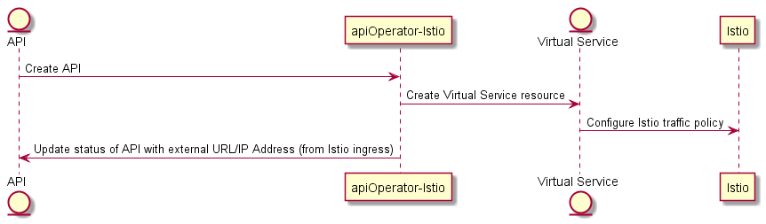

# API Operator for Istio - Introduction

The API operator for Istio takes the meta-data described in the api.oda.tmforum.org CRD and uses it to configure the Istio control-plane. In a production environment you would probably have an API gateway in front of the Service Mesh

Your kubernetes environment will need to have the Istio Service Mesh deployed and have a `gateway` resource deployed as part of the Canvas. The Operator creates Istio `Virtual Service` resources. These create traffic policies in Istio to route traffic (based on the API Path) to the correct micro-services.

The component controller written in Python, using the KOPF (https://kopf.readthedocs.io/) framework to listen for API resources being deployed in the ODA Canvas. 

**Testing KOPF module**

Run: `kopf run --namespace=components --standalone .\apiOperatorIstio.py`
