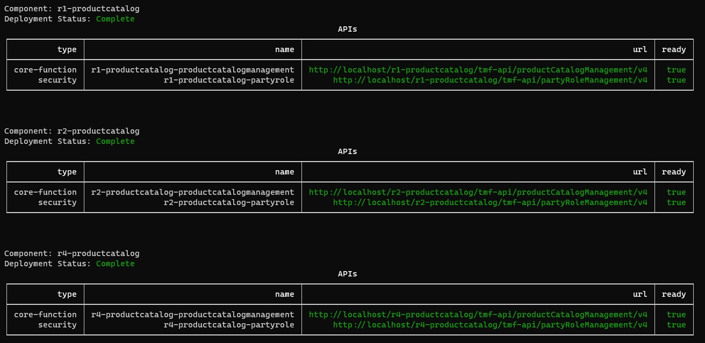

# Component Viewer utility

This is a simple command-line utility to view the ODA Component deployment and lifecycle.

# Installation

```
npm install @lesterthomas/cv -g
```


Then, to run utility:

```
cv
```


The utility will use the current kubeconfig to connect to the Kubernetes cluster. It will show 'No ODA Components to view' if there are no components being deployed. If there are components, you will get a screen like the one below:



To exit the utility, type `CTRL-C`


## Publishing

To publish a new version, update the version number in the package.json file and use the command

```
npm publish --access public
```