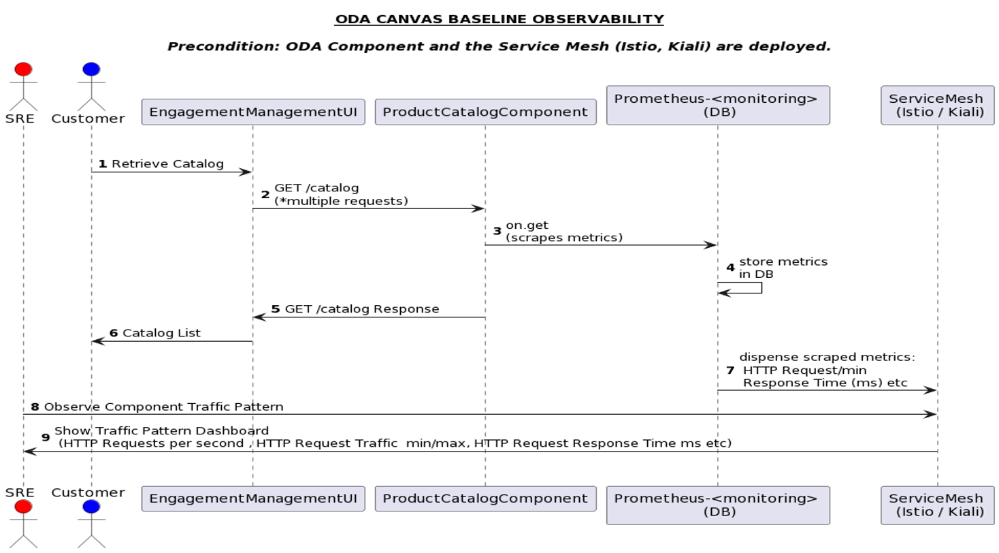

# **ODA Canvas & Component Interaction - NonFunctional Use-Case Library & Specification**

# 1. Observability and Monitoring

Observability and monitoring provides insight into the health, performance, and availability of ODA Components and the Canvas. Observability is essential for root cause analysis while monitoring provides alerts.

Observability Tools must provide:

- metrics, logs and traces e.g. traffic, performance, response time, CPU Usage and
- other business metrics: using counters for number of errors, number of requests served by the ODA component as well as using gauges for CPU usage, memory usage, number of concurrent requests amongst others.

Observability can be categorised into two broad areas based on the type of metrics scrapped, stored and processed. 
**ODA Baseline Observability:** is where the focus is on the technical metrics involved in an ODA Component to Canvas interaction such as monitoring success and failure traffic (HTTP request and response), CPU usage etc

**Custom Observability:** Custom business metrics involved in an ODA Component to Canvas interaction is, a custom metrics microservice needs to be implemented exposing a /metrics endpoint following an observability and monitoring solution e.g. the Prometheus operator standard. The microservice registers for component's events leveraging the Open-API publish/subscribe event notification pattern and generates the appropriate metrics to be observed.

# 2. Sample UseCases

The following use cases have been derived based on a Vodafone NFR Assessment and requirements elucidated from across the business.

## 2.1 Type: Scalability & Performance

**User Story**

- As a Site Reliability Engineer,
- I want to have a scalable ODA component such that more nodes can be added automatically to accommodate additional user requests.
- So that no degradation in performance of the ODA component (e.g. TMFC001 Product Catalog Management) functionality is observed as the number of user requests grow.

**BDD** (using Gherkin Syntax) describing component to Canvas interaction

| **Feature** | Allow a Site Reliability Engineer to see a scalable ODA component such that with additional load of user request more nodes are automatically added |
| --- | --- |
| **Scenario** | See nodes added to a running ODA component. |
| **Precondition** | **Given**  that an ODA component has been deployed into a scalable infrastructure|
| **Action** |  **when**  the number of user requests increases|
|            | **and** the Site Reliability Engineer selects the running ODA components view|
| **Outcome** | **then**  additional nodes are deployed|
|  | **and** the running nodes are visible|
|  | **and**  the component is observed to have higher throughput|
|  | **and** health status of each nodes should be visible as well. (move to another BDD)|

## 2.2 Type: Monitoring and observability

**User Story**

- As Site Reliability Engineer,
- I want the ability to be notified when system running an ODA component has resource exhaustion issues such as lack of memory or when the CPU utilisation rate is too high
- So that no performance issues such as long load and save times are observed and that application shut down can be prevented.

**BDD** (using Gherkin Syntax) describing component to Canvas interaction

| **Feature** | Allow a Site Reliability Engineer receive notifications whenever a running ODA component has resource exhaustion issues such as lack of memory or when the CPU utilisation rate is too high. |
| --- | --- |
| **Scenario** | Receiving a notification via appropriate channels, in order to carry out remedial actions on a running ODA component. |
| **Precondition** |  **Given**  that an ODA component has been deployed into a scalable infrastructure|
| **Action** | **when**  the ODA component system experiences resource exhaustion issues such as lack of memory or high CPU utilisation rate|
| **Outcome** | **then**  a notification is sent to the site reliability engineer indicating the system is lacking in memory or having high rate of CPU utilisation.|

## 2.3 Type: Management & Observability (the baseline example)

**User Story**

- As a s Site Reliability Engineer.
- I want to configure an observability service in the operation canvas
- So that when an ODA Component is deployed, updated or deleted its health status, performance, and availability can be monitored.

**BDD** (using Gherkin Syntax) describing component to Canvas interaction

| **Feature** | Allow a Site Reliability Engineer to declaratively configure an observability service such that when an ODA component is deployed, updated or deleted, its observability metrics can be monitored and observed. |
| --- | --- |
| **Scenario** | See and examine an observability service running on an operational canvas |
| **Precondition** | **Given**  that an ODA component has been deployed|
| **Action** | **when**  the Site Reliability Engineer access the observability service management console|
| **Outcome** | **then**  the ODA component is visible in the management interface|
|  |- **and** the number of HTTP requests/second is displayed|
|  |- **and** the response time in milliseconds is visible|

### 2.3.1 Canvas to Component Conversation Flow

## 2.4 Type: Logging

**{V-ODA L3:** Log Recording, Log Collection, Log Analysis, Alerting, Log Search, Log Aggregation, Monitoring}

**User Story**

- As an Operations Support Engineer,
- I want the application logs and audit logs to be captured and stored separately in order to be able to limit the size of the logs produced by system
- So that

## 2.5 Type: Manageability

**User Story**

- As a Release Manager.
- I want the ability to 'back out' changes on the production environment, reverting to the previous version, as a simple operation without the need to rerelease the previous version
- So that

## 2.6 Type: Response Time

**User Story**

- As the product owner,
- I want every customer search or filtering of the product catalogue to complete the search and return result in 5secs max
- So that no performance issues such as long load and save times are observed and application shut down can be prevented.

## 2.7 Type: Monitoring and observability

**User Story**

- As a s Site Reliability Engineer.
- I want the ability to check the status of all the running processes for and supporting an ODA component
- So that

## 2.8.Type: Monitoring and observability

**User Story**

- As a s Site Reliability Engineer.
- I want the ability to pass in support team names in a system monitoring message specification
- So that PagerDuty call out can be made to a specific team.
