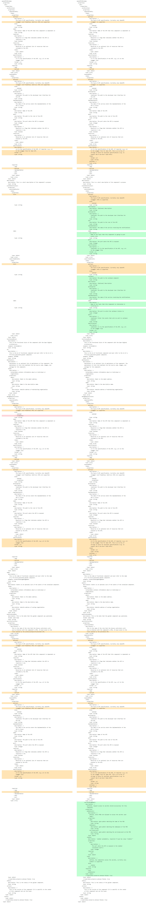

# Component Specification Release Notes

This page shows the ODA Component specification for each release version, with a comparison to the previous version. The ODA Component specification is defined using the [Open API Specification v3](https://swagger.io/specification/).

## v1beta3 - August 12th 2024

The OAS Specification can be found at [oda-component-oas-v1beta3.yaml](oda-component-oas-v1beta3.yaml).

Feature changes since v1beta2:

* In `coreFunction`, `managementFunction` and `securityFunction`, for every item in `exposedAPIs` the `specification` now allows an `array` with `minItems` of 1 (instead of a single string). This is to support Components that may expose APIs for different versions of the Open-API specification. It was introduced specifically to support the new TM Forum v5 APIs. A component may implement one or more versions of each API, and the specification will point to the OAS schema for that API.
* in `securityFunction` there is a new optional property `secretsManagement`. This allows the author of a component to declare a requirement for a secrets store. If set, the Canvas will configure access to a secrest store (the reference implementation being based on Hashicorp Vault). 
* The `eventNotification` `publishedEvents` have additional properties of `description`, `developerUI`, `hub`, `implementation`,`port` and `specification`. The `subscribedEvents` have additional properties of `callback`, `description`, `developerUI`, `implementation`,`port`, `query` and `specification`.

Fixes since v1beta2:

* In all `exposedAPIs` and `dependentAPIs`, the `apitype` is changed to `apiType` to adopt the correct camelCase format for properties.
* The `prometheus` `apiType` option has been removed from all areas except in the `managementFunction.exposedAPI` (this is the only place where the prometheus option was relavant).

The picture below shows a diff between [oda-component-oas-v1beta3.yaml](oda-component-oas-v1beta3.yaml) and [oda-component-oas-v1beta2.yaml](oda-component-oas-v1beta2.yaml).

