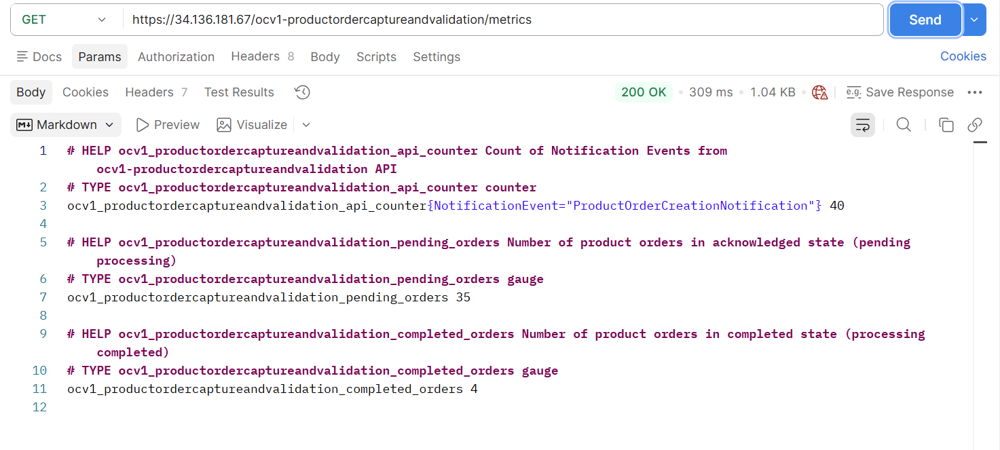

# Carbon Management Operator

**Carbon-Aware Scaling for Kubernetes Workloads on ODA Canvas**

A Kubernetes operator that dynamically adjusts workload scaling based on real-time carbon intensity data, enabling ODA Components to minimize their carbon footprint by reducing resource consumption during periods of high-carbon electricity generation. The operator integrates with KEDA (Kubernetes Event-Driven Autoscaler) to automatically manage replica counts based on both workload metrics and carbon intensity forecasts.

## Overview

The Carbon Management Operator enables carbon-aware computing on the ODA Canvas by automatically adjusting the maximum replica count of workloads based on real-time carbon intensity data from the electrical grid. This approach allows ODA Components to reduce their environmental impact without requiring code changes, by scaling down during periods when the electrical grid relies more heavily on fossil fuels and scaling up when renewable energy sources are more prevalent.

The operator discovers deployments based on label selectors, automatically creates and manages KEDA `ScaledObject` resources for each discovered deployment, and continuously updates their scaling parameters based on current carbon intensity levels. This design provides a centralized, declarative approach to carbon-aware scaling across multiple workloads within an ODA Component.

This operator follows the [Kubernetes Operator Pattern](https://kubernetes.io/docs/concepts/extend-kubernetes/operator/) and is part of the ODA Canvas modular architecture.

## Key Features

- **Automatic Deployment Discovery**: Uses label selectors to discover and manage deployments without manual ScaledObject creation
- **Dynamic Carbon-Aware Scaling**: Adjusts `maxReplicaCount` based on real-time carbon intensity thresholds
- **TMF628 API Integration**: Retrieves carbon intensity forecasts from the TMF628 Performance Management API deployed on the ODA Canvas
- **One-to-Many Management**: Single `CarbonManagement` resource manages multiple deployments within an ODA Component
- **GitOps Friendly**: Deployments self-register via standard Kubernetes labels
- **Automatic Cleanup**: Owner references ensure cascade deletion of managed `ScaledObject` resources
- **Orphan Detection**: Automatically removes `ScaledObject` resources for deployments that no longer match selectors

## Architecture

```
ODA Component (ProductOrderCaptureAndValidation)
├── Deployments (labeled: oda.tmforum.org/componentName, carbon-aware: enabled)
└── Business Metrics → Prometheus (pending_orders, completed_orders)

              ↓

CarbonManagement Resource (CRD)
├── deploymentSelector (label matching)
├── scaledObjectTemplate (KEDA triggers + Prometheus query)
├── maxReplicasByCarbonIntensity (400→9, 500→5, 550→1 replicas)
└── carbonIntensityForecastDataSource (TMF628 API endpoint)

              ↓ Reconciles every 5 min

Carbon Management Operator (main.py)
├── 1. Fetch Carbon Intensity (carbon_tmf628_fetcher.py → TMF628 API)
│      Example: 545 gCO2eq/kWh at 08:30 UTC
├── 2. Calculate Max Replicas (max_replica_getter.py)
│      545 falls in 500-550 range → maxReplicas = 1
├── 3. Discover Deployments (scaled_object_manager.py)
│      Found: ocv1-productorderprocessor
├── 4. Create/Update ScaledObject
│      ocv1-productorderprocessor-carbon-scaled:
│      ├── scaleTargetRef: ocv1-productorderprocessor
│      ├── maxReplicaCount: 1 (carbon-aware limit)
│      └── triggers: Prometheus query (pending_orders > 5)
└── 5. Update Status & Metrics

              ↓

KEDA (Event-Driven Autoscaler)
├── Polls Prometheus: pending_orders = 50 (exceeds threshold of 5)
├── Calculates desired: ~10 replicas needed for workload
├── Applies carbon limit: maxReplicaCount = 1 (enforced)
└── Creates HPA → Scales to 1 replica (prioritizes carbon reduction)

              ↓

Kubernetes Deployment
└── Runs 1 pod (reduced capacity during high-carbon period)

              ↓ Next cycle: intensity drops to 380

Operator Updates → maxReplicas = 9 → KEDA scales to 9 pods
```

## Managed Resources

### Custom Resources

- **CarbonManagement**: Primary resource for configuring carbon-aware scaling
  - API Group: `oda.tmforum.org`
  - Version: `v1alpha1`
  - Kind: `CarbonManagement`

### Created Resources

The operator creates and manages:

- **ScaledObject** (KEDA): One per discovered deployment, with naming pattern `{deployment-name}-carbon-scaled`
  - Includes KEDA triggers (Prometheus, etc.)
  - Dynamically adjusted `maxReplicaCount` based on carbon intensity
  - Owner references for automatic cleanup

### Labels Added to ScaledObjects

- `carbon-aware.kubernetes.io/managed: "true"` - Identifies operator-managed resources
- `carbon-aware.kubernetes.io/deployment: "{deployment-name}"` - Links to source deployment

## Prerequisites

Before deploying the Carbon Management Operator, ensure the following components are installed:

### 1. KEDA (Kubernetes Event-Driven Autoscaler)

The operator requires KEDA to manage event-driven autoscaling:

```bash
kubectl apply -f https://github.com/kedacore/keda/releases/download/v2.10.0/keda-2.10.0.yaml
```

Verify KEDA installation:

```bash
kubectl get pods -n keda
# Expected: keda-operator and keda-metrics-apiserver pods running
```

### 2. Observability Stack (Prometheus and Grafana)

The operator and managed workloads require Prometheus for metrics collection. Deploy the ODA Canvas observability stack:

```bash
# Deploy observability stack
helm install observability charts/observability-stack -n monitoring --create-namespace
```

Verify installation:

```bash
kubectl get svc -n monitoring

# Expected services:
# - observability-prometheus-prometheus (metrics collection)
# - observability-grafana (visualization)
# - observability-kube-state-metrics (cluster metrics)
# - observability-jaeger-* (distributed tracing)
# - observability-opentelemetry-collector (telemetry)
```

For complete installation instructions, see [charts/observability-stack/README.md](../../../../charts/observability-stack/README.md).

### 3. Carbon Intensity Service

The operator requires the TMF628-based Carbon Intensity Service for forecast data:

```bash
helm install carbon-intensity-service charts/carbon-intensity-service -n canvas
```

This service provides carbon intensity forecasts via the TMF628 Performance Management API.

## Installation

### Deploy the Custom Resource Definition

First, apply the `CarbonManagement` Custom Resource Definition:

```bash
kubectl apply -f ./manifests/carbonmanagemt-crd.yaml
```

Verify the CRD installation:

```bash
kubectl get crd carbonmanagements.oda.tmforum.org
```

### Deploy the Operator

#### Option A: Production Deployment (Using Helm)

Deploy the operator to the `canvas` namespace:

```bash
cd ../../../../charts
helm install carbon-management-operator ./carbon-management-operator -n canvas --create-namespace
```

Verify deployment:

```bash
kubectl get deployment carbon-management-operator -n canvas
kubectl get pods -n canvas -l app=carbon-management-operator
```

#### Option B: Local Development Mode

For development and testing, run the operator locally using Python and KOPF:

```bash
# Install dependencies
pip install -r requirements.txt

# Run operator locally (uses kubeconfig for cluster access)
python src/main.py

# Expected output:
# INFO:__main__:Carbon Management Operator started
# INFO:kopf.activities.startup:Activity 'configure' succeeded.
# INFO:kopf.engines.peering:Default peering object is found, leader is...
```

## Usage

### Step 1: Deploy an ODA Component

Deploy an ODA Component that you want to enable carbon-aware scaling for. For example, deploy the Product Order Capture and Validation component:

```bash
# Clone the reference components repository
git clone https://github.com/tmforum-oda/reference-example-components.git
cd reference-example-components

# Deploy the component
helm install ocv1 charts/ProductOrderCaptureAndValidation -n components --create-namespace
```

Verify the component deployment:

```bash
kubectl get components -n components
kubectl get deployments -n components
```

### Step 2: Label Deployments for Carbon-Aware Scaling

The operator discovers deployments using label selectors. Add labels to the deployments you want to manage:

```yaml
apiVersion: apps/v1
kind: Deployment
metadata:
  name: ocv1-productorderprocessor
  namespace: components
  labels:
    oda.tmforum.org/componentName: ocv1-productordercaptureandvalidation
    carbon-aware: enabled  # Required for operator discovery
spec:
  # ... deployment specification
```

**Important**: You can use any label selector strategy that fits your organization's needs. The operator supports flexible label matching through the `deploymentSelector.matchLabels` field.

### Step 3: Verify ServiceMonitor Configuration

Ensure that Prometheus is configured to scrape metrics from your ODA Component:

```bash
kubectl get servicemonitor -n components

# Expected: ServiceMonitor for your component
# Example: ocv1-productordercaptureandvalidation-metrics
```

If metrics are not being collected, verify that the component exposes Prometheus-compatible metrics endpoints.

### Step 4: Create a CarbonManagement Resource

Create a `CarbonManagement` resource to configure carbon-aware scaling for your component:

```yaml
apiVersion: oda.tmforum.org/v1alpha1
kind: CarbonManagement
metadata:
  name: productorder
  namespace: components
spec:
  # Deployment discovery - matches all deployments with these labels
  # Note: Replace 'ocv1' with your actual Helm release name
  deploymentSelector:
    matchLabels:
      oda.tmforum.org/componentName: ocv1-productordercaptureandvalidation
      carbon-aware: enabled
  
  # ScaledObject template applied to all discovered deployments
  scaledObjectTemplate:
    pollingInterval: 30       # Check metrics every 30 seconds
    cooldownPeriod: 300       # Wait 5 minutes before scaling down (300 seconds)
    minReplicaCount: 0        # Allow scaling to zero
    maxReplicaCount: 10       # Default maximum replicas
    triggers:
      - type: prometheus
        metadata:
        # Note: Replace 'observability-prometheus-prometheus' with your actual Prometheus service name
          serverAddress: http://observability-prometheus-prometheus.monitoring.svc:9090
          metricName: pending_orders
          threshold: '5'      # Scale up when pending orders > 5
          query: ocv1_productordercaptureandvalidation_pending_orders
    
  # Carbon-aware scaling configuration
  maxReplicasByCarbonIntensity:
    - carbonIntensityThreshold: 400    # gCO2eq/kWh
      maxReplicas: 9
    - carbonIntensityThreshold: 500
      maxReplicas: 5
    - carbonIntensityThreshold: 550
      maxReplicas: 1
  
  # Fallback when carbon data unavailable
  defaultMaxReplicas: 10
  
  # Carbon intensity data source
  carbonIntensityForecastDataSource:
    tmf628Api:
      url: "http://carbon-intensity-service.canvas.svc.cluster.local/tmf-api/performance/v5"
      region: "us-central1-c"
      timeout: 10
```

Apply the resource:

```bash
kubectl apply -f ./manifests/productorder-scaler.yaml
```

### Step 5: Verify Operator Functionality

Check that the operator discovered deployments and created `ScaledObject` resources:

```bash
# Check CarbonManagement status
kubectl get carbonmanagement productorder -n components
kubectl describe carbonmanagement productorder -n components

# List auto-created ScaledObjects
kubectl get scaledobjects -n components -l carbon-aware.kubernetes.io/managed=true

# Expected output:
# ocv1-productorderprocessor-carbon-scaled
# (one ScaledObject per discovered deployment)

# View ScaledObject details
kubectl describe scaledobject ocv1-productorderprocessor-carbon-scaled -n components
```

Check operator logs:

```bash
kubectl logs -n canvas deployment/carbon-management-operator -f

# Expected log output:
# [INFO] [components/productorder] Reconciling CarbonManagement: productorder
# [INFO] [components/productorder] Using TMF628 carbon forecast API at http://carbon-intensity-service...
# [INFO] [components/productorder] Current carbon intensity: 545.0 at 2026-06-17 08:30:00+00:00
# [INFO] [components/productorder] Calculated max replicas: 2
# [INFO] Discovering deployments with labels: carbon-aware=enabled,oda.tmforum.org/componentName=ocv1-prod...
# [INFO] Discovered deployment: components/ocv1-productorderprocessor
# [INFO] Updated ScaledObject: components/ocv1-productorderprocessor-carbon-scaled (maxReplicas=2)
```

### Step 6: Generate Workload to Trigger Scaling

This step is essential to demonstrate the complete carbon-aware scaling behavior. The `CarbonManagement` resource you created includes a Prometheus trigger based on `pending_orders`. Creating orders generates the workload metric that drives KEDA autoscaling, allowing you to observe how the operator dynamically limits scaling based on carbon intensity.

#### Verify Metrics Endpoint is Exposed

First, confirm that the ODA Component's metrics endpoint is accessible:

```bash
# List exposed APIs to find the metrics endpoint
kubectl get exposedapis -n components

# Expected output includes:
# NAME                                              URL                                                                     
# ocv1-productordercaptureandvalidation-metrics     https://<external-ip>/ocv1-productordercaptureandvalidation/metrics
```

#### Test Metrics Availability

Verify that Prometheus can scrape the metrics:

```bash
# Get the metrics URL dynamically
METRICS_URL=$(kubectl get exposedapi ocv1-productordercaptureandvalidation-metrics -n components \
  -o jsonpath='{.spec.url}')

# Fetch current metrics
curl -k ${METRICS_URL}

# Look for the pending_orders and completed_orders gauges in the output:
# ocv1_productordercaptureandvalidation_pending_orders 0
# ocv1_productordercaptureandvalidation_completed_orders 0
```

#### Create Orders Using the Order Creator Script

Generate test orders to trigger the scaling behavior:

```bash
# Make the script executable
chmod +x ./scripts/order-creator.sh

# Run the script to create orders
./scripts/order-creator.sh

# The script creates multiple orders, increasing the pending_orders metric
```

The script will:
1. Send POST requests to the Product Order API
2. Create orders that enter the processing queue
3. Increment the `pending_orders` metric
4. Trigger KEDA scaling when the metric exceeds the threshold (default: 5)

#### Verify Metrics Update

After creating orders, check that the metrics reflect the pending orders:

```bash
# Check metrics again
curl -k ${METRICS_URL}

# You should now see increased pending_orders value:
# ocv1_productordercaptureandvalidation_pending_orders 35
# ocv1_productordercaptureandvalidation_completed_orders 4
```

Example metrics output:



#### Confirm Prometheus Query Works

Verify that the exact Prometheus query used in your KEDA trigger returns data:

```bash
# Port-forward to Prometheus
kubectl port-forward -n monitoring svc/observability-prometheus-prometheus 9090:9090 &

# Open browser to http://localhost:9090
# Execute the query from your CarbonManagement resource:
# ocv1_productordercaptureandvalidation_pending_orders

# The query should return the current number of pending orders
```

This confirms that KEDA can successfully query the metric to make scaling decisions.

### Step 7: Observe Carbon-Aware Scaling in Action

Now that orders are generating workload, observe how the Carbon Management Operator limits scaling based on carbon intensity:

#### Monitor Scaling Behavior

Watch the deployment scale in real-time:

```bash
# Watch pod count change
kubectl get pods -n components -l app=ocv1-productorderprocessor -w

# In another terminal, watch HPA status
kubectl get hpa -n components -w

# View ScaledObject current state
kubectl get scaledobject ocv1-productorderprocessor-carbon-scaled -n components
```

#### Check Current Carbon-Aware Limits

View the current `maxReplicaCount` set by the operator based on carbon intensity:

```bash
# Get current max replicas
kubectl get scaledobject ocv1-productorderprocessor-carbon-scaled -n components \
  -o jsonpath='{.spec.maxReplicaCount}'

# Compare with operator logs to see carbon intensity
kubectl logs -n canvas deployment/carbon-management-operator | grep "Current carbon intensity"
```

#### Observe the Complete Behavior

**Expected Behavior**:

1. **Workload Trigger**: When `pending_orders` exceeds threshold (e.g., 5), KEDA signals the need to scale up
2. **Carbon-Aware Limit**: The operator has set `maxReplicaCount` based on current carbon intensity:
   - **Low carbon intensity** (< 400 gCO2eq/kWh) → Allows up to 9 replicas
   - **Medium carbon intensity** (400-500 gCO2eq/kWh) → Limits to 5 replicas  
   - **High carbon intensity** (500-550 gCO2eq/kWh) → Restricts to 1 replica
   - **Very high carbon intensity** (> 550 gCO2eq/kWh) → Uses last threshold (1 replica)
3. **Scaling Result**: Pods scale up to process orders, but never exceed the carbon-aware `maxReplicaCount`
4. **Order Processing**: As orders complete, `pending_orders` decreases
5. **Scale Down**: After cooldown period (300 seconds), pods scale down based on reduced workload

**Example Scenario**:
- Current carbon intensity: 545 gCO2eq/kWh → operator sets `maxReplicaCount` = 1
- Pending orders: 50 (well above threshold of 5)
- KEDA wants to scale to 10 pods to handle load
- **Result**: Only 1 pod runs due to carbon-aware limit, prioritizing environmental impact
- Orders process slower, but carbon footprint is minimized during high-carbon period

#### Continuous Monitoring

Monitor how limits change as carbon intensity fluctuates:

```bash
# Watch operator reconciliation (every 5 minutes)
kubectl logs -n canvas deployment/carbon-management-operator -f

# Look for log entries showing:
# [INFO] Current carbon intensity: 545.0 at 2026-06-17 08:30:00+00:00
# [INFO] Calculated max replicas: 1
# [INFO] Updated ScaledObject: components/ocv1-productorderprocessor-carbon-scaled (maxReplicas=1)
```

As carbon intensity changes throughout the day, the operator automatically adjusts scaling limits, allowing more replicas during cleaner energy periods and restricting them during high-carbon periods.


## Configuration Details

### CarbonManagement Resource Specification

#### Deployment Selection

The `deploymentSelector` field uses standard Kubernetes label matching:

```yaml
spec:
  deploymentSelector:
    matchLabels:
      # All labels must match for a deployment to be discovered
      oda.tmforum.org/componentName: ocv1-productordercaptureandvalidation
      carbon-aware: enabled
      # Add any additional labels as needed
```

**Best Practices**:
- Use consistent labels across all deployments in an ODA Component
- Include the ODA Component name for organizational clarity
- Add a `carbon-aware: enabled` label to explicitly opt-in to carbon-aware scaling

#### ScaledObject Template

The `scaledObjectTemplate` defines the KEDA configuration applied to all discovered deployments:

```yaml
spec:
  scaledObjectTemplate:
    pollingInterval: 30        # How often to check trigger metrics (seconds)
    cooldownPeriod: 300        # Cooldown after scaling down (seconds)
    minReplicaCount: 0         # Minimum replicas (0 allows scale-to-zero)
    maxReplicaCount: 10        # Initial maximum replicas (overridden by carbon intensity)
    
    triggers:                  # KEDA triggers (Prometheus, CPU, memory, etc.)
      - type: prometheus
        metadata:
          serverAddress: http://observability-prometheus-prometheus.monitoring.svc:9090
          metricName: pending_orders
          threshold: '5'
          query: ocv1_productordercaptureandvalidation_pending_orders
```

**Important**: The `maxReplicaCount` in the template serves as the default. The operator dynamically adjusts this value based on carbon intensity thresholds.

#### Carbon Intensity Thresholds

Define how maximum replicas should adjust based on carbon intensity:

```yaml
spec:
  maxReplicasByCarbonIntensity:
    - carbonIntensityThreshold: 400    # When intensity <= 400 gCO2eq/kWh
      maxReplicas: 9                   # Allow up to 9 replicas
    - carbonIntensityThreshold: 500    # When 400 < intensity <= 500 gCO2eq/kWh
      maxReplicas: 5                   # Limit to 5 replicas
    - carbonIntensityThreshold: 550    # When 500 < intensity <= 550 gCO2eq/kWh
      maxReplicas: 1                   # Severely restrict to 1 replica
```

**Behavior**: The operator evaluates thresholds as **upper bounds** (inclusive). It finds which range the current carbon intensity falls into:
- If intensity ≤ first threshold → use first config's `maxReplicas`
- If previous threshold < intensity ≤ current threshold → use current config's `maxReplicas`  
- If intensity > all thresholds → use last config's `maxReplicas`
- If forecast data is unavailable → use `defaultMaxReplicas`

**Example**: With the configuration above:
- Intensity = 350 → maxReplicas = 9
- Intensity = 450 → maxReplicas = 5
- Intensity = 540 → maxReplicas = 1
- Intensity = 600 → maxReplicas = 1 (last config applies)
- Forecast unavailable → maxReplicas = 10 (defaultMaxReplicas)

#### Carbon Intensity Data Source

Configure the TMF628 API endpoint for carbon intensity forecasts:

```yaml
spec:
  carbonIntensityForecastDataSource:
    tmf628Api:
      url: "http://carbon-intensity-service.canvas.svc.cluster.local/tmf-api/performance/v5"
      region: "us-central1-c"  # Cloud region identifier
      timeout: 10              # API request timeout (seconds)
```

**Note**: Replace the `region` value with the actual region where your workloads are running. The region identifier should match what the TMF628 API expects.

## Status and Monitoring

### CarbonManagement Status Fields

The operator provides detailed status information in the `CarbonManagement` resource:

```yaml
status:
  deploymentsDiscovered: 3       # Number of deployments matching selector
  scaledObjectsManaged: 3        # Number of ScaledObjects successfully created
  scaledObjectsFailed: 0         # Number of ScaledObjects with errors
  
  conditions:
    - type: OperatorDegraded
      status: "False"            # "False" means operator is working correctly
      reason: Succeeded
      message: Successfully managing 3 ScaledObjects with eco mode enabled
      lastTransitionTime: "2026-06-17T08:30:00Z"
```

**Status Interpretation**:
- `OperatorDegraded=False`: Operator functioning correctly
- `OperatorDegraded=True`: Check `reason` and `message` for error details
- `deploymentsDiscovered > scaledObjectsManaged`: Some deployments failed ScaledObject creation

### Viewing Operator Status

```bash
# Check overall status
kubectl get carbonmanagement productorder -n components -o yaml

# Check specific status fields
kubectl get carbonmanagement productorder -n components \
  -o jsonpath='{.status.conditions[0]}' | jq

# View discovered deployments
kubectl get carbonmanagement productorder -n components \
  -o jsonpath='{.status.deploymentsDiscovered}'
```

## Automatic Resource Management

### Owner References and Cascade Deletion

All `ScaledObject` resources created by the operator include owner references to their parent `CarbonManagement` resource:

```yaml
apiVersion: keda.sh/v1alpha1
kind: ScaledObject
metadata:
  name: ocv1-productorderprocessor-carbon-scaled
  namespace: components
  ownerReferences:
    - apiVersion: oda.tmforum.org/v1alpha1
      blockOwnerDeletion: true
      controller: true
      kind: CarbonManagement
      name: productorder
      uid: 01c54148-055d-4abf-aed3-cf51e89acbc4
spec:
  # ... ScaledObject specification
```

**Benefit**: Deleting the `CarbonManagement` resource automatically deletes all managed `ScaledObject` resources through Kubernetes garbage collection:

```bash
# This removes the CarbonManagement AND all its ScaledObjects
kubectl delete carbonmanagement productorder -n components
```

### Orphan Cleanup

The operator automatically removes `ScaledObject` resources for deployments that no longer match the selector:

**Cleanup Scenarios**:
1. **Deployment labels changed** → ScaledObject deleted
2. **Deployment deleted** → ScaledObject deleted
3. **Selector updated to exclude deployment** → ScaledObject deleted

**Verification**:

```bash
# List all managed ScaledObjects
kubectl get scaledobjects -n components \
  -l carbon-aware.kubernetes.io/managed=true

# Check operator logs for cleanup operations
kubectl logs -n canvas deployment/carbon-management-operator | grep cleanup
```

## Troubleshooting

### No Deployments Discovered

**Problem**: `CarbonManagement` resource shows `deploymentsDiscovered: 0`

**Solutions**:

1. Verify deployment labels match selector:
```bash
# Check deployment labels
kubectl get deployments -n components --show-labels

# Check CarbonManagement selector
kubectl get carbonmanagement -n components -o yaml | grep -A 5 deploymentSelector
```

2. Ensure deployments exist in the same namespace as the `CarbonManagement` resource

3. Check operator logs for discovery errors:
```bash
kubectl logs -n canvas deployment/carbon-management-operator | grep "Discovering deployments"
```

### ScaledObjects Not Created

**Problem**: Deployments discovered but `ScaledObject` resources not created

**Solutions**:

1. Check KEDA installation:
```bash
kubectl get pods -n keda
# Ensure keda-operator is running
```

2. Review operator logs for errors:
```bash
kubectl logs -n canvas deployment/carbon-management-operator | grep -i error
```

3. Verify CRD installation:
```bash
kubectl get crd scaledobjects.keda.sh
```

### Carbon Intensity Data Not Retrieved

**Problem**: Operator logs show errors fetching carbon intensity data

**Solutions**:

1. Verify Carbon Intensity Service is running:
```bash
kubectl get pods -n canvas -l app=carbon-intensity-service
kubectl get svc carbon-intensity-service -n canvas
```

2. Test API endpoint manually:
```bash
kubectl run -it --rm debug --image=curlimages/curl --restart=Never -- \
  curl http://carbon-intensity-service.canvas.svc.cluster.local/tmf-api/performance/v5/performanceIndicatorSpecification
```

3. Check region configuration matches API expectations

4. Review timeout settings if API is slow

### Scaling Not Happening

**Problem**: `ScaledObject` created but pods not scaling

**Solutions**:

1. Check HPA status (created by KEDA):
```bash
kubectl get hpa -n components
kubectl describe hpa keda-hpa-{deployment}-carbon-scaled -n components
```

2. Verify Prometheus metrics are available:
```bash
# Check if metric query returns data
kubectl port-forward -n monitoring svc/observability-prometheus-prometheus 9090:9090

# Visit http://localhost:9090 and run the query from your scaledObjectTemplate
```

3. Check KEDA operator logs:
```bash
kubectl logs -n keda deployment/keda-operator
```

4. Verify deployment has sufficient resources to scale

### Operator Not Starting

**Problem**: Operator pod fails to start or crashloops

**Solutions**:

1. Check pod logs:
```bash
kubectl logs -n canvas deployment/carbon-management-operator
```

2. Verify RBAC permissions:
```bash
kubectl get clusterrole carbon-management-operator
kubectl get clusterrolebinding carbon-management-operator
```

3. Check CRD installation:
```bash
kubectl get crd carbonmanagements.oda.tmforum.org
```

4. Ensure dependencies are met (Python packages, etc.)

## Reference Implementation

### Technology Stack

- **Language**: Python 3.9+
- **Framework**: [KOPF](https://kopf.readthedocs.io/) (Kubernetes Operator Framework)
- **Dependencies**:
  - `kubernetes` - Kubernetes Python client
  - `kopf` - Operator framework
  - `requests` - HTTP client for TMF628 API
  - `pydantic` - Data validation

## Key Files

| File | Purpose |
|------|---------|
| `src/main.py` | Main operator entry point |
| `src/models.py` | Pydantic data models for CRDs |
| `src/carbon_tmf628_fetcher.py` | TMF628 API client |
| `src/carbon_forecast_fetcher.py` | Carbon forecast abstraction |
| `src/max_replica_getter.py` | Carbon intensity calculation logic |
| `src/scaled_object_manager.py` | ScaledObject lifecycle management |
| `src/metrics.py` | Prometheus metrics |
| `src/utils.py` | Utility functions |
| `manifests/carbonmanagemt-crd.yaml` | CRD definition |
| `manifests/productorder-scaler.yaml` | Example CarbonManagement resource |
| `scripts/order-creator.sh` | Test workload generator |
| `requirements.txt` | Python dependencies |
| `Dockerfile` | Container image definition |

### Reconciliation Loop

The operator executes a reconciliation loop every 5 minutes:

1. **Fetch Carbon Intensity**: Query TMF628 API for current carbon intensity
2. **Calculate Max Replicas**: Apply threshold rules to determine appropriate `maxReplicaCount`
3. **Discover Deployments**: Find all deployments matching `deploymentSelector`
4. **Create/Update ScaledObjects**: Ensure each deployment has a `ScaledObject` with correct settings
5. **Clean Up Orphans**: Remove `ScaledObjects` for deployments no longer matching selector
6. **Update Status**: Write status information back to `CarbonManagement` resource

## Development

### Local Development Setup

1. Clone the repository:
```bash
git clone https://github.com/tmforum-oda/oda-canvas.git
cd oda-canvas/source/operators/TMFOP011-Carbon-Management/carbon-management
```

2. Install Python dependencies:
```bash
pip install -r requirements.txt
```

3. Configure `kubectl` to access your test cluster:
```bash
# Verify connectivity
kubectl cluster-info
kubectl get nodes
```

4. Deploy prerequisites (KEDA, Observability Stack, Carbon Intensity Service)

5. Apply CRD:
```bash
kubectl apply -f ./manifests/carbonmanagemt-crd.yaml
```

### Interactive Development and Testing

Run the operator locally in standalone mode:

```bash
kopf run --namespace=components --standalone ./src/main.py --verbose
```

**Benefits of Standalone Mode**:
- Fast iteration without building container images
- Direct access to logs and debugger
- Uses local `kubeconfig` for cluster access
- Easy testing of code changes

**Important**: Stop the in-cluster operator to avoid conflicts:

```bash
kubectl scale deployment carbon-management-operator -n canvas --replicas=0
```

### Debugging

Enable verbose logging:

```bash
export LOG_LEVEL=DEBUG
kopf run --verbose --namespace=components --standalone ./main.py
```

Common debugging commands:

```bash
# Watch operator reconciliation
kubectl logs -n canvas deployment/carbon-management-operator -f

# Check CarbonManagement resource
kubectl describe carbonmanagement -n components

# List managed ScaledObjects
kubectl get scaledobjects -n components -l carbon-aware.kubernetes.io/managed=true

# Check KEDA HPA
kubectl get hpa -n components

# View Kubernetes events
kubectl get events -n components --sort-by='.lastTimestamp'
```


## Build automation and versioning

The build and release process for docker images is described here:
[/docs/developer/work-with-dockerimages.md](../../../docs/developer/work-with-dockerimages.md)

## Cleanup

### Remove CarbonManagement Resources

Delete a specific `CarbonManagement` resource (automatically removes managed `ScaledObject` resources):

```bash
kubectl delete carbonmanagement productorder -n components
```

### Remove Test Components

```bash
# Remove ODA Component
helm uninstall ocv1 -n components
```

### Uninstall Operator

```bash
# Using Helm
helm uninstall carbon-management-operator -n canvas
```

### Remove CRD

**Warning**: This will delete all `CarbonManagement` resources in the cluster.

```bash
kubectl delete crd carbonmanagements.oda.tmforum.org
```

### Uninstall Prerequisites

```bash
# Remove KEDA
kubectl delete -f https://github.com/kedacore/keda/releases/download/v2.10.0/keda-2.10.0.yaml

# Remove observability stack
helm uninstall observability -n monitoring

# Remove carbon intensity service
helm uninstall carbon-intensity-service -n canvas
```

## Related Documentation

- **Helm Chart**: [charts/carbon-management-operator/](../../../../charts/carbon-management-operator/)
- **Carbon Intensity Service**: [charts/carbon-intensity-service/](../../../../charts/carbon-intensity-service/)
- **Observability Stack**: [charts/observability-stack/README.md](../../../../charts/observability-stack/README.md)
- **KEDA Documentation**: https://keda.sh/docs/
- **Canvas Design**: [Canvas-design.md](../../../../Canvas-design.md)
- **Operators Overview**: [source/operators/README.md](../../README.md)
