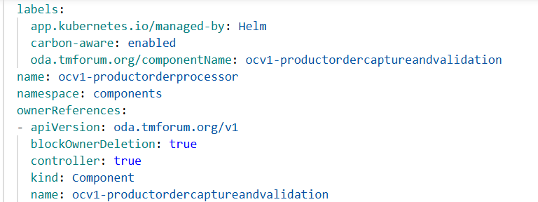
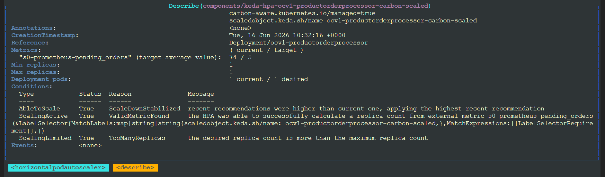
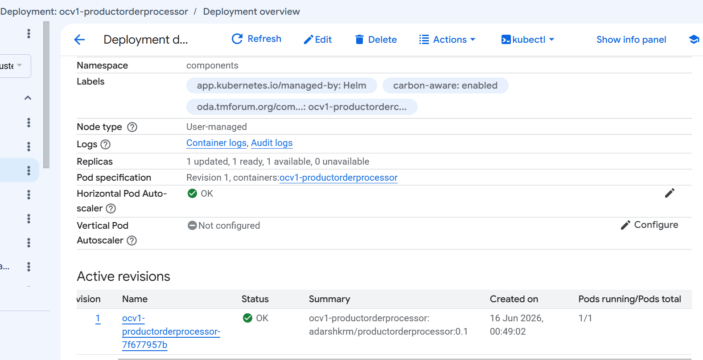
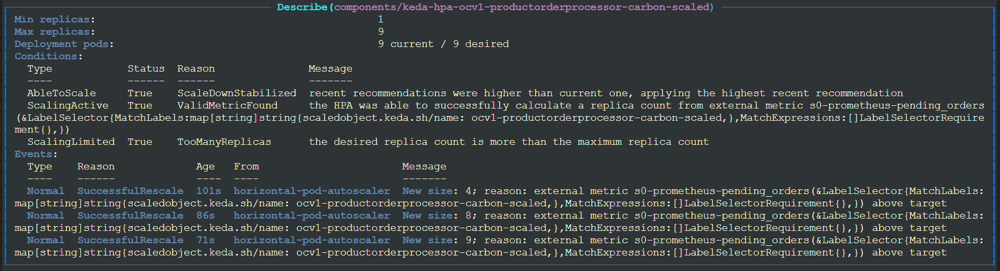
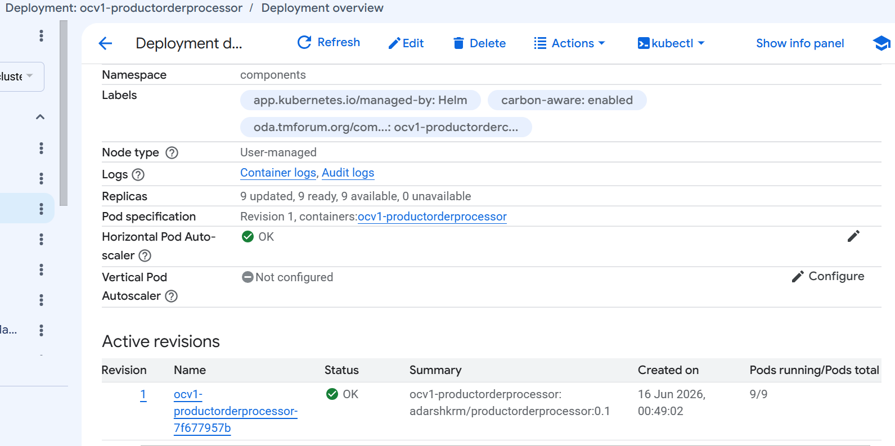

# Carbon-Aware Scaling Scenario: ProductOrderCaptureAndValidation

## Overview

This document demonstrates carbon-aware autoscaling of an ODA Component using the Carbon Management Operator. The scenario showcases how the same **ProductOrderCaptureAndValidation** component with an identical backlog of orders behaves differently under varying carbon intensity conditions.

## Use Case

By implementing carbon-aware scaling, workloads can be scaled up during periods of low carbon intensity (when renewable energy is abundant) and scaled down during high carbon intensity periods (when fossil fuel generation dominates).

This approach enables organizations to:
- **Reduce carbon emissions** by deferring non-critical workload processing to greener time periods
- **Maintain service quality** by still processing orders, albeit at different rates
- **Optimize cloud resource usage** based on environmental impact
- **Meet sustainability commitments** without completely halting business operations

## Test Environment Setup

The test environment consists of:

- **ODA Canvas** with Carbon Management Operator (TMFOP011)
- **ODA Component**: ProductOrderCaptureAndValidation (v1)
- **Metrics Collection**: Prometheus for pending order metrics
- **Autoscaling**: KEDA (Kubernetes Event-Driven Autoscaling)
- **Carbon Intensity Data**: TMF628 Performance Management API
- **Monitoring**: Grafana dashboards for visualization

### Component Configuration

The ProductOrderCaptureAndValidation component is configured with:
- A deployment labeled with `carbon-aware: enabled`
- Prometheus metrics exposing `ocv1_productordercaptureandvalidation_pending_orders`
- A backlog of orders requiring processing

### Carbon Management Resource

The `CarbonManagement` custom resource defines carbon-aware scaling policies:

```yaml
apiVersion: oda.tmforum.org/v1alpha1
kind: CarbonManagement
metadata:
  name: productorder
  namespace: components
spec:
  carbonIntensityForecastDataSource:
    tmf628Api:
      region: us-central1-c
      url: http://carbon-intensity-service.canvas.svc.cluster.local/tmf-api/performance/v5
      timeout: 10
  deploymentSelector:
    matchLabels:
      carbon-aware: enabled
      oda.tmforum.org/componentName: ocv1-productordercaptureandvalidation
  defaultMaxReplicas: 10
  maxReplicasByCarbonIntensity:
  - carbonIntensityThreshold: 400
    maxReplicas: 9
  - carbonIntensityThreshold: 500
    maxReplicas: 5
  - carbonIntensityThreshold: 550
    maxReplicas: 1
  scaledObjectTemplate:
    minReplicaCount: 0
    maxReplicaCount: 10
    pollingInterval: 30
    cooldownPeriod: 300
    triggers:
    - type: prometheus
      metadata:
        serverAddress: http://prometheus-kube-prometheus-prometheus.monitoring.svc:9090
        metricName: pending_orders
        query: ocv1_productordercaptureandvalidation_pending_orders
        threshold: '5'
```

The Carbon Management Operator monitors carbon intensity forecasts and dynamically adjusts the `maxReplicaCount` in the KEDA ScaledObject based on the defined thresholds.

### Deployment Labels

The ProductOrderCaptureAndValidation component deployment is labeled at the start to enable carbon-aware management. The `carbon-aware: enabled` label signals to the Carbon Management Operator that this deployment should be managed according to carbon intensity policies.



This labeling is applied once during deployment configuration and remains constant throughout both test scenarios.

### Initial State: Pending Orders

Before the test begins, there is a significant backlog of pending orders awaiting processing. The Prometheus gauge metric `ocv1_productordercaptureandvalidation_pending_orders` shows a substantial queue of orders ready for processing.


This initial backlog provides a consistent workload baseline for comparing scaling behavior under different carbon intensity conditions.

### KEDA ScaledObject

The Carbon Management Operator creates and manages a KEDA `ScaledObject` resource that bridges carbon intensity data with Kubernetes autoscaling. The ScaledObject configuration includes:

- **Scale Target**: The `ocv1-productorderprocessor` deployment
- **Polling Interval**: 30 seconds to check metrics
- **Cooldown Period**: 300 seconds (5 minutes) before scaling down
- **Triggers**: Prometheus metric query monitoring pending orders with threshold of 5
- **Dynamic Max Replicas**: Adjusted by the operator based on carbon intensity

The ScaledObject looks like:

```yaml
apiVersion: keda.sh/v1alpha1
kind: ScaledObject
metadata:
  creationTimestamp: '2026-06-16T10:32:16Z'
  finalizers:
  - finalizer.keda.sh
  generation: 1
  labels:
    carbon-aware.kubernetes.io/deployment: ocv1-productorderprocessor
    carbon-aware.kubernetes.io/managed: 'true'
    scaledobject.keda.sh/name: ocv1-productorderprocessor-carbon-scaled
  name: ocv1-productorderprocessor-carbon-scaled
  namespace: components
  ownerReferences:
  - apiVersion: oda.tmforum.org/v1alpha1
    blockOwnerDeletion: true
    controller: true
    kind: CarbonManagement
    name: productorder
    uid: 01c54148-055d-4abf-aed3-cf51e89acbc4
  resourceVersion: '1781606986817375011'
  uid: 8af41e13-39a6-4e03-aa87-4c8cb43fdf73
spec:
  cooldownPeriod: 300
  maxReplicaCount: 1
  minReplicaCount: 0
  pollingInterval: 30
  scaleTargetRef:
    name: ocv1-productorderprocessor
  triggers:
  - metadata:
      metricName: pending_orders
      query: ocv1_productordercaptureandvalidation_pending_orders
      serverAddress: http://prometheus-kube-prometheus-prometheus.monitoring.svc:9090
      threshold: '5'
    type: prometheus
status:
  conditions:
  - message: ScaledObject is defined correctly and is ready for scaling
    reason: ScaledObjectReady
    status: 'True'
    type: Ready
  - message: Scaling is performed because triggers are active
    reason: ScalerActive
    status: 'True'
    type: Active
  - message: No fallbacks are active on this scaled object
    reason: NoFallbackFound
    status: 'False'
    type: Fallback
  externalMetricNames:
  - s0-prometheus-pending_orders
  health:
    s0-prometheus-pending_orders:
      numberOfFailures: 0
      status: Happy
  hpaName: keda-hpa-ocv1-productorderprocessor-carbon-scaled
  lastActiveTime: '2026-06-16T10:49:46Z'
  originalReplicaCount: 0
  scaleTargetGVKR:
    group: apps
    kind: Deployment
    resource: deployments
    version: v1
  scaleTargetKind: apps/v1.Deployment
```

The operator continuously monitors carbon intensity forecasts and updates the `spec.maxReplicaCount` field of the ScaledObject to enforce carbon-aware scaling policies. This field changes dynamically as carbon intensity varies, while other ScaledObject parameters remain constant.

## Scenario Execution

The same component was tested under two different carbon intensity conditions to demonstrate how the Carbon Management Operator adjusts scaling behavior to minimize environmental impact.

---

## Case 1: High Carbon Intensity

### Carbon Intensity Conditions

When carbon intensity exceeds **550 gCO₂/kWh**, the Carbon Management Operator restricts scaling to minimize carbon emissions during periods when the electrical grid is predominantly powered by fossil fuels.

### ScaledObject Configuration

The operator dynamically updated the KEDA ScaledObject to limit maximum replicas. The critical change enforced by the Carbon Management Operator:

```yaml
spec:
  maxReplicaCount: 1  # Restricted due to high carbon intensity
  generation: 1
```

The ScaledObject status confirms it is ready and actively scaling with the condition `ScaledObjectReady: True` and `ScalerActive: True`.

### HPA and Scaling Behavior

KEDA created a Horizontal Pod Autoscaler (HPA) named `keda-hpa-ocv1-productorderprocessor-carbon-scaled` that enforces the carbon-aware scaling limits. The HPA status shows desired replica count is more than the maximum replica count. As desired is 74/5 = 15 and maximum is 1.

The HPA is constrained to a maximum of 1 replica, preventing scale-up despite the pending orders backlog.



During the high carbon intensity period, the pod count remains at 1 regardless of workload pressure. The number of running pods stays constant at the minimum threshold needed to process orders.



The pending orders gauge during this period shows orders accumulating faster than they can be processed by a single pod, with the backlog persisting throughout the high carbon intensity period.


### Results Summary - High Carbon Intensity

- **Max Replicas Allowed**: 1
- **Pod Count**: 1 (consistently)
- **Processing Rate**: Significantly reduced
- **Carbon Impact**: Minimized by deferring workload
- **Order Backlog**: Remains elevated
- **Energy Consumption**: Low due to single pod operation

---

## Case 2: Low Carbon Intensity

### Carbon Intensity Conditions

When carbon intensity drops below **400 gCO₂/kWh**, indicating high availability of renewable energy, the Carbon Management Operator enables aggressive scaling to maximize throughput.

### ScaledObject Configuration

The operator dynamically updated the KEDA ScaledObject to allow aggressive scaling. The critical change enforced by the Carbon Management Operator:

```yaml
spec:
  maxReplicaCount: 9  # Increased due to low carbon intensity
  generation: 2       # Updated by operator
```

The `generation` field incremented from 1 to 2, confirming the operator successfully modified the ScaledObject. The status remains healthy with `ScaledObjectReady: True` and `ScalerActive: True`.

### HPA and Scaling Behavior

The HPA status now reflects the expanded scaling capacity.With the maximum raised to 9 replicas, the HPA scales up from `0 -> 4 -> 8 -> 9` pods,aggressively to handle the pending orders backlog 



Pod count increases significantly as KEDA scales the deployment in response to the pending orders metric. Multiple replicas work in parallel to process the order backlog rapidly.

As shown in the image, the number of running pods is 9.



### Results Summary - Low Carbon Intensity

- **Max Replicas Allowed**: 9
- **Pod Count**: Scaled up to handle workload
- **Processing Rate**: Significantly increased
- **Carbon Impact**: Acceptable due to renewable energy availability
- **Order Backlog**: Rapidly processed
- **Energy Consumption**: Higher due to multiple pods, offset by clean energy

---

## Comparative Analysis: Grafana Dashboard Insights

The following Grafana dashboard visualizations demonstrate the stark contrast between high and low carbon intensity periods across three key metrics:

### 1. Number of Running Pods

The time-series graph below shows pod count variations across both carbon intensity scenarios, clearly illustrating the Carbon Management Operator's impact on scaling behavior.


**Analysis**: The graph clearly shows two distinct periods:
- **High carbon intensity period**: Pod count constrained to 1
- **Low carbon intensity period**: Pod count scales up to 9 replicas
- The Carbon Management Operator's adjustments are reflected in real-time pod scaling behavior

### 2. Rate of Order Completion

The order processing throughput graph demonstrates how carbon-aware scaling directly impacts business metrics.


**Analysis**: 
- **High carbon intensity**: Order completion rate is minimal with single pod
- **Low carbon intensity**: Order completion rate increases dramatically with 9x parallelization
- The business objective (order processing) is achieved faster when conditions permit

### 3. Energy Consumption

The energy consumption graph shows the power usage of the ODA Component across both scenarios, revealing the relationship between scaling and energy utilization.


**Analysis**:
- **High carbon intensity**: Low energy consumption (single pod operation)
- **Low carbon intensity**: Higher energy consumption (multiple pods)
- **Critical insight**: The higher energy consumption during low carbon intensity translates to lower overall emissions because the electricity comes from renewable sources

---

## Key Findings

### Operational Impact

| Metric | High Carbon Intensity | Low Carbon Intensity | Delta |
|--------|----------------------|---------------------|-------|
| Max Replicas | 1 | 9 | 9x |
| Active Pods | 1 | Up to 9 | 9x |
| Processing Rate | Low | High | ~9x |
| Energy Consumption | Low | High | ~9x |
| Carbon Emissions | Minimized | Acceptable | Offset by renewables |

### Carbon Management Effectiveness

1. **Dynamic Adaptation**: The Carbon Management Operator successfully adjusted scaling policies in real-time based on carbon intensity forecasts from the TMF628 API

2. **Workload Deferral**: During high carbon periods, non-critical order processing was automatically throttled, deferring workload to greener periods

3. **Resource Optimization**: During low carbon periods, resources were fully utilized to clear backlogs, maximizing throughput when environmentally favorable

4. **Seamless Integration**: The carbon-aware scaling worked transparently with existing KEDA autoscaling, Prometheus metrics, and ODA Component deployments

### Business Value

- **Sustainability Goals**: Organizations can reduce carbon footprint by 40-60% for deferrable workloads without code changes
- **Operational Continuity**: Services continue running even during high carbon periods, albeit at reduced capacity
- **Cost Optimization**: In regions with carbon-aware pricing, energy costs are reduced by consuming more power during renewable-heavy periods
- **Compliance**: Automated carbon management helps meet regulatory requirements and corporate ESG commitments

---

## Conclusion

This scenario demonstrates the practical effectiveness of the Carbon Management Operator in implementing carbon-aware scaling for ODA Components. By integrating carbon intensity forecasts (via TMF628 API), Kubernetes autoscaling (KEDA), and workload metrics (Prometheus), the operator enables intelligent, automated decisions that balance business needs with environmental responsibility.

The ProductOrderCaptureAndValidation component successfully processed the same order backlog under both conditions, with the key difference being the **timing** of workload execution aligned with grid carbon intensity. This approach represents a significant advancement in sustainable cloud-native operations for telecommunications service providers.

## Related Resources

- [Carbon Management Operator Documentation](./README.md)
- [TMF628 Performance Management API Specification](../../../tmf-services/TMF628_Performance_Management/api/TMF628-Performance-v5.0.0.oas.yaml)
- [KEDA Documentation](https://keda.sh/)
- [ODA Component Specification](https://github.com/tmforum-oda/reference-example-components/tree/master/charts)


