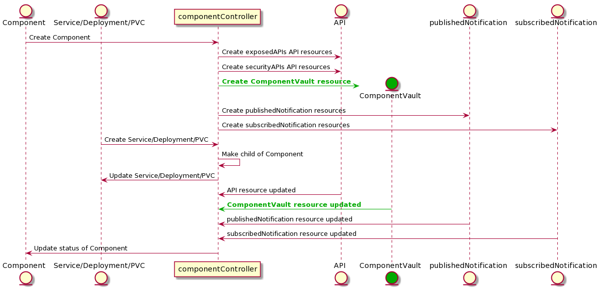

# Component Operator - Introduction

This is the reference implementaiton of a component controller that takes metadata from ODA Component and uses it to automatically configure the exposedAPIs, securityAPIs ${\color{green}, SecretsManagement}$, dependentAPIs (and in the future other services). The diagram below shows how the component controller interacts with the different Kubernetes entities (via the Kubernetes API).




[plantUML code](sequenceDiagrams/componentOperator.puml)


The component controller written in Python, using the [KOPF](https://kopf.readthedocs.io/) framework to listen for components being deployed in the ODA Canvas. 


**Interactive development and Testing of operator using KOPF**

The production operator will execute inside a Kubernetes Pod. For development and testing, it is possible to run the operator on the command-line (or inside a debugger). Kopf includes a `--standalone` attribute to allow the operator to execute in a standalone mode. This means that the operator will run independently, without relying on any external controllers or frameworks. It is particularly useful for development and debugging purposes, as it allows you to run and test your operator locally on your machine.

Run locally in command-line: 
```
kopf run --namespace=components --standalone .\componentOperator.py
```

This mode will use the kubeconfig file (typically located at `$HOME/.kube/config`) to as long as `kubectl` is correctly configured for your cluster, the operator should work. 

You need to ensure you turn-off the operator execusing in Kubernetes (for example, by setting the replicas to 0 in the operator Deployment).

The command above will execute just the component operator. You will also need to execute the other operators relavant for your Canvas implementation - these can be executed in separate terminal command-lines.


# Buildautomation and Versioning

The build and release process for docker images is described here:
[/docs/developer/work-with-dockerimages.md](/docs/developer/work-with-dockerimages.md)


