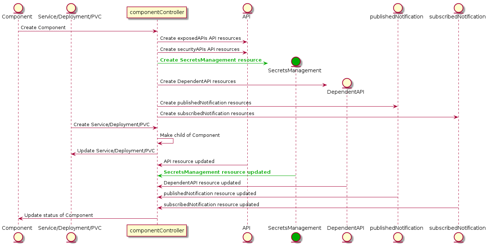

# Component Operator - Introduction

This is the reference implementaiton of a component controller that takes metadata from ODA Component and uses it to automatically configure the exposedAPIs, securityAPIs (and in the future other services). The diagram below shows how the component controller interacts with the different Kubernetes entities (via the Kubernetes API).

[plantUML code](sequenceDiagrams//componentOperator.puml)

The component controller written in Python, using the [KOPF](https://kopf.readthedocs.io/) framework to listen for components being deployed in the ODA Canvas. 

**Testing KOPF module**

Run: `kopf run --namespace=components --standalone .\componentOperator.py`
