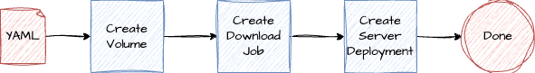

# MLModel Kubernetes Operator Example
A Kubernetes Operator created as a POC to showcase how to handle long running processes and tasks in a Kubernetes cluster.

# Intro
Use case: Deployment of a machine learning model inside a Kubernetes cluster.

By creating a MLModel resource, the operator will deploy a pod with the model and expose it as a service. It will also handle the downloading of the model with a kubernetes job, and failure states.



## Why?
This project is a POC to showcase how to handle long running processes and tasks in a Kubernetes cluster. It is a simple example of how to create a Kubernetes operator using the operator framework.

As such the following workflows have been implemented:
- Simple sequential flow -> success scenario just like the diagram above.
  - Statuses of the MLModel will be updated as each step is completed.
- Failure scenario -> The operator will handle the failure of the download job and the pod. The status of the MLModel will be updated to Failed, with a message of the error.
- Deletion of the MLModel -> The operator will delete the pod and the service when the MLModel is deleted.

## Important notes

As this is a POC, the following features have not been implemented:
- **Proper model update**. So far, the operator will properly identify MLModel resource updates based on the `Generation` of the resource inside Kubernetes. However, it will delete all resources and start again.

In a production scenario, the above cases should be implemented properly depending on the business scenario.

### If you use arm64 architecture / Apple Silicon...

The final step uses the `tensorflow/serving` image, which (at the time of this writing) is not available for the arm64 architecture. Since those images need an environment with AVX instruction set, or a docker environment with proper emulation of this instruction set, some MacOS docker environments (such as orbstack) will throw an error inside the running pod mentioning :"Illegal instruction" or something similar.

If that is the case, you can change the `DockerImagePoc` variable inside the `mlmodel_controller.go` file to something calling a dummy server, like `ealen/echo-server`. This will allow you to test the operator without the final step. It's a POC after all, and you can get away with it :) 

## Technology
This uses the kubernetes [operator framework](https://operatorframework.io/), officially supported by CNCF. Therefore most of the instructions below concern the default documentation of the framework.


# Getting Started

### Prerequisites
- go version v1.22.0+
- docker version 17.03+.
- kubectl version v1.11.3+.
- Access to a Kubernetes v1.11.3+ cluster.

### To Deploy on the cluster
**Build and push your image to the location specified by `IMG`:**

```sh
make docker-build docker-push IMG=<some-registry>/demo-mlmodel-operator:tag
```

**NOTE:** This image ought to be published in the personal registry you specified.
And it is required to have access to pull the image from the working environment.
Make sure you have the proper permission to the registry if the above commands don’t work.

**Install the CRDs into the cluster:**

```sh
make install
```

**Deploy the Manager to the cluster with the image specified by `IMG`:**

```sh
make deploy IMG=<some-registry>/demo-mlmodel-operator:tag
```

> **NOTE**: If you encounter RBAC errors, you may need to grant yourself cluster-admin
privileges or be logged in as admin.

**Create instances of your solution**
You can apply the samples (examples) from the config/sample:

```sh
kubectl apply -k config/samples/
```

>**NOTE**: Ensure that the samples has default values to test it out.

### To Uninstall
**Delete the instances (CRs) from the cluster:**

```sh
kubectl delete -k config/samples/
```

**Delete the APIs(CRDs) from the cluster:**

```sh
make uninstall
```

**UnDeploy the controller from the cluster:**

```sh
make undeploy
```

## Project Distribution

Following are the steps to build the installer and distribute this project to users.

1. Build the installer for the image built and published in the registry:

```sh
make build-installer IMG=<some-registry>/demo-mlmodel-operator:tag
```

NOTE: The makefile target mentioned above generates an 'install.yaml'
file in the dist directory. This file contains all the resources built
with Kustomize, which are necessary to install this project without
its dependencies.

2. Using the installer

Users can just run kubectl apply -f <URL for YAML BUNDLE> to install the project, i.e.:

```sh
kubectl apply -f https://raw.githubusercontent.com/<org>/demo-mlmodel-operator/<tag or branch>/dist/install.yaml
```

## Contributing
// TODO(user): Add detailed information on how you would like others to contribute to this project

**NOTE:** Run `make help` for more information on all potential `make` targets

More information can be found via the [Kubebuilder Documentation](https://book.kubebuilder.io/introduction.html)

## License

Copyright 2025.

Licensed under the Apache License, Version 2.0 (the "License");
you may not use this file except in compliance with the License.
You may obtain a copy of the License at

    http://www.apache.org/licenses/LICENSE-2.0

Unless required by applicable law or agreed to in writing, software
distributed under the License is distributed on an "AS IS" BASIS,
WITHOUT WARRANTIES OR CONDITIONS OF ANY KIND, either express or implied.
See the License for the specific language governing permissions and
limitations under the License.

