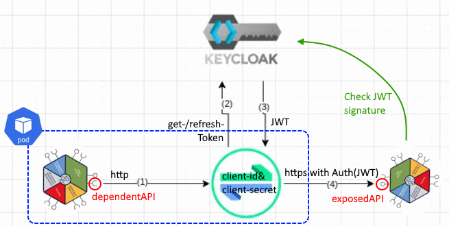

# OAuth2 EnvoyFilter Demo


## Overview




## set default namespace to "components"

```
kubectl config set-context --current --namespace=components
```


### remove old data


```
helm uninstall clientcomp
helm uninstall targetcomp
helm uninstall jedionlytarget
helm uninstall proxy-extecho


kubectl delete exposedapi externalapi-productcatalogmanagement
kubectl delete serviceentry add-https
kubectl delete destinationrule demo-b-productcatalogmanagement-downstreamproductcatalog-add-https
kubectl delete destinationrule clientcomp-echoclient-downstreamproductcatalog-add-https
kubectl delete destinationrule clientcomp-echoclient-echotarget-add-https
kubectl delete destinationrule clientcomp-echoclient-jedionlytarget-add-https
kubectl delete destinationrule clientcomp-echoclient-extecho-add-https 
kubectl delete secret envoy-oauth2-secrets 
kubectl delete envoyfilter demo-b-productcatalogmanagement-envoyfilter-oauth2
kubectl delete envoyfilter clientcomp-echoclient-envoyfilter-oauth2
kubectl delete configmap deps-clientcomp-echoclient
```

check cleanup

```
kubectl get serviceentries,envoyfilters,destinationrules,secrets,exposedapis,dependentapis,components -n components
```


## Install Credentials-Management-Operator (Prerequisite)

find client-secret for client "credentialsmanagement-operator" in realm "odari":

https://canvas-keycloak.ihc-dt.cluster-1.de/

install Credentials-Manager-Operator using helm

```
helm upgrade --install canvas-credman-op -n canvas charts/credentialsmanagement-operator --set=credentials.client_secret=****
```

show there are no existing secrets

```
kubectl get secrets
```

## deploy targets

```
helm upgrade --install targetcomp source/operators/oauth2EnvoyfilterOperator/helm/echotarget
```

```
helm upgrade --install jedionlytarget source/operators/oauth2EnvoyfilterOperator/helm/jedionlytarget
```

```
helm upgrade --install proxy-extecho source/operators/oauth2EnvoyfilterOperator/helm/proxy-extecho
```

### take a short look at the sources

https://github.com/tmforum-oda/oda-canvas/tree/feature/362-authentication-adding-authentication-to-outbound-api-calls-from-component/source/operators/oauth2EnvoyfilterOperator/helm


(optional) https://github.com/ODA-CANVAS-FORK/oda-canvas-notes/blob/main/apps/echoservice/app/app.py#L83-L110


### verify credentials management works

```
kubectl canvaslogs deployment credentialsmanagement-operator
```

The secrets now exist:

```
kubectl get secret targetcomp-echotarget-secret -oyaml
```

extract secret

```
kubectl get secret targetcomp-echotarget-secret -ojsonpath='{.data.client_secret}' | base64 -d
```

compare with credentials in keycloak


### check components are ready

```
kubectl get components
```

## deploy client with dependent apis

```
helm upgrade --install clientcomp source/operators/oauth2EnvoyfilterOperator/helm/echoclient
```

show exposedapi

```
kubectl get exposedapis
```

```
  NAME                                 API_ENDPOINT                                      IMPLEMENTATION_READY
  clientcomp-echoclient-echo           https://components.ihc-dt.cluster-1.de/ip         true
  jedionlytarget-jedionlytarget-echo   https://components.ihc-dt.cluster-1.de/jedionly   true
  proxy-extecho-proxy-extecho          https://echo.free.beeceptor.com                   true
  targetcomp-echotarget-echo           https://components.ihc-dt.cluster-1.de/echo       true
```

open endpoint in browser

https://components.ihc-dt.cluster-1.de/ip


## log into POD

```
kubectl get pods -Lapp -Limpl
CLIENTCOMP_POD=$(kubectl get pods -limpl=clientcomp-echo -o=jsonpath="{.items[*].metadata.name}")
kubectl exec -it $CLIENTCOMP_POD -- /bin/bash
```

### query target comp

```
curl https://components.ihc-dt.cluster-1.de/echo
```

GET is not allowed, use POST

```
curl -XPOST https://components.ihc-dt.cluster-1.de/echo
```

401 unauthorized


### query public echo

```
curl  https://echo.free.beeceptor.com
```

Mention protocol "https" and very few header attribute

```
curl  http://echo.free.beeceptor.com
```

now protocol is "http" and much more header attributes with "X-Envoy-..." automatically added by Istio

injection only possible with http, because https is e2e encrypted.


## Instal OAUTH2 operator

```
helm upgrade --install canvas-oauth2-op -n canvas charts/experimental/oauth2-envoyfilter-operator
```


## look into logs:

```
kubectl canvaslogs deployment canvas-oauth2-op
```

add url to dependency configmap


```
kubectl get configmap deps-clientcomp-echoclient -oyaml
```

restart client to recognize new env vars:

```
kubectl rollout restart deployment clientcomp-echo   
```


## log into POD

```
kubectl get pods -Lapp -Limpl

CLIENTCOMP_POD=$(kubectl get pods -limpl=clientcomp-echo -o=jsonpath="{.items[*].metadata.name}")
kubectl exec -it $CLIENTCOMP_POD -- /bin/bash
```

### look at env vars

```
env | grep DEP
```

```
  DEPENDENCY_URL_ECHOTARGET=http://components.ihc-dt.cluster-1.de/echo
  DEPENDENCY_URL_JEDIONLYTARGET=http://components.ihc-dt.cluster-1.de/jedionly
  DEPENDENCY_URL_EXTECHO=http://echo.free.beeceptor.com
```

### call extecho

```
curl $DEPENDENCY_URL_EXTECHO
```

interesting: protocol "https"

```
echo $DEPENDENCY_URL_EXTECHO
```

do a call with https:

```
curl https://echo.free.beeceptor.com
```

now only the same few headers as before are set

again call with http:

```
curl $DEPENDENCY_URL_EXTECHO
```

copy token and paste into 

https://developer.telekom.de/tooling/jwt

payload:

```json
{
    "exp": 1741770728,
    "iat": 1741770428,
    "jti": "b5ece68b-034e-45f5-8f52-1f1ecf3f187c",
    "iss": "http://canvas-keycloak.canvas.svc.cluster.local:8083/auth/realms/odari",
    "aud": "account",
    "sub": "12b72716-818b-4536-997a-ff262b1fa425",
    "typ": "Bearer",
    "azp": "clientcomp-echoclient",
    "acr": "1",
    "realm_access": {
        "roles": [
            "offline_access",
            "uma_authorization",
            "default-roles-odari"
        ]
    },
    "resource_access": {
        "account": {
            "roles": [
                "manage-account",
                "manage-account-links",
                "view-profile"
            ]
        }
    },
    "scope": "email profile",
    "clientHost": "10.92.0.39",
    "clientId": "clientcomp-echoclient",
    "email_verified": false,
    "preferred_username": "service-account-clientcomp-echoclient",
    "clientAddress": "10.92.0.39"
}
```

payload contains issuer "iss", authorized party "azp", audience "aud", expiration timestamp "exp" and also the list of realm roles

## call echo target

now we can access the echo target which checks for a valid JWT

```
curl -XPOST $DEPENDENCY_URL_ECHOTARGET
```

pretty printed:

``` 
curl -s -XPOST $DEPENDENCY_URL_ECHOTARGET | jq .
```


## jedionlytarget

the called service can check for all information provided in the payload, eg. the realm roles.

therefore we have deployed the third target

```
echo $DEPENDENCY_URL_JEDIONLYTARGET
```

```
  http://components.ihc-dt.cluster-1.de/jedionly 
```

lets first try to access without injection by switching to https

```
curl -XPOST https://components.ihc-dt.cluster-1.de/jedionly
```

we get a 401 with the message "error in x-gateway-token",
which makes sense, as there is no token at all.

call with token:

```
curl -XPOST $DEPENDENCY_URL_JEDIONLYTARGET 
```

again we get a 401, but now with the error message "you are not a jedi".


KeyCloak: https://canvas-keycloak.ihc-dt.cluster-1.de/auth/admin/master/console/#/odari/users
select user "service-account-clientcomp-echoclient" 


Role-mapping > assign role

now it may take one or two minutes, until the token is refreshed.

look at sources:

https://github.com/ODA-CANVAS-FORK/oda-canvas-notes/blob/948976ef1d5d11c621aef2ef6a06ce8fc0078e92/apps/echoservice/app/app.py#L145-L148


pretty print result

```
curl -s -XPOST $DEPENDENCY_URL_JEDIONLYTARGET | jq .
```

copying the JWT into the editor again

https://developer.telekom.de/tooling/jwt


now the "jedi" role is in the list.


# closing

That was the live demo.

Let´s take a final look which istio/envoy objects were created by the oauth2 operator to make the magic happen:

```
kubectl get serviceentries,envoyfilters,destinationrules,secrets -n components
```

```
  NAME                                         HOSTS                                                          LOCATION   RESOLUTION   AGE
  serviceentry.networking.istio.io/add-https   ["components.ihc-dt.cluster-1.de","echo.free.beeceptor.com"]              DNS          62m

  NAME                                                                       AGE
  envoyfilter.networking.istio.io/clientcomp-echoclient-envoyfilter-oauth2   62m

  NAME                                                                                 HOST                             AGE
  destinationrule.networking.istio.io/clientcomp-echoclient-echotarget-add-https       components.ihc-dt.cluster-1.de   62m
  destinationrule.networking.istio.io/clientcomp-echoclient-extecho-add-https          echo.free.beeceptor.com          62m
  destinationrule.networking.istio.io/clientcomp-echoclient-jedionlytarget-add-https   components.ihc-dt.cluster-1.de   62m

  NAME                                          TYPE                 DATA   AGE
  secret/clientcomp-echoclient-secret           Opaque               2      63m
  secret/envoy-oauth2-secrets                   Opaque               1      62m
  secret/jedionlytarget-jedionlytarget-secret   Opaque               2      64m
  secret/sh.helm.release.v1.clientcomp.v1       helm.sh/release.v1   1      63m
  secret/sh.helm.release.v1.jedionlytarget.v1   helm.sh/release.v1   1      65m
  secret/sh.helm.release.v1.proxy-extecho.v1    helm.sh/release.v1   1      65m
  secret/sh.helm.release.v1.targetcomp.v1       helm.sh/release.v1   1      65m
  secret/targetcomp-echotarget-secret           Opaque               2      65m
```


If you are interested in the details, how the oauth2 operator works, 
you can take a look at the github [issue #362](https://github.com/tmforum-oda/oda-canvas/issues/362).
There is a detailed description what has to be done to manually configure istio to achieve this.


# error analysis


inject error at token generation:

```
root@demo-b-prodcatapi-6675466b75-nrgtl:/src# curl http://echo.free.beeceptor.com/echo
Failed to inject credential.root@demo-b-prodcatapi-6675466b75-nrgtl:/src# curl http://echo.free.beeceptor.com/echo
```

## log istiod


```
kubectl logs -n istio-system deployment/istiod
```

```
...
2025-03-04T14:59:32.434877Z     warn    delta   ADS:LDS: ACK ERROR demo-a-prodcatapi-5988ff6d7-q8rr2.components-22 Internal:Error adding/updating listener(s) 0.0.0.0_10259: paths must refer to an existing path in the system: '/envoy_secrets/oauth2secs/demo-a-productcatalogmanagement.yaml' does not exist
0.0.0.0_9100: paths must refer to an existing path in the system: '/envoy_secrets/oauth2secs/demo-a-productcatalogmanagement.yaml' does not exist
0.0.0.0_10255: paths must refer to an existing path in the system: '/envoy_secrets/oauth2secs/demo-a-productcatalogmanagement.yaml' does not exist
...
```


## log sidecar

```
kubectl logs -n components demo-b-prodcatapi-7d8c788c77-v7b9h istio-proxy
```

```
...
2025-03-04T15:35:56.042168Z     error   envoy credential_injector external/envoy/source/extensions/http/injected_credentials/oauth2/token_provider.cc:111       onGetAccessTokenFailure: Failed to get access token      thread=12
2025-03-04T15:35:56.042254Z     error   envoy credential_injector external/envoy/source/extensions/http/injected_credentials/oauth2/oauth_client.cc:74  Oauth response code: 404        thread=12
2025-03-04T15:35:56.042263Z     error   envoy credential_injector external/envoy/source/extensions/http/injected_credentials/oauth2/oauth_client.cc:75  Oauth response body: {"error":"Realm does not exist"}   thread=12
2025-03-04T15:35:56.042266Z     error   envoy credential_injector external/envoy/source/extensions/http/injected_credentials/oauth2/token_provider.cc:111       onGetAccessTokenFailure: Failed to get access token      thread=12
2025-03-04T15:35:56.042356Z     error   envoy credential_injector external/envoy/source/extensions/http/injected_credentials/oauth2/oauth_client.cc:74  Oauth response code: 404        thread=12
2025-03-04T15:35:56.042370Z     error   envoy credential_injector external/envoy/source/extensions/http/injected_credentials/oauth2/oauth_client.cc:75  Oauth response body: {"error":"Realm does not exist"}   thread=12
2025-03-04T15:35:56.042372Z     error   envoy credential_injector external/envoy/source/extensions/http/injected_credentials/oauth2/token_provider.cc:111       onGetAccessTokenFailure: Failed to get access token      thread=12
```


