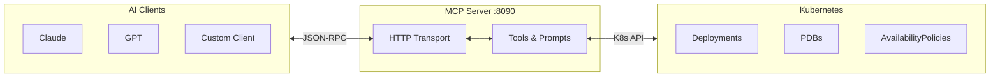

# PDB Management Operator

**Intelligent Pod Disruption Budget Management for Kubernetes & ODA Canvas**

A sophisticated Kubernetes operator that automatically creates and manages Pod Disruption Budgets (PDBs) based on availability requirements, organizational policies, and component functions. Designed specifically for the TM Forum Open Digital Architecture (ODA) Canvas with enterprise-grade observability and policy enforcement.

## Key Features

- **Dual Configuration Model**: Annotation-based and policy-based PDB management
- **Intelligent Policy Enforcement**: Three enforcement modes (Strict, Flexible, Advisory)
- **Component Intelligence**: Automatic availability classification based on component function
- **Maintenance Windows**: Time-based PDB suspension for scheduled maintenance
- **AI-Powered Analysis**: MCP server for cluster analysis and intelligent recommendations
- **Enterprise Ready**: Comprehensive metrics, tracing, audit logging, and admission webhooks
- **ODA Canvas Native**: Built-in support for TM Forum ODA component architecture
- **High Performance**: Optimized for 200+ deployments with intelligent caching
- **Security First**: RBAC, admission control, and compliance-ready audit trails

## Quick Start

### Prerequisites

- Kubernetes 1.21+
- Go 1.25+ (for development)
- cert-manager (for webhook TLS certificates)

### Installation

#### Option 1: Quick Deployment

```bash
# Deploy to canvas namespace
kubectl create namespace canvas
kubectl apply -k config/default/

# Verify installation
kubectl get pods -n canvas
kubectl get crd | grep availability
```

#### Option 2: With Webhooks (Recommended for Production)

```bash
# Install cert-manager first
kubectl apply -f https://github.com/cert-manager/cert-manager/releases/download/v1.13.0/cert-manager.yaml

# Deploy operator with webhooks
kubectl apply -k config/certmanager/
kubectl apply -k config/webhook/
kubectl apply -k config/default/

# Enable webhooks
kubectl patch deployment pdb-management-controller-manager -n canvas \
  --type='json' -p='[{"op": "replace", "path": "/spec/template/spec/containers/0/args", "value": ["--leader-elect", "--enable-webhook=true"]}]'
```

### Basic Usage

Create a deployment with availability annotations:

```yaml
apiVersion: apps/v1
kind: Deployment
metadata:
  name: my-api
  annotations:
    oda.tmforum.org/availability-class: "high-availability"
    oda.tmforum.org/component-function: "core"
spec:
  replicas: 6
  # ... rest of deployment spec
```

The operator automatically creates a PDB:

```bash
kubectl get pdb my-api-pdb
# NAME         MIN AVAILABLE   MAX UNAVAILABLE   ALLOWED DISRUPTIONS   AGE
# my-api-pdb   75%            N/A               1                     5s
```

## Core Concepts

### Annotation-Based Management

Control PDB creation directly through deployment annotations:

```yaml
metadata:
  annotations:
    # Required: Availability class
    oda.tmforum.org/availability-class: "high-availability"

    # Optional: Component function (affects PDB calculation)
    oda.tmforum.org/component-function: "security"

    # Optional: Component name for identification
    oda.tmforum.org/componentName: "authentication-service"

    # Optional: Maintenance window
    oda.tmforum.org/maintenance-window: "02:00-04:00 UTC"

    # Optional: Override reason (when required by policy)
    oda.tmforum.org/override-reason: "Emergency deployment"
```

### Policy-Based Management

Define organization-wide availability policies using custom resources:

```yaml
apiVersion: availability.oda.tmforum.org/v1alpha1
kind: AvailabilityPolicy
metadata:
  name: production-security-policy
  namespace: canvas
spec:
  # Availability requirement
  availabilityClass: mission-critical

  # Enforcement behavior
  enforcement: strict # strict|flexible|advisory
  priority: 1000 # Higher number = higher priority

  # Component selection
  componentSelector:
    componentFunctions: [security]
    namespaces: [production, staging]
    matchLabels:
      tier: critical

  # Maintenance windows
  maintenanceWindows:
    - start: "02:00"
      end: "04:00"
      timezone: "UTC"
      daysOfWeek: [0, 6] # Weekends only
```

## Availability Classes

| Class               | Core/Management | Security     | Description                    |
| ------------------- | --------------- | ------------ | ------------------------------ |
| `non-critical`      | 20%             | 50%          | Development, testing workloads |
| `standard`          | 50%             | 75%          | Typical production services    |
| `high-availability` | 75%             | 75%          | Important business services    |
| `mission-critical`  | 90%             | 90%          | Critical infrastructure        |
| `custom`            | User-defined    | User-defined | Custom PDB configuration       |

**Note**: Security components are automatically upgraded to higher availability levels.

## Enforcement Modes

### Strict Enforcement

**Policy always wins** - annotations are ignored completely.

```yaml
spec:
  enforcement: strict
  # Annotations have no effect - policy configuration is always used
```

**Use Cases**: Compliance requirements, security policies, regulatory environments.

### Flexible Enforcement

**Annotations accepted if they meet minimum requirements**.

```yaml
spec:
  enforcement: flexible
  minimumClass: standard # Annotations can be standard or higher
```

**Behavior**:

- Annotation ≥ minimum class → Annotation used
- Annotation < minimum class → Minimum class enforced

**Use Cases**: Teams can opt for higher availability but can't go below standards.

### Advisory Enforcement

**Annotations preferred** with controlled override capabilities.

```yaml
spec:
  enforcement: advisory
  allowOverride: true
  overrideRequiresReason: true # Must provide justification
```

**Use Cases**: Development environments, flexible policies with audit trails.

## Component Function Intelligence

The operator automatically classifies and optimizes based on component function:

### Automatic Classification

```go
// Operator automatically detects component function from:
// 1. oda.tmforum.org/component-function annotation
// 2. Deployment name patterns (auth*, security*, *-controller, etc.)
// 3. Labels and metadata
```

### Function-Based Behavior

**Security Components**:

- Automatically upgraded to higher availability
- Enhanced monitoring and audit logging
- Stricter policy enforcement by default

**Management Components**:

- Controllers, operators, admin interfaces
- Balanced availability with operational needs

**Core Components**:

- Business logic and API services
- Standard availability mappings

## Maintenance Windows

### Annotation-Based Windows

```yaml
metadata:
  annotations:
    oda.tmforum.org/maintenance-window: "02:00-04:00 UTC"
```

### Policy-Based Windows

```yaml
spec:
  maintenanceWindows:
    - start: "02:00"
      end: "04:00"
      timezone: "America/New_York"
      daysOfWeek: [1, 2, 3, 4, 5] # Weekdays
    - start: "00:00"
      end: "23:59"
      timezone: "UTC"
      daysOfWeek: [0, 6] # Weekends - full day maintenance
```

**Behavior During Maintenance**:

- PDB `minAvailable` temporarily set to 0
- Maintenance mode annotation added to PDB
- Automatic restoration when window ends
- Audit events generated for compliance

## Advanced Configuration

### Custom Availability Classes

```yaml
apiVersion: availability.oda.tmforum.org/v1alpha1
kind: AvailabilityPolicy
metadata:
  name: database-custom-policy
spec:
  availabilityClass: custom
  customPDBConfig:
    minAvailable: 2 # Absolute number instead of percentage
    # OR use maxUnavailable: 1
    unhealthyPodEvictionPolicy: "IfHealthyBudget" # or "AlwaysAllow"
  componentSelector:
    matchLabels:
      tier: database
```

### Override Controls

```yaml
spec:
  # Require specific annotation to allow overrides
  overrideRequiresAnnotation: "ops.company.com/emergency-override"

  # Require justification for overrides
  overrideRequiresReason: true

  # Control who can override
  allowOverride: true
```

Example deployment with controlled override:

```yaml
metadata:
  annotations:
    oda.tmforum.org/availability-class: "non-critical"
    oda.tmforum.org/override-reason: "Emergency incident response - approved by SRE team"
    ops.company.com/emergency-override: "INCIDENT-2024-001"
```

### Multi-Criteria Component Selection

```yaml
spec:
  componentSelector:
    # All criteria must match (AND logic)
    namespaces: [production, staging]
    componentNames: [payment-service, auth-service]
    componentFunctions: [core, security]

    # Standard Kubernetes label selectors
    matchLabels:
      tier: critical
      team: platform

    # Complex expressions
    matchExpressions:
      - key: environment
        operator: In
        values: [prod, staging]
      - key: criticality
        operator: NotIn
        values: [low, experimental]
```

## Monitoring & Observability

### Key Metrics

The operator exports comprehensive Prometheus metrics:

```bash
# PDB lifecycle
pdb_management_pdbs_created_total
pdb_management_pdbs_updated_total
pdb_management_pdbs_deleted_total

# Performance
pdb_management_reconciliation_duration_seconds
pdb_management_cache_hits_total
pdb_management_cache_misses_total

# Policy enforcement
pdb_management_enforcement_decisions_total
pdb_management_override_attempts_total
pdb_management_policy_conflicts_total

# Operator health
pdb_management_operator_info
pdb_management_maintenance_window_active
```

### Grafana Dashboards

Pre-built dashboards available in `config/grafana/`:

- **Overview**: High-level metrics and health status
- **Policy Analysis**: Policy effectiveness and compliance
- **Troubleshooting**: Error diagnosis and performance
- **Distributed Tracing**: End-to-end request correlation

### Structured Audit Logging

```json
{
  "level": "info",
  "audit": {
    "action": "PDB_CREATED",
    "resource": "payment-service-pdb",
    "result": "success",
    "metadata": {
      "availabilityClass": "mission-critical",
      "enforcement": "strict",
      "policy": "security-policy",
      "durationMs": 142
    }
  }
}
```

### Distributed Tracing

Full OpenTelemetry integration:

```bash
# Enable tracing
kubectl set env deployment/pdb-management-controller-manager -n canvas \
  ENABLE_TRACING=true \
  OTEL_EXPORTER_OTLP_ENDPOINT=http://jaeger:4317
```

## Troubleshooting

### Common Issues

#### No PDB Created

```bash
# Check operator logs
kubectl logs -n canvas deployment/pdb-management-controller-manager

# Common causes:
# - Single replica deployment (replicas < 2)
# - Invalid availability class
# - No matching policy and no annotations
```

#### Policy Conflicts

```bash
# Check policy status
kubectl get availabilitypolicy -A -o wide

# Debug policy resolution
kubectl logs -n canvas deployment/pdb-management-controller-manager | grep "resolveConfiguration"
```

#### Webhook Validation Errors

```bash
# Check webhook status
kubectl get validatingwebhookconfiguration

# Check certificate
kubectl get certificate serving-cert -n canvas

# Debug webhook logs
kubectl logs -n canvas deployment/pdb-management-controller-manager | grep webhook
```

### Debug Mode

```bash
# Enable debug logging
kubectl patch deployment pdb-management-controller-manager -n canvas \
  --type='json' -p='[{"op": "replace", "path": "/spec/template/spec/containers/0/args", "value": ["--leader-elect", "--log-level=debug"]}]'
```

### Health Checks

```bash
# Liveness probe
curl http://operator-pod:8081/healthz

# Readiness probe
curl http://operator-pod:8081/readyz

# Metrics endpoint
curl http://operator-pod:8080/metrics
```

## Examples

### Example 1: Basic Web Service

```yaml
apiVersion: apps/v1
kind: Deployment
metadata:
  name: web-api
  annotations:
    oda.tmforum.org/availability-class: "high-availability"
spec:
  replicas: 6
  # ... rest of spec
---
# Result: PDB with 75% minAvailable (4 pods minimum)
```

### Example 2: Security Service with Policy

```yaml
# Policy
apiVersion: availability.oda.tmforum.org/v1alpha1
kind: AvailabilityPolicy
metadata:
  name: security-strict
  namespace: canvas
spec:
  availabilityClass: mission-critical
  enforcement: strict
  componentSelector:
    componentFunctions: [security]
  priority: 1000
---
# Deployment
apiVersion: apps/v1
kind: Deployment
metadata:
  name: auth-service
  annotations:
    oda.tmforum.org/component-function: "security"
    oda.tmforum.org/availability-class: "standard" # Ignored due to strict policy
spec:
  replicas: 5
# Result: PDB with 90% minAvailable (5 pods minimum) due to strict policy
```

### Example 3: Flexible Policy with Override

```yaml
# Policy
apiVersion: availability.oda.tmforum.org/v1alpha1
kind: AvailabilityPolicy
metadata:
  name: production-flexible
  namespace: canvas
spec:
  availabilityClass: high-availability
  enforcement: flexible
  minimumClass: standard
  componentSelector:
    namespaces: [production]
---
# Deployment that meets minimum
apiVersion: apps/v1
kind: Deployment
metadata:
  name: api-service
  namespace: production
  annotations:
    oda.tmforum.org/availability-class: "mission-critical" # Accepted (higher than minimum)
spec:
  replicas: 10
# Result: PDB with 90% minAvailable (mission-critical honored)
```

### Example 4: TM Forum ODA Component

```yaml
apiVersion: apps/v1
kind: Deployment
metadata:
  name: tmf620-productcatalog
  namespace: components
  labels:
    oda.tmforum.org/componentName: productcatalog
    oda.tmforum.org/componentType: core
  annotations:
    oda.tmforum.org/availability-class: "high-availability"
    oda.tmforum.org/component-function: "core"
    oda.tmforum.org/api-specification: "TMF620-ProductCatalog-v4.0.0"
    oda.tmforum.org/maintenance-window: "02:00-04:00 UTC"
spec:
  replicas: 5
# Result: PDB with 75% minAvailable, suspended during maintenance window
```

## AI-Powered Cluster Analysis (MCP)

The operator includes an integrated **Model Context Protocol (MCP)** server that provides intelligent cluster analysis and policy recommendations. This enables AI assistants like Claude to analyze your Kubernetes cluster and provide intelligent recommendations for availability management.



### Features

- **Cluster Analysis**: Comprehensive analysis of PDB coverage and availability gaps
- **Workload Pattern Detection**: Automatic identification of deployment patterns and characteristics
- **Intelligent Recommendations**: AI-powered suggestions for optimal availability classes and policies
- **Policy Management**: Create and simulate availability policies with impact analysis
- **Interactive Assistance**: Natural language interface for cluster management

### Quick Setup with Claude Desktop

1. **Enable MCP server** (enabled by default):

   ```bash
   kubectl apply -k config/mcp/
   ```

2. **Port forward to access the MCP server**:

   ```bash
   kubectl port-forward -n canvas service/pdb-management-mcp-service 8090:8090
   ```

3. **Configure Claude Desktop** (`claude_desktop_config.json`):
   ```json
   {
     "mcpServers": {
       "pdb-management": {
         "command": "curl",
         "args": [
           "-X",
           "POST",
           "-H",
           "Content-Type: application/json",
           "--data-binary",
           "@-",
           "http://localhost:8090/mcp"
         ]
       }
     }
   }
   ```

### Example Interactions

Ask Claude to help with your cluster:

- _"Analyze my cluster's availability status"_
- _"What workload patterns do you see in my deployments?"_
- _"Recommend availability classes for my production services"_
- _"Create a security policy for mission-critical workloads"_
- _"Simulate the impact of applying high-availability to all production deployments"_

### Available MCP Tools

#### Analysis Tools

- `analyze_cluster_availability`: Get comprehensive PDB coverage analysis
- `analyze_workload_patterns`: Understand deployment patterns and characteristics

#### Recommendation Tools

- `recommend_availability_classes`: Get optimal availability class suggestions
- `recommend_policies`: Receive policy recommendations based on cluster analysis

#### Management Tools

- `create_availability_policy`: Create new AvailabilityPolicy resources
- `update_deployment_annotations`: Modify deployment availability settings
- `simulate_policy_impact`: Preview policy changes before applying

### Configuration

The MCP server can be configured via command line flags:

```bash
# Enable/disable MCP server (default: enabled)
--enable-mcp=true
--mcp-bind-address=:8090

# Or via environment variables
export ENABLE_MCP=true
export MCP_BIND_ADDRESS=:8090
```

For detailed MCP configuration, API reference, and advanced usage, see the [MCP Integration Guide](docs/MCP_INTEGRATION.md).

## Security & RBAC

The operator requires the following permissions:

```yaml
# Core permissions
- apiGroups: ["apps"]
  resources: ["deployments"]
  verbs: ["get", "list", "watch"]

- apiGroups: ["policy"]
  resources: ["poddisruptionbudgets"]
  verbs: ["get", "list", "watch", "create", "update", "patch", "delete"]

- apiGroups: ["availability.oda.tmforum.org"]
  resources: ["availabilitypolicies"]
  verbs: ["get", "list", "watch", "create", "update", "patch", "delete"]

# Webhook permissions (if enabled)
- apiGroups: ["admissionregistration.k8s.io"]
  resources:
    ["validatingwebhookconfigurations", "mutatingwebhookconfigurations"]
  verbs: ["get", "list", "watch"]
```

## Known Limitations

- **Minimum Replicas**: PDBs are only created for deployments with 2+ replicas
- **Namespace Scope**: Policies in the `canvas` namespace apply cluster-wide
- **Cache TTL**: Policy cache has a 5-minute TTL - changes may take up to 5 minutes to propagate
- **Webhook Dependencies**: Webhook functionality requires cert-manager for TLS certificates
