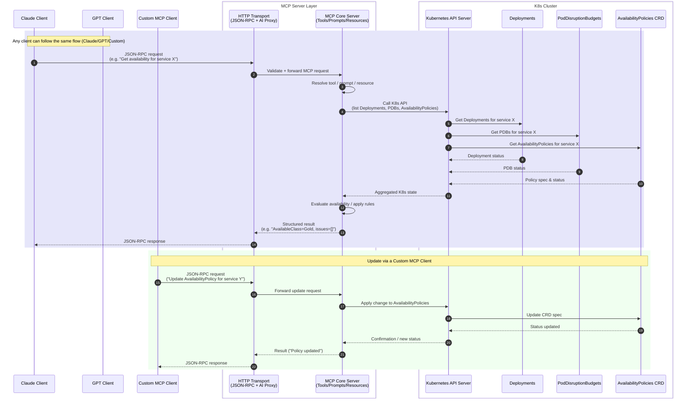

# MCP Server Integration

The PDB Management Operator includes an integrated **Model Context Protocol (MCP)** server that enables AI-powered cluster analysis, intelligent recommendations, and natural language interaction for availability management.

## Overview

The MCP server exposes tools that can be consumed by AI assistants (Claude, GPT, etc.) to analyze your Kubernetes cluster's availability posture and provide intelligent recommendations.



## Configuration

### Enable MCP Server

Set environment variables in the operator deployment:

```yaml
env:
  - name: ENABLE_MCP_SERVER
    value: "true"
  - name: MCP_SERVER_ADDRESS
    value: ":8090" # Default port
```

Or via Helm values:

```yaml
mcp:
  enabled: true
  port: 8090
```

### Verify MCP Server is Running

```bash
# Check health endpoint
curl http://localhost:8090/health

# Response:
{
  "status": "healthy",
  "server": "pdb-management-mcp-server",
  "version": "v1.0.0",
  "initialized": true,
  "timestamp": 1720267822
}
```

## Available Tools

The MCP server provides the following tools for AI-powered analysis:

### 1. Analysis Tools

| Tool                           | Description                                  |
| ------------------------------ | -------------------------------------------- |
| `analyze_cluster_availability` | Comprehensive cluster availability analysis  |
| `analyze_deployment`           | Deep analysis of a specific deployment       |
| `get_availability_summary`     | Quick summary of cluster availability status |

### 2. Management Tools

| Tool               | Description                             |
| ------------------ | --------------------------------------- |
| `list_pdbs`        | List all PDBs with their status         |
| `list_deployments` | List deployments with availability info |
| `get_pdb_details`  | Get detailed PDB information            |
| `create_pdb`       | Create a new PDB for a deployment       |
| `update_pdb`       | Update an existing PDB configuration    |
| `delete_pdb`       | Remove a PDB                            |

### 3. Compliance Tools

| Tool                    | Description                          |
| ----------------------- | ------------------------------------ |
| `check_compliance`      | Check availability policy compliance |
| `get_compliance_report` | Generate compliance report           |
| `list_violations`       | List policy violations               |

### 4. Optimization Tools

| Tool                               | Description                         |
| ---------------------------------- | ----------------------------------- |
| `get_optimization_recommendations` | AI-powered optimization suggestions |
| `analyze_resource_usage`           | Resource utilization analysis       |
| `predict_availability_impact`      | Impact prediction for changes       |

### 5. Monitoring Tools

| Tool                    | Description                   |
| ----------------------- | ----------------------------- |
| `get_cluster_health`    | Overall cluster health status |
| `get_disruption_events` | Recent disruption events      |
| `get_pdb_metrics`       | PDB-related metrics           |

### 6. Backup Tools

| Tool           | Description                   |
| -------------- | ----------------------------- |
| `backup_pdbs`  | Backup all PDB configurations |
| `restore_pdbs` | Restore PDB configurations    |
| `list_backups` | List available backups        |

## API Endpoints

### MCP Protocol Endpoint

```
POST /mcp
Content-Type: application/json

{
  "jsonrpc": "2.0",
  "id": "1",
  "method": "tools/call",
  "params": {
    "name": "analyze_cluster_availability",
    "arguments": {
      "namespace": "production"
    }
  }
}
```

### AI Proxy Endpoint

For direct AI provider integration:

```
POST /ai/proxy
Content-Type: application/json

{
  "config": {
    "provider": "claude",
    "apiKey": "your-api-key",
    "model": "claude-sonnet-4-20250514"
  },
  "request": {
    "messages": [
      {"role": "user", "content": "Analyze my cluster's availability"}
    ]
  }
}
```

### Health Endpoint

```
GET /health
```

## Connecting AI Clients

### Using with Claude Desktop

Add to your Claude Desktop MCP configuration (`~/.claude/mcp.json`):

```json
{
  "servers": {
    "pdb-management": {
      "url": "http://localhost:8090/mcp",
      "transport": "http"
    }
  }
}
```

### Using with Custom MCP Client

```python
import requests

def call_mcp_tool(tool_name, arguments):
    response = requests.post(
        "http://localhost:8090/mcp",
        json={
            "jsonrpc": "2.0",
            "id": "1",
            "method": "tools/call",
            "params": {
                "name": tool_name,
                "arguments": arguments
            }
        }
    )
    return response.json()

# Analyze cluster availability
result = call_mcp_tool("analyze_cluster_availability", {
    "namespace": "production"
})
print(result)
```

### Port Forwarding for Local Access

```bash
# Forward MCP server port
kubectl port-forward -n canvas svc/pdb-management-mcp 8090:8090

# Now accessible at localhost:8090
curl http://localhost:8090/health
```

## Example Interactions

### 1. Cluster Analysis

**Request:**

```json
{
  "method": "tools/call",
  "params": {
    "name": "analyze_cluster_availability",
    "arguments": {}
  }
}
```

**Response:**

```json
{
  "result": {
    "summary": {
      "total_deployments": 45,
      "protected_deployments": 38,
      "unprotected_deployments": 7,
      "coverage_percentage": 84.4
    },
    "by_class": {
      "mission-critical": 5,
      "high-availability": 18,
      "standard": 15,
      "non-critical": 7
    },
    "recommendations": [
      "7 deployments have no PDB protection",
      "Consider adding PDBs to: api-gateway, cache-service..."
    ]
  }
}
```

### 2. Get Optimization Recommendations

**Request:**

```json
{
  "method": "tools/call",
  "params": {
    "name": "get_optimization_recommendations",
    "arguments": {
      "namespace": "production",
      "focus": "availability"
    }
  }
}
```

**Response:**

```json
{
  "result": {
    "recommendations": [
      {
        "type": "pdb",
        "priority": "high",
        "title": "Increase minAvailable for payment-service",
        "description": "Critical service with only 50% minAvailable",
        "actions": ["Update to 75% or higher"],
        "expected_benefit": "Improved availability during disruptions"
      }
    ]
  }
}
```

### 3. Compliance Check

**Request:**

```json
{
  "method": "tools/call",
  "params": {
    "name": "check_compliance",
    "arguments": {
      "policy": "production-standards"
    }
  }
}
```

## Metrics

The MCP server exposes Prometheus metrics:

```
# MCP request metrics
pdb_management_mcp_requests_total{method="tools/call",status="success"}
pdb_management_mcp_request_duration_seconds{method="tools/call"}

# Tool usage metrics
pdb_management_mcp_tool_calls_total{tool="analyze_cluster_availability"}
pdb_management_mcp_tool_duration_seconds{tool="analyze_cluster_availability"}
```

## Security Considerations

1. **Network Security**: MCP server should only be accessible within the cluster or via authenticated ingress
2. **API Key Management**: When using AI proxy, API keys are not stored
3. **Audit Logging**: All MCP operations are logged with correlation IDs
4. **RBAC**: MCP server uses the operator's service account permissions

### Recommended Network Policy

```yaml
apiVersion: networking.k8s.io/v1
kind: NetworkPolicy
metadata:
  name: mcp-server-policy
  namespace: canvas
spec:
  podSelector:
    matchLabels:
      app: pdb-management
  ingress:
    - from:
        - namespaceSelector:
            matchLabels:
              mcp-client: "true"
      ports:
        - port: 8090
```

## Troubleshooting

### MCP Server Not Responding

```bash
# Check if MCP is enabled
kubectl get deployment pdb-management-controller-manager -n canvas \
  -o jsonpath='{.spec.template.spec.containers[0].env}' | jq '.[] | select(.name=="ENABLE_MCP_SERVER")'

# Check logs
kubectl logs -n canvas deployment/pdb-management-controller-manager | grep mcp
```

### Tool Call Errors

```bash
# Enable debug logging
kubectl set env deployment/pdb-management-controller-manager \
  -n canvas LOG_LEVEL=debug

# Check for specific errors
kubectl logs -n canvas deployment/pdb-management-controller-manager | \
  jq 'select(.msg | contains("MCP"))'
```

## Related Documentation

- [Technical Documentation](TECHNICAL_DOCUMENTATION.md) - Full architecture details
- [Performance and Caching](PERFORMANCE_AND_CACHING.md) - Performance optimization
- [Operational Runbook](OPERATIONAL_RUNBOOK.md) - Operations guide
