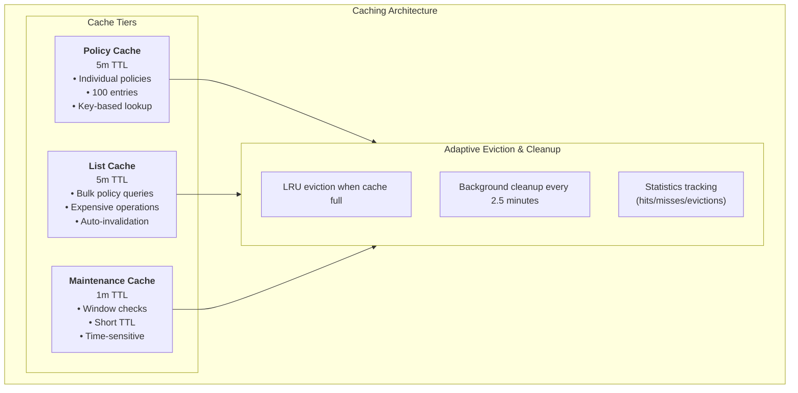
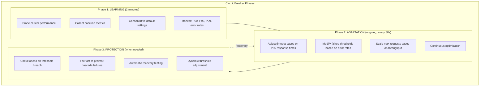

# PDB Management Operator - Performance and Caching

## Overview

The PDB Management Operator implements sophisticated performance optimization strategies to efficiently handle large-scale deployments (200+ deployments) with minimal resource overhead. This document details the comprehensive caching system, adaptive circuit breaker, and performance optimization techniques.

## Performance Architecture

### Multi-Level Caching System

The operator implements a three-tier caching strategy:



### 1. Policy Cache

**Purpose**: Cache individual AvailabilityPolicy lookups to reduce API calls.

**Configuration**:

- **Size**: 100 entries
- **TTL**: 5 minutes
- **Eviction**: LRU (Least Recently Used)

**Implementation Details**:

```go
// Cache entry structure
type policyCacheEntry struct {
    policy    *availabilityv1alpha1.AvailabilityPolicy
    timestamp time.Time
}

// Thread-safe operations with RWMutex
pc.mu.RLock()
defer pc.mu.RUnlock()
```

**Cache Keys**: `namespace/policyname` format for individual policies.

### 2. List Cache

**Purpose**: Cache expensive list operations when fetching all policies.

**Configuration**:

- **TTL**: 5 minutes (same as policy cache)
- **Key**: `"all-policies"` for full policy lists
- **Automatic Invalidation**: Invalidated when any policy changes

**Optimization**: When a list is cached, individual policies are also cached automatically.

### 3. Maintenance Window Cache

**Purpose**: Cache maintenance window calculations with short TTL.

**Configuration**:

- **TTL**: 1 minute (shorter due to time-sensitive nature)
- **Purpose**: Avoid repeated time calculations

## Adaptive Circuit Breaker

### Overview

The operator implements an **adaptive circuit breaker** that learns cluster characteristics and automatically adjusts parameters based on cluster performance.

### Learning Phases



### Adaptive Configuration

**Base Settings** (Conservative defaults):

```yaml
baseMaxRequests: 5
baseTimeout: 30s
baseFailureRatio: 0.6
baseConsecutiveFailures: 5
```

**Adaptation Parameters**:

```yaml
learningPeriod: 2m # Initial learning phase
adjustmentInterval: 30s # How often to adjust settings
maxTimeoutMultiplier: 3.0 # Maximum timeout increase
minTimeoutMultiplier: 0.5 # Minimum timeout decrease
```

### Cluster Performance Probing

**Initial Probe Operations**:

1. **List Namespaces** - Lightweight operation for baseline
2. **List Deployments** - Standard operation testing
3. **List Policies** - CRD-specific operation testing

**Metrics Collected**:

- **Response Time Percentiles**: P50, P95, P99
- **Error Rate**: Percentage of failed operations
- **Throughput**: Requests per second capacity

## Performance Optimization Techniques

### 1. Change Detection

**Purpose**: Avoid unnecessary reconciliations by detecting actual changes.

**Implementation**:

```go
// State tracking per deployment
lastDeploymentState map[types.NamespacedName]string

// Change detection
func (r *DeploymentReconciler) hasDeploymentStateChanged(ctx context.Context,
    deployment *appsv1.Deployment, config *AvailabilityConfig) (bool, error) {

    currentState := r.calculateDeploymentStateHash(deployment, config)

    r.mu.RLock()
    lastState, exists := r.lastDeploymentState[namespacedName]
    r.mu.RUnlock()

    return !exists || lastState != currentState, nil
}
```

**Tracked Changes**:

- Deployment generation
- Availability class changes
- Policy configuration changes
- Replica count changes

### 2. Batch Processing

**Event Predicates**: Filter unnecessary events at the controller level.

```go
deploymentPredicate := predicate.Funcs{
    UpdateFunc: func(e event.UpdateEvent) bool {
        // Skip if only status changed
        oldDeployment := e.ObjectOld.(*appsv1.Deployment)
        newDeployment := e.ObjectNew.(*appsv1.Deployment)

        if oldDeployment.Generation == newDeployment.Generation {
            return oldDeployment.DeletionTimestamp == nil &&
                   newDeployment.DeletionTimestamp != nil
        }
        return true
    },
}
```

### 3. Resource Optimization

**Memory Management**:

- Efficient object reuse
- Deep copy only when necessary
- Limited cache sizes with eviction

**CPU Optimization**:

- Concurrent reconcilers (configurable: 3-10)
- Non-blocking cache operations
- Efficient predicate filtering

## Performance Monitoring

### Key Metrics

```prometheus
# Cache Performance
pdb_management_cache_hits_total{cache_type="policy"}
pdb_management_cache_misses_total{cache_type="policy"}

# Reconciliation Performance
pdb_management_reconciliation_duration_seconds{controller="deployment-pdb"}
pdb_management_reconciliation_errors_total{controller="deployment-pdb"}

# Circuit Breaker Status
pdb_management_circuit_breaker_state{operation="create-pdb",state="open|closed|half-open"}

# Retry Metrics
pdb_management_retry_attempts_total{operation,error_type,attempt}
pdb_management_retry_exhausted_total{operation,error_type}
pdb_management_retry_success_after_retry_total{operation,attempts}

# Multi-Policy Resolution
pdb_management_multi_policy_matches_total{namespace,policy_count}
pdb_management_policy_tie_breaks_total{namespace,resolution_method}

# Webhook Status
pdb_management_webhook_status{status,reason}

# Resource Usage
pdb_management_deployments_managed{namespace,availability_class}
process_resident_memory_bytes
go_goroutines
```

### Performance Targets

| Metric                  | Target      | Description                     |
| ----------------------- | ----------- | ------------------------------- |
| **Cache Hit Rate**      | > 90%       | Policy cache effectiveness      |
| **Reconciliation Time** | < 100ms avg | Average reconciliation duration |
| **Memory Usage**        | < 100MB     | Operator memory consumption     |
| **CPU Usage**           | < 100m      | Steady-state CPU usage          |
| **Error Rate**          | < 1%        | Reconciliation error percentage |

### Grafana Dashboard Queries

**Cache Hit Rate**:

```promql
rate(pdb_management_cache_hits_total[5m]) /
(rate(pdb_management_cache_hits_total[5m]) + rate(pdb_management_cache_misses_total[5m])) * 100
```

**Average Reconciliation Time**:

```promql
rate(pdb_management_reconciliation_duration_seconds_sum[5m]) /
rate(pdb_management_reconciliation_duration_seconds_count[5m])
```

**Circuit Breaker Health**:

```promql
pdb_management_circuit_breaker_state{state="open"} == 1
```

## Configuration and Tuning

### Command-Line Flags

The operator supports extensive configuration via CLI flags:

#### Cache Configuration

| Flag                             | Default | Description                            |
| -------------------------------- | ------- | -------------------------------------- |
| `--policy-cache-ttl`             | `5m`    | TTL for cached policies                |
| `--policy-cache-size`            | `100`   | Maximum number of policies to cache    |
| `--maintenance-window-cache-ttl` | `1m`    | TTL for cached maintenance window results |

#### Retry Configuration

| Flag                    | Default  | Description                        |
| ----------------------- | -------- | ---------------------------------- |
| `--retry-max-attempts`  | `5`      | Maximum retry attempts for transient errors |
| `--retry-initial-delay` | `100ms`  | Initial delay between retries      |
| `--retry-max-delay`     | `30s`    | Maximum delay between retries      |
| `--retry-backoff-factor`| `2.0`    | Backoff multiplier for retry delays |

#### Other Configuration

| Flag                        | Default | Description                  |
| --------------------------- | ------- | ---------------------------- |
| `--max-concurrent-reconciles` | `5`   | Concurrent reconciliations   |
| `--enable-webhook`          | `false` | Enable admission webhooks    |

### Tuning for Different Environments

#### Small Clusters (< 50 deployments)

```yaml
resources:
  requests:
    memory: "64Mi"
    cpu: "50m"
  limits:
    memory: "128Mi"
    cpu: "200m"

args:
  - --policy-cache-size=50
  - --max-concurrent-reconciles=3
```

#### Medium Clusters (50-200 deployments)

```yaml
resources:
  requests:
    memory: "128Mi"
    cpu: "100m"
  limits:
    memory: "256Mi"
    cpu: "500m"

args:
  - --policy-cache-size=100
  - --max-concurrent-reconciles=5
```

#### Large Clusters (200+ deployments)

```yaml
resources:
  requests:
    memory: "256Mi"
    cpu: "200m"
  limits:
    memory: "512Mi"
    cpu: "1000m"

args:
  - --policy-cache-size=200
  - --max-concurrent-reconciles=10
  - --policy-cache-ttl=10m
```

### Retry Configuration Tuning

#### Default (Stable Networks)

```yaml
args:
  - --retry-max-attempts=5
  - --retry-initial-delay=100ms
  - --retry-max-delay=30s
  - --retry-backoff-factor=2.0
```

#### Unstable Networks (More Aggressive Retries)

```yaml
args:
  - --retry-max-attempts=10
  - --retry-initial-delay=200ms
  - --retry-max-delay=60s
  - --retry-backoff-factor=1.5
```

#### Fast Fail (Low Latency Requirements)

```yaml
args:
  - --retry-max-attempts=3
  - --retry-initial-delay=50ms
  - --retry-max-delay=5s
  - --retry-backoff-factor=2.0
```

## Troubleshooting Performance Issues

### Cache Performance Issues

**Symptoms**: High cache miss rate (< 80%)

**Diagnosis**:

```bash
# Check cache metrics
kubectl port-forward -n canvas svc/controller-manager-metrics-service 8443:8443
curl -s https://localhost:8443/metrics | grep cache

# Look for high miss rate
pdb_management_cache_misses_total / (pdb_management_cache_hits_total + pdb_management_cache_misses_total)
```

**Solutions**:

1. **Increase cache size**: Set `--policy-cache-size=200`
2. **Increase TTL**: Set `--policy-cache-ttl=10m`
3. **Check policy churn**: Reduce policy update frequency

### High Reconciliation Latency

**Symptoms**: Reconciliation duration > 500ms

**Diagnosis**:

```bash
# Check reconciliation metrics
kubectl logs -n canvas deployment/pdb-management-controller-manager | \
  jq 'select(.details.durationMs != null) | .details.durationMs' | \
  sort -n | tail -10
```

**Solutions**:

1. **Increase concurrency**: Set `--max-concurrent-reconciles=10`
2. **Optimize predicates**: Ensure proper event filtering
3. **Check API server latency**: Monitor cluster performance

### Retry Exhaustion

**Symptoms**: Operations failing after all retries

**Diagnosis**:

```bash
# Check retry metrics
curl -s https://localhost:8443/metrics | grep retry

# Look for exhausted retries
kubectl logs -n canvas deployment/pdb-management-controller-manager | \
  grep -i "retry.*exhausted"
```

**Solutions**:

1. **Increase max attempts**: Set `--retry-max-attempts=10`
2. **Increase max delay**: Set `--retry-max-delay=60s` for transient network issues
3. **Check cluster health**: Monitor API server and etcd performance

### Memory Issues

**Symptoms**: Operator OOMKilled or high memory usage

**Diagnosis**:

```bash
# Check memory metrics
kubectl top pod -n canvas -l app.kubernetes.io/name=pdb-management

# Check for memory leaks
kubectl exec -n canvas deployment/pdb-management-controller-manager -- \
  curl http://localhost:8080/debug/pprof/heap > heap.prof
```

**Solutions**:

1. **Increase memory limits**: Set higher resource limits
2. **Reduce cache size**: Lower `--policy-cache-size` value
3. **Reduce TTL**: Lower `--policy-cache-ttl` to reduce memory usage

## Performance Testing

### Built-in Performance Test Suite

The operator includes comprehensive performance testing tools:

```bash
# Run basic performance test (100 deployments)
./toolsforlocal/unified-performance-test.sh --basic 100

# Run cache performance test
./toolsforlocal/unified-performance-test.sh --cache

# Run advanced stress test (10 minutes)
./toolsforlocal/unified-performance-test.sh --advanced 600

# Run circuit breaker test
./toolsforlocal/unified-performance-test.sh --circuit-breaker

# Run all tests
./toolsforlocal/unified-performance-test.sh --all
```

### Custom Performance Testing

**Load Test Configuration**:

```yaml
# Generate test load
for i in {1..200}; do
  kubectl apply -f - <<EOF
apiVersion: apps/v1
kind: Deployment
metadata:
  name: perf-test-$i
  annotations:
    oda.tmforum.org/availability-class: "standard"
spec:
  replicas: 3
  selector:
    matchLabels:
      app: perf-test-$i
  template:
    metadata:
      labels:
        app: perf-test-$i
    spec:
      containers:
      - name: app
        image: nginx:alpine
        resources:
          requests:
            cpu: 1m
            memory: 1Mi
EOF
done
```

**Performance Validation**:

```bash
# Measure PDB creation time
start_time=$(date +%s)
kubectl wait --for=condition=Ready pdb --all --timeout=300s
end_time=$(date +%s)
echo "PDB creation took $((end_time - start_time)) seconds for 200 deployments"

# Target: < 5 minutes for 200 PDBs
```

## Best Practices

### 1. Cache Optimization

- **Monitor cache hit rates** regularly
- **Adjust cache size** based on cluster size
- **Use appropriate TTL** values (not too short, not too long)

### 2. Resource Planning

- **Start conservative** with resource requests
- **Monitor actual usage** and adjust limits
- **Use horizontal pod autoscaling** for high-load clusters

### 3. Monitoring Setup

- **Set up alerts** for cache miss rates > 20%
- **Monitor reconciliation latency** with P95/P99 percentiles
- **Track circuit breaker** state changes

### 4. Deployment Strategy

- **Gradual rollout** in large clusters
- **Test performance** in staging environments
- **Monitor during updates** and rollbacks

The performance optimization features in this operator enable it to efficiently manage hundreds of deployments while maintaining low latency and resource usage. The adaptive circuit breaker and multi-level caching system work together to provide both resilience and efficiency at scale.
