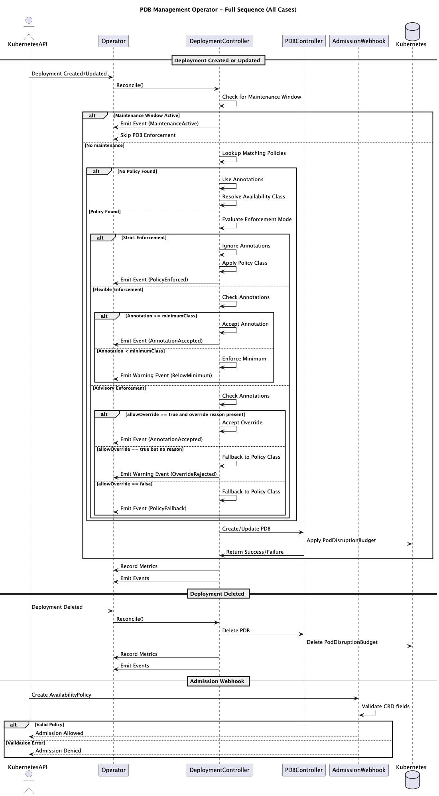

# PDB Management Operator

**Intelligent Pod Disruption Budget Management for ODA Canvas**

The PDB Management Operator automatically creates and manages Pod Disruption Budgets (PDBs) for Kubernetes deployments based on availability requirements and component functions within the TM Forum Open Digital Architecture (ODA) Canvas.

## Key Features

- **Automatic PDB Management**: Creates PDBs based on deployment annotations
- **Policy-Based Configuration**: Define organization-wide availability policies using CRDs
- **Flexible Enforcement Modes**: Strict, Flexible, and Advisory policy enforcement
- **ODA Canvas Integration**: Native support for TM Forum ODA component metadata
- **Intelligent Defaults**: Component function-aware availability levels
- **Maintenance Windows**: Time-based PDB suspension for scheduled maintenance
- **AI-Powered Analysis**: Integrated MCP server for cluster analysis and intelligent recommendations
- **High Performance**: Optimized for 200+ deployments with intelligent caching
- **Comprehensive Observability**: Built-in metrics, tracing, and audit logging
- **Admission Webhooks**: Validate and default AvailabilityPolicy resources

## Architecture Overview



## Quick Start

### Basic Usage - Annotation Based

```yaml
apiVersion: apps/v1
kind: Deployment
metadata:
  name: my-app
  annotations:
    oda.tmforum.org/availability-class: "high-availability"
    oda.tmforum.org/component-function: "core" # optional
spec:
  replicas: 3
  # ... rest of deployment spec
```

The operator will automatically create a PDB with appropriate settings:

```bash
kubectl get pdb my-app-pdb
# NAME         MIN AVAILABLE   MAX UNAVAILABLE   ALLOWED DISRUPTIONS   AGE
# my-app-pdb   75%            N/A               1                     5s
```

### Policy-Based Configuration

For organization-wide policies, use the powerful AvailabilityPolicy CRD:

#### Example 1: Strict Enforcement for Critical Services

```yaml
apiVersion: availability.oda.tmforum.org/v1alpha1
kind: AvailabilityPolicy
metadata:
  name: critical-services-strict
spec:
  availabilityClass: mission-critical
  enforcement: strict # No overrides allowed - policy always wins
  componentSelector:
    componentFunctions: [security]
    matchLabels:
      tier: critical
  priority: 1000 # Highest priority
```

#### Example 2: Flexible Enforcement with Minimum Standards

```yaml
apiVersion: availability.oda.tmforum.org/v1alpha1
kind: AvailabilityPolicy
metadata:
  name: production-flexible
spec:
  availabilityClass: high-availability
  enforcement: flexible
  minimumClass: standard # Teams can increase but not go below standard
  componentSelector:
    matchLabels:
      environment: production
  maintenanceWindows:
    - start: "02:00"
      end: "04:00"
      timezone: "UTC"
      daysOfWeek: [0, 6] # weekends
  priority: 500
```

#### Example 3: Advisory with Override Controls

```yaml
apiVersion: availability.oda.tmforum.org/v1alpha1
kind: AvailabilityPolicy
metadata:
  name: development-advisory
spec:
  availabilityClass: standard
  enforcement: advisory
  allowOverride: true
  overrideRequiresReason: true # Must provide reason in annotation
  componentSelector:
    matchLabels:
      environment: development
  priority: 100
```

## Availability Classes

| Class               | Core/Mgmt    | Security     | Description            | Use Cases               |
| ------------------- | ------------ | ------------ | ---------------------- | ----------------------- |
| `non-critical`      | 20%          | 50%\*        | Non-critical workloads | Dev/test, batch jobs    |
| `standard`          | 50%          | 75%\*        | Typical services       | Microservices, APIs     |
| `high-availability` | 75%          | 75%          | Important services     | Core business logic     |
| `mission-critical`  | 90%          | 90%          | Critical services      | Payment, authentication |
| `custom`            | User-defined | User-defined | Custom requirements    | Special cases           |

\*Security components are automatically promoted to higher availability levels

## Configuration

The operator supports extensive configuration via CLI flags:

```bash
# Cache configuration
--policy-cache-ttl=5m              # TTL for cached policies
--policy-cache-size=100            # Maximum policies to cache
--maintenance-window-cache-ttl=1m  # TTL for maintenance window cache

# Retry configuration
--retry-max-attempts=5             # Maximum retry attempts
--retry-initial-delay=100ms        # Initial retry delay
--retry-max-delay=30s              # Maximum retry delay
--retry-backoff-factor=2.0         # Backoff multiplier

# Webhook (gracefully degrades if cert-manager unavailable)
--enable-webhook=true              # Enable admission webhooks
```

See [Performance and Caching](PERFORMANCE_AND_CACHING.md) for detailed tuning guidance.

## Advanced Features

### Enforcement Modes

The operator supports three enforcement modes for policies:

1. **Strict**: Policy always wins, annotations are ignored

- Use for: Compliance requirements, critical infrastructure
- Example: Security components must be mission-critical

2. **Flexible**: Annotations accepted if they meet minimum requirements

- Use for: Allowing teams to opt for higher availability
- Example: Production can be standard or higher

3. **Advisory**: Annotations preferred, policy as fallback

- Use for: Development environments, recommendations
- Example: Suggest standard but allow overrides

### Advanced Policy Features

#### Override Controls

Control how deployments can override policy settings:

```yaml
spec:
  enforcement: advisory
  allowOverride: true # Allow annotation overrides
  overrideRequiresReason: true # Require reason annotation
```

When `overrideRequiresReason` is true, deployments must include:

```yaml
annotations:
  oda.tmforum.org/availability-class: "non-critical"
  oda.tmforum.org/override-reason: "Development testing only"
```

#### Custom PDB Configurations

Define custom availability classes with specific PDB settings:

```yaml
apiVersion: availability.oda.tmforum.org/v1alpha1
kind: AvailabilityPolicy
metadata:
  name: custom-database-policy
spec:
  availabilityClass: custom
  customPDBConfig:
    minAvailable: 2 # Absolute number instead of percentage
    unhealthyPodEvictionPolicy: "AlwaysAllow" # Even unhealthy pods
  componentSelector:
    matchLabels:
      type: database
```

#### Multi-Criteria Selection

Policies can use multiple selection criteria:

```yaml
componentSelector:
  namespaces: [prod, staging] # Specific namespaces
  componentNames: [api-gateway] # Specific components
  componentFunctions: [core, security] # Component functions
  matchLabels: # Label selectors
    tier: critical
  matchExpressions: # Complex selectors
    - key: region
      operator: In
      values: [us-east, eu-west]
```

### Component Function Intelligence

The operator automatically adjusts availability based on component function:

- **Security Components**: Auto-upgrade to ensure higher availability
- **Core Components**: Use standard availability mappings
- **Management Components**: Standard behavior with configurable overrides

### Maintenance Windows

Configure maintenance windows to temporarily suspend PDB enforcement:

```yaml
annotations:
  oda.tmforum.org/maintenance-window: "02:00-04:00 UTC"
```

Or via policy:

```yaml
maintenanceWindows:
  - start: "02:00"
    end: "04:00"
    timezone: "UTC"
    daysOfWeek: [1, 2, 3, 4, 5] # weekdays only
```

### Custom Availability Configurations

Define custom availability classes via environment variable:

```bash
AVAILABILITY_CONFIGS='{
  "ultra-critical": {
    "minAvailable": "95%",
    "description": "Ultra critical services"
  }
}'
```

## Monitoring & Observability

### Key Metrics

#### Core Metrics
- `pdb_management_pdbs_created_total` - Total PDBs created
- `pdb_management_pdbs_updated_total` - Total PDBs updated
- `pdb_management_reconciliation_duration_seconds` - Reconciliation performance
- `pdb_management_enforcement_decisions_total` - Policy enforcement decisions
- `pdb_management_cache_hits_total` - Cache efficiency metrics

#### Multi-Policy Resolution
- `pdb_management_multi_policy_matches_total` - Times multiple policies matched a deployment
- `pdb_management_policy_tie_breaks_total` - Policy tie-break resolutions

#### Retry Operations
- `pdb_management_retry_attempts_total` - Retry attempts by operation and error type
- `pdb_management_retry_exhausted_total` - Operations that exhausted all retries
- `pdb_management_retry_success_after_retry_total` - Successful operations after retry

#### Webhook Status
- `pdb_management_webhook_status` - Current webhook state (enabled/disabled/failed)

### Health Checks

```bash
# Liveness probe
curl http://operator-pod:8081/healthz

# Readiness probe
curl http://operator-pod:8081/readyz

# Metrics endpoint
curl http://operator-pod:8080/metrics
```

### Unified Logging System

The operator implements a comprehensive unified logging system that provides structured, traceable logs with full observability:

#### Structured JSON Logging

All logs are emitted in structured JSON format with consistent fields:

```json
{
  "level": "info",
  "ts": "2025-07-06T09:50:22.454304592Z",
  "msg": "Starting reconciliation",
  "controller": {
    "type": "deployment-pdb",
    "name": "deployment-controller",
    "group": "apps",
    "kind": "Deployment"
  },
  "resource": {
    "type": "deployment",
    "name": "tmf620-productcatalog",
    "namespace": "components"
  },
  "reconcileID": "deployment-f959cd46-f5c8-497f-b84d-b6d0d0ce04a2",
  "correlationID": "b558f470-b55d-4af4-b9b4-b7a6043ce95f",
  "trace": {
    "trace_id": "2b4148def0c46c496b41c1ade1c7cc7f",
    "span_id": "55b5595fbf126025"
  },
  "details": {
    "availabilityClass": "high-availability",
    "source": "annotation-no-policy"
  }
}
```

#### Trace Context Propagation

Every log entry includes full trace context for distributed tracing:

- **trace_id**: Unique identifier for the entire request flow
- **span_id**: Identifier for the current operation span
- **correlationID**: Business correlation identifier
- **reconcileID**: Kubernetes reconciliation identifier

#### Audit Logging

The operator provides comprehensive audit logging for compliance with full trace context:

```json
{
  "level": "info",
  "ts": "2025-07-06T09:50:22.457153467Z",
  "msg": "Audit log",
  "controller": {
    "type": "pdb-direct",
    "name": "pdb-direct-controller",
    "group": "apps",
    "kind": "Deployment"
  },
  "resource": {
    "type": "poddisruptionbudget",
    "name": "tmf620-productcatalog",
    "namespace": "components"
  },
  "reconcileID": "pdb-526803c1-b0b4-46ed-83e2-3a0357fdc594",
  "correlationID": "f7da36c6-716a-4e65-89b7-cb83476542fd",
  "trace": {
    "trace_id": "8e37377bd4ff755b7e21278e06bd73fd",
    "span_id": "450fe3d49c33229e"
  },
  "details": {
    "action": "CREATE",
    "availabilityClass": "high-availability",
    "correlationId": "",
    "maxUnavailable": null,
    "minAvailable": "75%",
    "name": "tmf620-productcatalog",
    "namespace": "components",
    "resource": "tmf620-productcatalog-pdb",
    "resourceType": "PodDisruptionBudget",
    "result": "SUCCESS",
    "timestamp": "2025-07-06T09:50:22Z"
  }
}
```

#### Log Levels and Filtering

The operator supports configurable log levels:

```bash
# Set log level via environment variable
kubectl set env deployment/pdb-management-controller-manager \
  -n canvas LOG_LEVEL=debug

# Available levels: debug, info, warn, error
```

#### Log Analysis

Use structured logging for advanced analysis:

```bash
# Filter logs by trace ID
kubectl logs -n canvas deployment/pdb-management-controller-manager | \
  jq 'select(.trace.trace_id == "2b4148def0c46c496b41c1ade1c7cc7f")'

# Find all audit logs for a specific resource
kubectl logs -n canvas deployment/pdb-management-controller-manager | \
  jq 'select(.msg == "Audit log" and .details.resource == "my-app-pdb")'

# Track reconciliation flow
kubectl logs -n canvas deployment/pdb-management-controller-manager | \
  jq 'select(.reconcileID == "deployment-f959cd46-f5c8-497f-b84d-b6d0d0ce04a2")'
```

## Security

- **RBAC**: Minimal required permissions (principle of least privilege)
- **Pod Security Standards**: Runs as non-root with read-only filesystem
- **Network Policies**: Support for network isolation
- **Webhook Security**: Certificate-based authentication for admission webhooks

## Troubleshooting

### Common Issues

**PDBs not being created?**

```bash
# Check operator logs
kubectl -n canvas logs deployment/pdb-management-controller-manager

# Verify annotations
kubectl get deployment my-app -o jsonpath='{.metadata.annotations}'

# Check if PDB management is enabled
kubectl -n canvas get deployment pdb-management-controller-manager -o yaml | grep ENABLE_PDB
```

**Policy not matching deployments?**

```bash
# List all policies
kubectl get availabilitypolicies -A

# Check policy details
kubectl describe availabilitypolicy production-policy

# Verify deployment labels match selector
kubectl get deployment my-app --show-labels
```

**Performance issues?**

```bash
# Check cache metrics
curl http://operator-pod:8080/metrics | grep cache

# Enable debug logging
kubectl set env deployment/pdb-management-controller-manager \
  -n canvas LOG_LEVEL=debug
```

## Documentation

- [Technical Documentation](TECHNICAL_DOCUMENTATION.md) - Architecture and internals
- [MCP Integration](MCP_INTEGRATION.md) - AI-powered analysis via Model Context Protocol
- [Performance and Caching](PERFORMANCE_AND_CACHING.md) - Performance optimization and caching strategies
- [Webhook Deployment](WEBHOOK_DEPLOYMENT.md) - Admission webhook setup
- [Operational Runbook](OPERATIONAL_RUNBOOK.md) - Operations and troubleshooting guide
- [Verification Guide](VERIFICATION.md) - Testing and validation

## Diagrams

All architecture and sequence diagrams are available in the [diagrams](diagrams/) directory:

| Diagram | Description |
|---------|-------------|
| [pdb-management-operator](diagrams/pdb-management-operator.png) | Full reconciliation sequence |
| [annotation-based-deployment-creation](diagrams/annotation-based-deployment-creation.png) | Annotation-based PDB creation flow |
| [policy-based-creation-strict-enforcement](diagrams/policy-based-creation-strict-enforcement.png) | Strict enforcement mode |
| [policy-based-creation-flexible-enforcement](diagrams/policy-based-creation-flexible-enforcement.png) | Flexible enforcement mode |
| [policy-based-creation-advisory-override](diagrams/policy-based-creation-advisory-override.png) | Advisory mode with overrides |
| [policy-priority-resolution](diagrams/policy-priority-resolution.png) | Policy priority resolution |
| [policy-conflict-resolution](diagrams/policy-conflict-resolution.png) | Conflict resolution logic |
| [maintenance-window-suspension](diagrams/maintenance-window-suspension.png) | Maintenance window handling |
| [admission-webhook-validation](diagrams/admission-webhook-validation.png) | Webhook validation flow |
| [deployment-deletion](diagrams/deployment-deletion.png) | Deployment deletion cleanup |

## Contributing

This operator is part of the [TM Forum ODA Canvas](https://github.com/tmforum-oda/oda-canvas) project. We welcome contributions!
