# PDB Management Operator - Technical Documentation

## Table of Contents

1. [Overview](#overview)
2. [Architecture](#architecture)
3. [Components](#components)
4. [Features](#features)
5. [Configuration](#configuration)
6. [Usage](#usage)
7. [API Reference](#api-reference)
8. [AvailabilityPolicy Deep Dive](#availabilitypolicy-deep-dive)
9. [Migration Guide](#migration-guide)
10. [Internals](#internals)
11. [Monitoring & Observability](#monitoring--observability)
12. [Performance](#performance)
13. [Security](#security)
14. [Troubleshooting](#troubleshooting)

## Overview

The PDB (Pod Disruption Budget) Management Operator is a Kubernetes operator designed specifically for the ODA (Open Digital Architecture) Canvas project. It automates the creation and management of Pod Disruption Budgets based on deployment annotations and custom policies, ensuring high availability and controlled disruptions for applications running in Kubernetes clusters.

### Key Benefits

- **Automated PDB Management**: Automatically creates and updates PDBs based on deployment annotations
- **Policy-Based Configuration**: Define organization-wide availability policies using CRDs
- **Flexible Enforcement**: Three enforcement modes (Strict, Flexible, Advisory) for different scenarios
- **AI-Powered Intelligence**: Integrated MCP server for cluster analysis and intelligent recommendations
- **ODA Canvas Integration**: Seamlessly integrates with ODA Canvas component architecture
- **High Performance**: Optimized for managing 200+ deployments with efficient caching
- **Maintenance Windows**: Support for scheduled maintenance periods
- **Comprehensive Observability**: Built-in metrics, tracing, and audit logging

### Architecture Overview

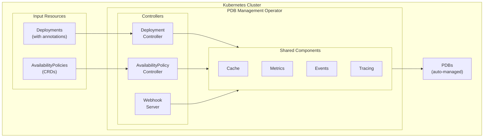

### Full Reconciliation Sequence

The following diagram shows the complete sequence of operations during deployment reconciliation, including all enforcement modes and edge cases:


## Architecture

### Design Principles

1. **Separation of Concerns**: Distinct controllers handle different aspects
2. **High Performance**: Optimized for large-scale deployment environments with caching and circuit breakers.
3. **Resilience**: Circuit breaker pattern prevents cascading failures
4. **Observability**: Comprehensive metrics, tracing, and audit logging
5. **Flexibility**: Both annotation-based and policy-based configuration
6. **Security**: Least privilege RBAC, admission webhooks for validation

### Controller Architecture

The operator implements two main controllers, an admission webhook, and an MCP server:

1. **Deployment Controller**: Watches deployments for availability annotations
2. **AvailabilityPolicy Controller**: Manages custom availability policies
3. **Admission Webhook**: Validates and defaults AvailabilityPolicy resources
4. **MCP Server**: Provides AI-powered cluster analysis and recommendations via Model Context Protocol

### Data Flow

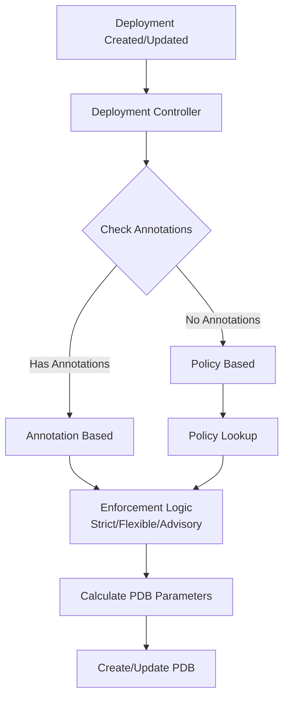

## Components

### 1. Deployment Controller

Responsible for:

- Watching deployment changes
- Extracting availability annotations
- Looking up matching policies
- Applying enforcement logic
- Creating/updating PDBs

Key features:

- Intelligent policy resolution with enforcement modes
- Component function awareness
- Maintenance window support
- Efficient caching with TTL

### 2. AvailabilityPolicy Controller

Manages AvailabilityPolicy CRDs:

- Validates policy specifications
- Tracks policy usage
- Handles policy updates
- Manages policy priorities

### 3. Admission Webhook

Provides:

- Validation of AvailabilityPolicy resources
- Defaulting of optional fields
- Warning generation for best practices
- Prevention of invalid configurations

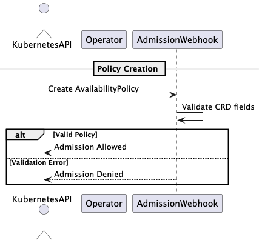

## MCP Server Architecture

The integrated Model Context Protocol (MCP) server extends the operator with AI-powered cluster analysis capabilities. This component enables intelligent recommendations and natural language interaction for cluster management.

### MCP Components

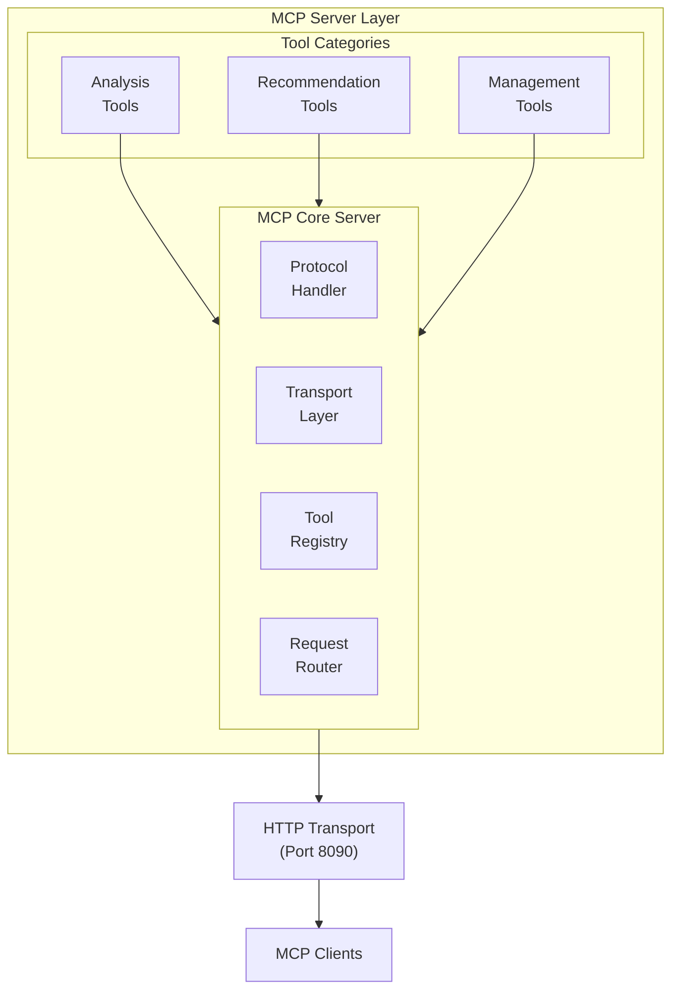

### Analysis Tools

1. **Cluster Availability Analysis**

   - PDB coverage assessment across namespaces
   - Availability gap identification
   - Deployment risk analysis
   - Compliance reporting

2. **Workload Pattern Detection**
   - Automatic pattern classification (API, database, frontend, etc.)
   - Replica distribution analysis
   - Component function inference
   - Deployment characteristics analysis

### Recommendation Engine

1. **Availability Class Recommendations**

   - AI-powered classification based on workload characteristics
   - Security component detection and upgrade suggestions
   - Confidence scoring for recommendations
   - Impact analysis for changes

2. **Policy Recommendations**
   - Cluster-wide policy analysis
   - Pattern-based policy generation
   - Conflict resolution suggestions
   - Priority optimization

### Management Interface

1. **Policy Creation**

   - Interactive policy definition
   - Validation and conflict checking
   - Template-based policy generation

2. **Impact Simulation**

   - What-if analysis for policy changes
   - Deployment impact assessment
   - Risk evaluation before applying changes

3. **Deployment Management**
   - Annotation updates via natural language
   - Batch operations across multiple deployments

### MCP Protocol Implementation

The server implements the full MCP specification:

- **JSON-RPC 2.0**: Standard protocol for request/response
- **Tools**: Structured function calls with typed parameters
- **Prompts**: Template-based interaction patterns
- **Resources**: Dynamic resource access and management
- **Notifications**: Real-time updates and status changes

### Security and Access Control

- **Network Policies**: Restricted access via Kubernetes NetworkPolicy
- **Client Authentication**: Support for authenticated MCP clients
- **Audit Logging**: All MCP operations are logged with correlation IDs
- **Rate Limiting**: Built-in protection against abuse

### Integration Points

The MCP server integrates with all existing operator components:

- **Policy Cache**: Leverages existing caching for performance
- **Event System**: Publishes events for MCP operations
- **Metrics**: Exposes MCP-specific metrics
- **Tracing**: Full OpenTelemetry correlation with operator traces

## Features

### 1. Enforcement Modes

The operator supports three enforcement modes for policies:

#### Strict Enforcement

- Policy configuration always wins
- Annotations are ignored even if present
- Use for compliance-critical environments

```yaml
spec:
  enforcement: strict
  availabilityClass: mission-critical
```

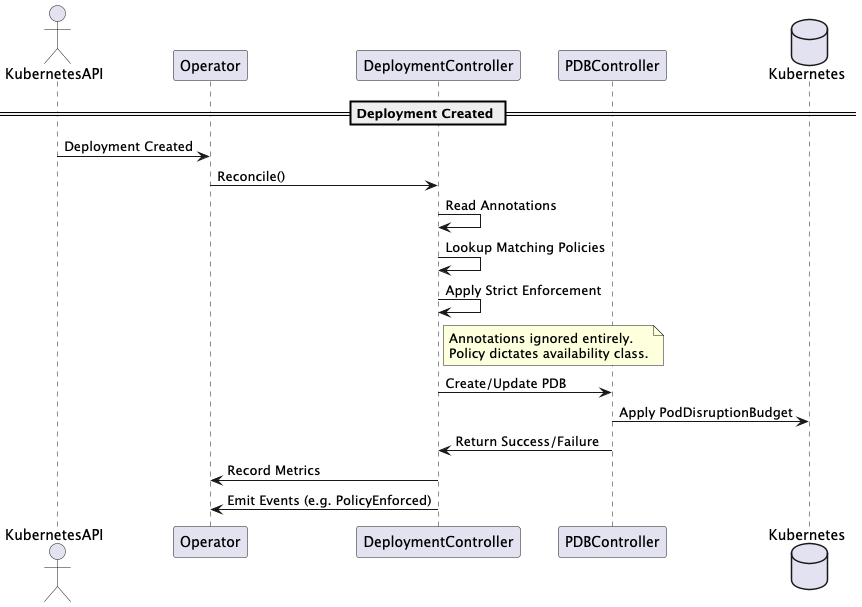

#### Flexible Enforcement

- Annotations accepted if they meet minimum requirements
- Allows teams to opt for higher availability
- Prevents downgrading below minimum

```yaml
spec:
  enforcement: flexible
  availabilityClass: high-availability
  minimumClass: standard # annotations must be >= standard
```

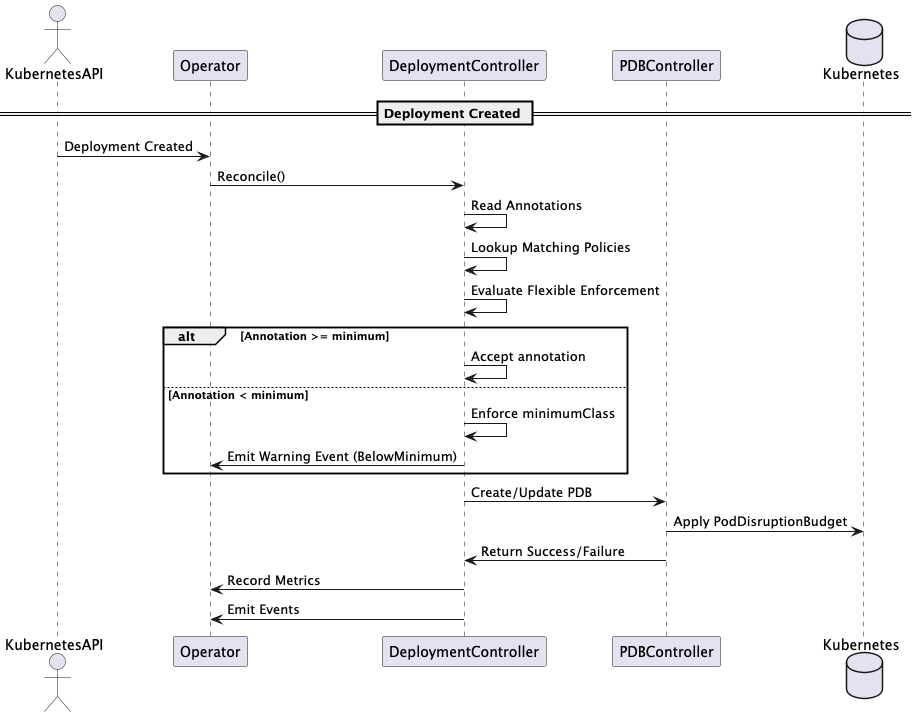

#### Advisory Enforcement

- Annotations take precedence when present
- Policy acts as fallback/default
- Maximum flexibility for teams

```yaml
spec:
  enforcement: advisory # default
  availabilityClass: standard
```

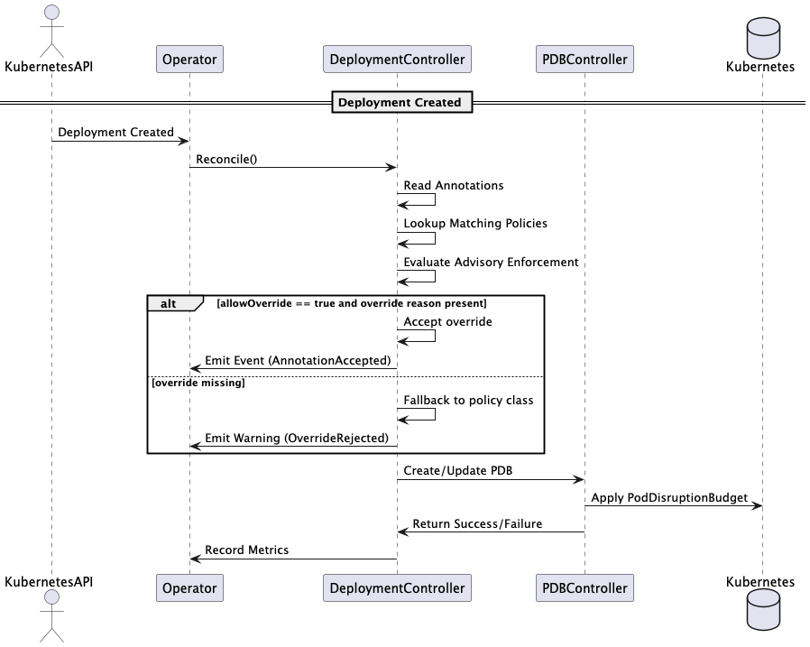

### 2. Component Function Intelligence

The operator automatically adjusts availability based on component function:

```go
// Security components get upgraded availability
if componentFunction == "security" {
    switch availabilityClass {
    case "non-critical":
        return "standard"  // 20% → 50%
    case "standard":
        return "high-availability"  // 50% → 75%
    default:
        return availabilityClass
    }
}
```

### 3. Maintenance Windows

Support for scheduled maintenance periods:

```yaml
maintenanceWindows:
  - start: "02:00"
    end: "04:00"
    timezone: "UTC"
    daysOfWeek: [0, 6] # Sunday, Saturday
```

During maintenance windows:

- PDB enforcement is temporarily suspended
- Metrics indicate maintenance mode
- Audit logs track window activation

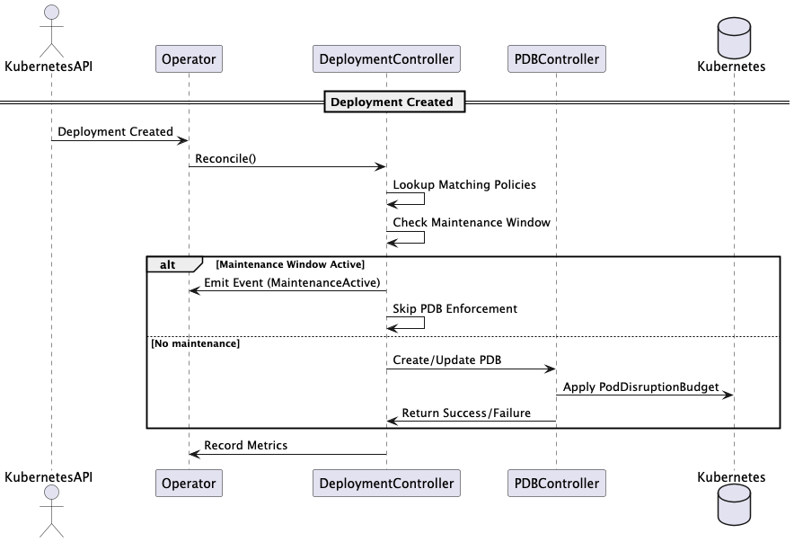

### 4. Intelligent Caching

Performance optimization features:

- Policy cache with 5-minute TTL
- Maintenance window result caching
- Circuit breaker integration
- Reduces API server load

### 5. Circuit Breaker Protection

Prevents cascading failures:

- Per-operation circuit breakers
- Opens after 60% failure rate (3 requests minimum)
- 30-second timeout before retry
- Automatic recovery

### 6. Comprehensive Observability

#### Metrics

- PDB lifecycle metrics (created, updated, deleted)
- Reconciliation performance metrics
- Cache hit/miss ratios
- Enforcement decision tracking
- Policy conflict resolution

#### Tracing

- OpenTelemetry integration
- Distributed trace support
- Correlation ID propagation

#### Audit Logging

- All PDB operations logged
- Policy decisions tracked
- Override attempts recorded
- Compliance-ready format

## Configuration

### Environment Variables

| Variable                    | Default   | Description                                  |
| --------------------------- | --------- | -------------------------------------------- |
| `ENABLE_PDB`                | `true`    | Enable PDB controller                        |
| `DEFAULT_NAMESPACE`         | `default` | Default namespace for operations             |
| `METRICS_NAMESPACE`         | `canvas`  | Namespace for metrics                        |
| `LEADER_ELECTION_NAMESPACE` | `canvas`  | Leader election namespace                    |
| `LOG_LEVEL`                 | `info`    | Logging level (debug, info, warn, error)     |
| `TRACE_SAMPLE_RATE`         | `0.1`     | Tracing sample rate (0.0-1.0)                |
| `JAEGER_ENDPOINT`           | -         | Jaeger collector endpoint                    |
| `OTLP_ENDPOINT`             | -         | OTLP collector endpoint                      |
| `AVAILABILITY_CONFIGS`      | -         | Custom availability class definitions (JSON) |

### Operator Flags

```bash
--metrics-bind-address string      Metrics endpoint (default ":8080")
--health-probe-bind-address string Health probe endpoint (default ":8081")
--leader-elect                     Enable leader election (default true)
--watch-namespace string           Namespace to watch (empty = all)
--sync-period duration             Resync period (default 10h)
--enable-webhook                   Enable admission webhooks
--webhook-port int                 Webhook server port (default 9443)
--log-level string                 Log level (default "info")
--enable-tracing                   Enable OpenTelemetry tracing (default true)
--max-concurrent-reconciles int    Max concurrent reconciles (default 5)
```

## Usage

### Basic Usage - Annotation Based

The simplest way to use the operator is via deployment annotations:

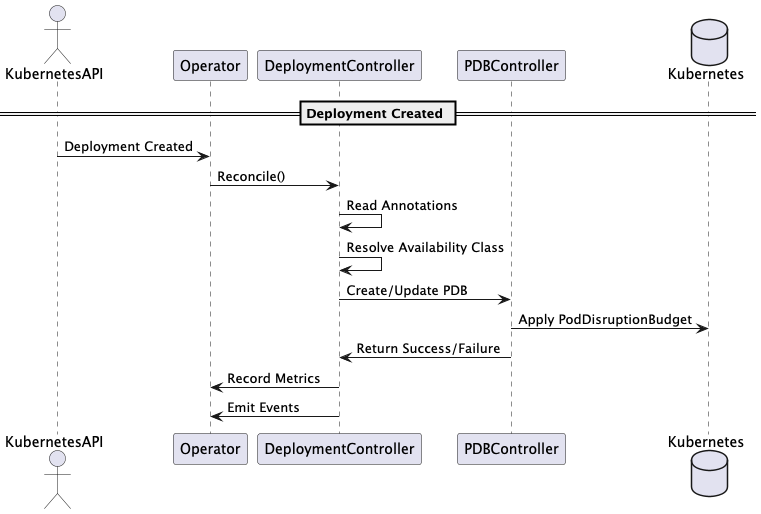

1. **Add annotations to your deployment**:

```yaml
apiVersion: apps/v1
kind: Deployment
metadata:
  name: my-app
  annotations:
    oda.tmforum.org/availability-class: "standard"
    oda.tmforum.org/component-function: "core"
    oda.tmforum.org/componentName: "my-app-component"
spec:
  replicas: 3
  # ... rest of deployment spec
```

2. **Operator automatically creates PDB**:

```yaml
apiVersion: policy/v1
kind: PodDisruptionBudget
metadata:
  name: my-app-pdb
  labels:
    oda.tmforum.org/managed-by: "pdb-management-operator"
spec:
  minAvailable: 50%
  selector:
    matchLabels:
      app: my-app
```

### Policy-Based Configuration

1. **Create an AvailabilityPolicy**:

```yaml
apiVersion: availability.oda.tmforum.org/v1alpha1
kind: AvailabilityPolicy
metadata:
  name: production-databases
spec:
  availabilityClass: mission-critical
  enforcement: flexible
  minimumClass: high-availability
  componentSelector:
    matchLabels:
      type: database
      environment: production
    componentFunctions: [core]
  priority: 100
  maintenanceWindows:
    - start: "02:00"
      end: "04:00"
      timezone: "UTC"
      daysOfWeek: [0] # Sunday only
```

2. **Deploy matching workloads**:

```yaml
apiVersion: apps/v1
kind: Deployment
metadata:
  name: postgres-primary
  labels:
    type: database
    environment: production
  annotations:
    # This annotation will be accepted if >= high-availability
    oda.tmforum.org/availability-class: "mission-critical"
spec:
  replicas: 3
  # ... rest of deployment spec
```

## API Reference

### AvailabilityPolicy CRD

```yaml
apiVersion: availability.oda.tmforum.org/v1alpha1
kind: AvailabilityPolicy
metadata:
  name: <policy-name>
spec:
  # Required: availability class for this policy
  availabilityClass: high-availability # non-critical|standard|high-availability|mission-critical|custom

  # Enforcement mode (default: advisory)
  enforcement: flexible # strict|flexible|advisory

  # Minimum class for flexible enforcement
  minimumClass: standard # only used with flexible enforcement

  # Component selector (at least one criterion required)
  componentSelector:
    # Select by namespaces
    namespaces:
      - production
      - staging

    # Select by component names
    componentNames:
      - payment-service
      - auth-service

    # Select by component functions
    componentFunctions:
      - core
      - security
      - management

    # Select by labels
    matchLabels:
      tier: critical

    # Select by expressions
    matchExpressions:
      - key: environment
        operator: In
        values: [prod, staging]
      - key: region
        operator: NotIn
        values: [test, dev]
      - key: sla
        operator: Exists

  # Priority for conflict resolution (default: 50)
  priority: 100 # 0-1000, higher wins

  # Maintenance windows
  maintenanceWindows:
    - start: "02:00"
      end: "04:00"
      timezone: "UTC"
      daysOfWeek: [0, 6] # 0=Sunday, 6=Saturday

  # Custom PDB configuration (only with custom availability class)
  customPDBConfig:
    minAvailable: "90%" # or absolute number like 2
    # OR
    maxUnavailable: 1 # or percentage like "10%"
    unhealthyPodEvictionPolicy: "IfHealthyBudget" # AlwaysAllow|IfHealthyBudget

  # Override controls
  allowOverride: true # Whether to allow annotation overrides (ignored in strict mode)
  overrideRequiresReason: true # Require override-reason annotation

  # Minimum replicas enforcement
  enforceMinReplicas: true # Ensure minimum replicas for availability class
```

### Deployment Annotations

| Annotation                           | Required | Description               | Example                          |
| ------------------------------------ | -------- | ------------------------- | -------------------------------- |
| `oda.tmforum.org/availability-class` | Yes\*    | Availability class        | `high-availability`              |
| `oda.tmforum.org/component-function` | No       | Component function        | `core`, `security`, `management` |
| `oda.tmforum.org/componentName`      | No       | Component identifier      | `payment-service`                |
| `oda.tmforum.org/maintenance-window` | No       | Simple maintenance window | `02:00-04:00 UTC`                |
| `oda.tmforum.org/override-reason`    | No\*\*   | Reason for override       | `Batch processing requirements`  |

\*Required unless matching an AvailabilityPolicy
\*\*Required when policy has `overrideRequiresReason: true`

## AvailabilityPolicy Deep Dive

### Complete Feature Set

The AvailabilityPolicy CRD provides sophisticated control over PDB management:

#### 1. Enforcement Modes with Examples

**Strict Enforcement**

```yaml
apiVersion: availability.oda.tmforum.org/v1alpha1
kind: AvailabilityPolicy
metadata:
  name: security-strict-policy
spec:
  availabilityClass: mission-critical
  enforcement: strict  # Annotations completely ignored
  componentSelector:
    componentFunctions: [security]
  priority: 1000

# Deployment with annotation (will be ignored):
metadata:
  annotations:
    oda.tmforum.org/availability-class: "standard"  # IGNORED
# Result: PDB with 90% minAvailable (mission-critical from policy)
```

**Flexible Enforcement**

```yaml
apiVersion: availability.oda.tmforum.org/v1alpha1
kind: AvailabilityPolicy
metadata:
  name: production-flexible
spec:
  availabilityClass: high-availability  # Recommended
  enforcement: flexible
  minimumClass: standard  # Minimum acceptable
  componentSelector:
    matchLabels:
      environment: production

# Scenario 1: Annotation meets minimum
annotations:
  oda.tmforum.org/availability-class: "mission-critical"
# Result: PDB with 90% (annotation accepted)

# Scenario 2: Annotation below minimum
annotations:
  oda.tmforum.org/availability-class: "non-critical"
# Result: PDB with 50% (minimum enforced), warning logged
```

**Advisory with Controls**

```yaml
apiVersion: availability.oda.tmforum.org/v1alpha1
kind: AvailabilityPolicy
metadata:
  name: dev-advisory
spec:
  availabilityClass: standard
  enforcement: advisory
  allowOverride: true
  overrideRequiresReason: true
  componentSelector:
    matchLabels:
      environment: development

# Valid override:
metadata:
  annotations:
    oda.tmforum.org/availability-class: "non-critical"
    oda.tmforum.org/override-reason: "Batch processing workload"
# Result: PDB with 20% (override accepted)

# Invalid override (missing reason):
metadata:
  annotations:
    oda.tmforum.org/availability-class: "non-critical"
# Result: PDB with 50% (policy default), override rejected
```

#### 2. Advanced Selection Capabilities

**Multi-Namespace Policy**

```yaml
spec:
  componentSelector:
    namespaces:
      - production
      - staging
      - pre-prod
    matchLabels:
      managed-by: platform-team
```

**Component Function Based**

```yaml
spec:
  componentSelector:
    componentFunctions:
      - core # Core business logic
      - security # Auth, encryption
      - management # Admin, monitoring
```

**Complex Label Expressions**

```yaml
spec:
  componentSelector:
    matchExpressions:
      - key: tier
        operator: In
        values: [gold, platinum]
      - key: region
        operator: NotIn
        values: [dev, test]
      - key: sla
        operator: Exists
```

#### 3. Custom PDB Configurations

**Database-Specific Settings**

```yaml
apiVersion: availability.oda.tmforum.org/v1alpha1
kind: AvailabilityPolicy
metadata:
  name: database-custom
spec:
  availabilityClass: custom
  customPDBConfig:
    minAvailable: 2 # Absolute number for stateful sets
    unhealthyPodEvictionPolicy: "IfHealthyBudget"
  componentSelector:
    componentNames:
      - postgres-primary
      - postgres-secondary
```

**Percentage with Specific Policy**

```yaml
spec:
  availabilityClass: custom
  customPDBConfig:
    maxUnavailable: "25%" # Different from minAvailable
    unhealthyPodEvictionPolicy: "AlwaysAllow"
```

#### 4. Maintenance Window Configurations

**Complex Maintenance Schedule**

```yaml
spec:
  maintenanceWindows:
    # Weekday maintenance (Mon-Fri 2-4 AM)
    - start: "02:00"
      end: "04:00"
      timezone: "UTC"
      daysOfWeek: [1, 2, 3, 4, 5]
    # Weekend maintenance (Sat-Sun all day)
    - start: "00:00"
      end: "23:59"
      timezone: "UTC"
      daysOfWeek: [0, 6]
```

#### 5. Priority and Conflict Resolution

When multiple policies match a deployment, the operator uses priority to resolve conflicts:

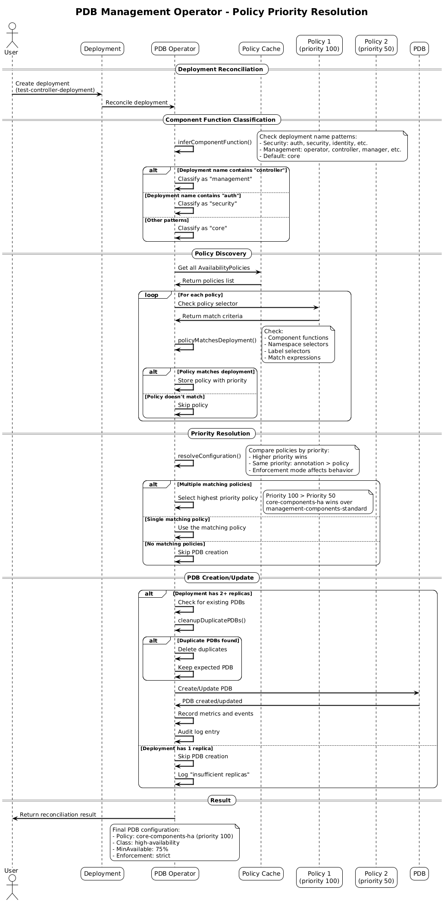

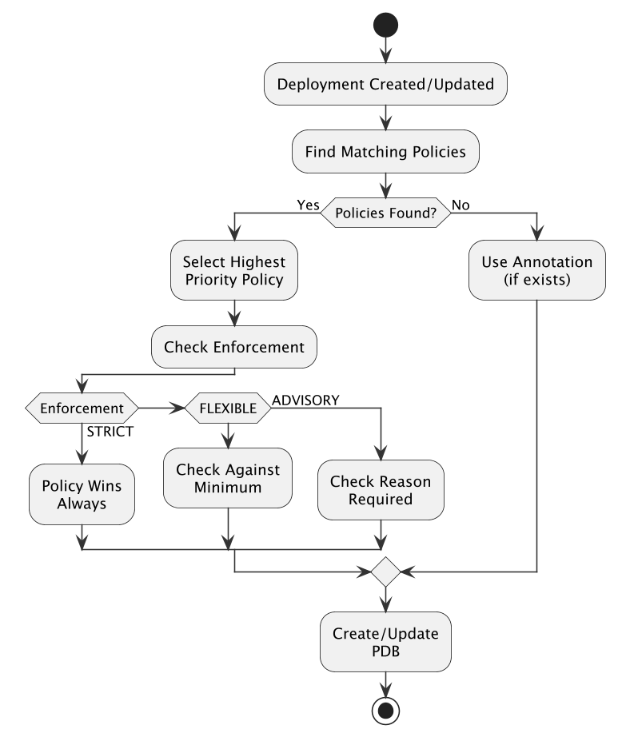

**Priority Chain Example**

```yaml
# Highest priority - catches security components
- name: security-override
  priority: 1000
  componentSelector:
    componentFunctions: [security]

# Medium priority - catches production
- name: production-policy
  priority: 500
  componentSelector:
    matchLabels:
      environment: production

# Lowest priority - catch-all
- name: default-policy
  priority: 1
  componentSelector:
    matchLabels: {} # Matches everything
```

### Policy Matching Logic

1. **Namespace Filter** (if specified)

   - Deployment must be in one of the listed namespaces

2. **Component Name Match** (if specified)

   - Checks `oda.tmforum.org/componentName` annotation
   - Falls back to deployment name if annotation missing

3. **Component Function Match** (if specified)

   - Checks `oda.tmforum.org/component-function` annotation
   - Defaults to "core" if not specified

4. **Label Selector Match** (if specified)
   - Standard Kubernetes label matching
   - Both matchLabels and matchExpressions supported

All specified criteria must match (AND logic).

### Webhook Validation Rules

The admission webhook enforces these rules:

1. **Availability Class Validation**

   - Must be one of: non-critical, standard, high-availability, mission-critical, custom
   - Custom requires customPDBConfig

2. **Custom PDB Config Validation**

   - Must specify either minAvailable OR maxUnavailable (not both)
   - Values must be valid (percentage or number)
   - UnhealthyPodEvictionPolicy must be valid if specified

3. **Component Selector Validation**

   - At least one selection criterion required
   - Namespaces must be valid DNS names
   - Label keys/values must be valid

4. **Maintenance Window Validation**

   - Start/end times must be valid HH:MM format
   - Timezone must be valid IANA timezone
   - DaysOfWeek must be 0-6

5. **Enforcement Configuration**
   - MinimumClass only valid with flexible enforcement
   - MinimumClass must be valid availability class
   - Override settings ignored in strict mode

### Audit Events

The operator generates events for policy decisions:

```yaml
Events: Type     Reason                Age   From                    Message
  ----     ------                ----  ----                    --------
  Warning  PolicyEnforced        1m    pdb-management-operator Annotation override blocked by strict policy security-strict-policy
  Normal   AnnotationAccepted    30s   pdb-management-operator Annotation mission-critical meets minimum requirement standard
  Warning  BelowMinimum         15s   pdb-management-operator Annotation non-critical below minimum standard, using standard
  Normal   MaintenanceActive     5s    pdb-management-operator Entering maintenance window, PDB enforcement suspended
```

## Migration Guide

### From v1alpha to v1alpha1

1. **Update CRD version**:

   ```yaml
   # Old
   apiVersion: pdb.oda.tmforum.org/v1alpha

   # New
   apiVersion: availability.oda.tmforum.org/v1alpha1
   ```

2. **New enforcement field**:

   ```yaml
   spec:
     enforcement: flexible # new field
     minimumClass: standard # new field for flexible mode
   ```

3. **Enhanced webhook validation**:
   - Automatic defaulting of maintenance window timezones
   - Validation of enforcement configurations
   - Warning generation for best practices

## Internals

### Caching Strategy

The operator uses a multi-level caching strategy:

1. **Policy Cache**: 5-minute TTL, 100 entry limit
2. **Maintenance Window Cache**: 1-minute TTL for active checks
3. **Deployment State Cache**: Tracks managed deployments

### Circuit Breaker Implementation

```go
// Per-operation circuit breakers
breakers := map[string]*gobreaker.CircuitBreaker{
    "create-pdb": newBreaker("create-pdb"),
    "update-pdb": newBreaker("update-pdb"),
    "delete-pdb": newBreaker("delete-pdb"),
}

// Configuration
Settings: gobreaker.Settings{
    Timeout: 30 * time.Second,
    ReadyToTrip: func(counts gobreaker.Counts) bool {
        failureRatio := float64(counts.TotalFailures) / float64(counts.Requests)
        return counts.Requests >= 3 && failureRatio >= 0.6
    },
}
```

### Reconciliation Logic

1. **Deployment Controller**:

   - Processes deployment changes
   - Resolves configuration (annotation vs policy)
   - Applies enforcement logic
   - Creates/updates/deletes PDBs

2. **AvailabilityPolicy Controller**:
   - Processes policy changes
   - Triggers re-reconciliation of affected deployments
   - Updates policy metrics

### Deployment Deletion Handling

When a deployment is deleted, the operator ensures proper cleanup of associated PDBs:

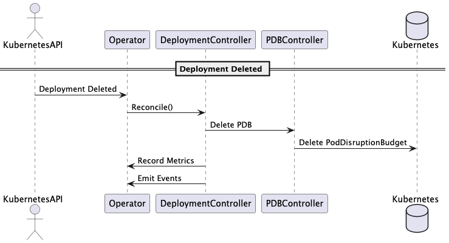

## Monitoring & Observability

### Key Metrics

```prometheus
# PDB lifecycle
pdb_management_pdbs_created_total{namespace, availability_class, component_function}
pdb_management_pdbs_updated_total{namespace, availability_class}
pdb_management_pdbs_deleted_total{namespace, reason}

# Performance
pdb_management_reconciliation_duration_seconds{controller, result}
pdb_management_reconciliation_errors_total{controller, error_type}

# Enforcement
pdb_management_enforcement_decisions_total{enforcement_mode, decision, namespace}
pdb_management_override_attempts_total{result, reason, namespace}
pdb_management_policy_conflicts_total{resolution, enforcement_mode, namespace}

# Cache
pdb_management_cache_hits_total{cache_type}
pdb_management_cache_misses_total{cache_type}

# Resources
pdb_management_deployments_managed{namespace, availability_class}
pdb_management_policies_active{namespace}
```

### Grafana Dashboard

A comprehensive dashboard is available at `dashboards/pdb-management.json` featuring:

- PDB lifecycle metrics
- Enforcement decision breakdown
- Cache performance
- Error rates and types
- Reconciliation performance

### Unified Logging System

The operator implements a comprehensive unified logging system that provides structured, traceable logs with full observability and eliminates field duplication.

#### Architecture

The unified logging system consists of:

1. **UnifiedLogEntry**: Single struct for all log entries
2. **UnifiedLogger**: Centralized logger with context propagation
3. **Trace Context**: Automatic propagation of trace_id, span_id, correlationID
4. **Structured Output**: Consistent JSON format across all log types

#### Log Structure

All logs follow a consistent structure:

```json
{
  "level": "info",
  "ts": "2025-07-06T09:50:22.454304592Z",
  "msg": "Starting reconciliation",
  "controller": {
    "type": "deployment-pdb",
    "name": "deployment-controller",
    "group": "apps",
    "kind": "Deployment"
  },
  "resource": {
    "type": "deployment",
    "name": "tmf620-productcatalog",
    "namespace": "components"
  },
  "reconcileID": "deployment-f959cd46-f5c8-497f-b84d-b6d0d0ce04a2",
  "correlationID": "b558f470-b55d-4af4-b9b4-b7a6043ce95f",
  "trace": {
    "trace_id": "2b4148def0c46c496b41c1ade1c7cc7f",
    "span_id": "55b5595fbf126025"
  },
  "details": {
    "availabilityClass": "high-availability",
    "source": "annotation-no-policy"
  }
}
```

#### Trace Context Fields

- **trace_id**: OpenTelemetry trace identifier for distributed tracing
- **span_id**: Current operation span identifier
- **correlationID**: Business correlation identifier for request tracking
- **reconcileID**: Kubernetes reconciliation identifier

#### Audit Logging

Audit logs include full trace context and structured details:

```json
{
  "level": "info",
  "ts": "2025-07-06T09:50:22.457153467Z",
  "msg": "Audit log",
  "controller": {
    "type": "pdb-direct",
    "name": "pdb-direct-controller",
    "group": "apps",
    "kind": "Deployment"
  },
  "resource": {
    "type": "poddisruptionbudget",
    "name": "tmf620-productcatalog",
    "namespace": "components"
  },
  "reconcileID": "pdb-526803c1-b0b4-46ed-83e2-3a0357fdc594",
  "correlationID": "f7da36c6-716a-4e65-89b7-cb83476542fd",
  "trace": {
    "trace_id": "8e37377bd4ff755b7e21278e06bd73fd",
    "span_id": "450fe3d49c33229e"
  },
  "details": {
    "action": "CREATE",
    "availabilityClass": "high-availability",
    "correlationId": "",
    "maxUnavailable": null,
    "minAvailable": "75%",
    "name": "tmf620-productcatalog",
    "namespace": "components",
    "resource": "tmf620-productcatalog-pdb",
    "resourceType": "PodDisruptionBudget",
    "result": "SUCCESS",
    "timestamp": "2025-07-06T09:50:22Z"
  }
}
```

#### Implementation Details

The unified logging system is implemented in `internal/logging/unified.go`:

```go
type UnifiedLogEntry struct {
    Level        string                 `json:"level"`
    Timestamp    time.Time              `json:"ts"`
    Message      string                 `json:"msg"`
    Controller   ControllerInfo         `json:"controller"`
    Resource     ResourceInfo           `json:"resource"`
    ReconcileID  string                 `json:"reconcileID"`
    CorrelationID string                `json:"correlationID"`
    Trace        TraceInfo              `json:"trace"`
    Details      map[string]interface{} `json:"details,omitempty"`
}

type UnifiedLogger struct {
    logger       logr.Logger
    context      context.Context
    controller   ControllerInfo
    resource     ResourceInfo
    reconcileID  string
    correlationID string
}
```

#### Context Propagation

The system automatically propagates trace context:

1. **OpenTelemetry Integration**: Automatic trace_id and span_id extraction
2. **Correlation ID**: Business correlation identifier for request tracking
3. **Reconcile ID**: Kubernetes reconciliation identifier
4. **Controller Context**: Controller type, name, group, and kind
5. **Resource Context**: Resource type, name, and namespace

#### Log Analysis

Advanced log analysis capabilities:

```bash
# Filter by trace ID for distributed tracing
kubectl logs -n canvas deployment/pdb-management-controller-manager | \
  jq 'select(.trace.trace_id == "2b4148def0c46c496b41c1ade1c7cc7f")'

# Find all audit logs for a specific resource
kubectl logs -n canvas deployment/pdb-management-controller-manager | \
  jq 'select(.msg == "Audit log" and .details.resource == "my-app-pdb")'

# Track complete reconciliation flow
kubectl logs -n canvas deployment/pdb-management-controller-manager | \
  jq 'select(.reconcileID == "deployment-f959cd46-f5c8-497f-b84d-b6d0d0ce04a2")'

# Analyze enforcement decisions
kubectl logs -n canvas deployment/pdb-management-controller-manager | \
  jq 'select(.details.enforcement) | .details'
```

### Tracing

The operator supports OpenTelemetry tracing with full context propagation:

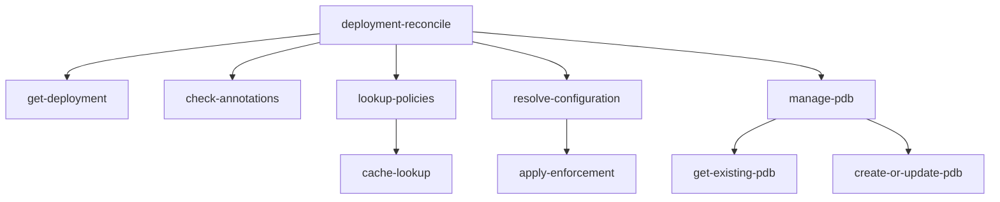

All trace spans include the unified logging context for complete observability.

## Performance

### Benchmarks

Tested with 200+ deployments:

- **Reconciliation time**: < 100ms average
- **Cache hit rate**: > 90%
- **Memory usage**: < 100MB
- **CPU usage**: < 100m

### Optimization Techniques

1. **Efficient watching**: Predicate filters reduce unnecessary reconciliations
2. **Batch processing**: Groups related operations
3. **Smart caching**: TTL-based with size limits
4. **Circuit breakers**: Prevent cascade failures

## Security

### RBAC Configuration

Minimal required permissions:

```yaml
- apiGroups: ["apps"]
  resources: ["deployments"]
  verbs: ["get", "list", "watch", "update", "patch"]

- apiGroups: ["policy"]
  resources: ["poddisruptionbudgets"]
  verbs: ["get", "list", "watch", "create", "update", "patch", "delete"]

- apiGroups: ["availability.oda.tmforum.org"]
  resources: ["availabilitypolicies"]
  verbs: ["get", "list", "watch"]
```

### Security Features

1. **Non-root execution**: Runs as non-root user
2. **Read-only filesystem**: Except for temp directories
3. **Dropped capabilities**: All capabilities dropped
4. **Network policies**: Support for network isolation
5. **Webhook authentication**: Cert-based webhook auth

### Pod Security Standards

Complies with Kubernetes restricted security standards:

- `runAsNonRoot: true`
- `readOnlyRootFilesystem: true`
- `allowPrivilegeEscalation: false`
- `seccompProfile: RuntimeDefault`

## Troubleshooting

### Common Issues

1. **PDB Not Created**

Check deployment annotations:

```bash
kubectl get deployment my-app -o jsonpath='{.metadata.annotations}'
```

Check operator logs:

```bash
kubectl logs -n canvas deployment/pdb-management-controller-manager
```

2. **Policy Not Matching**

Verify policy selector:

```bash
kubectl describe availabilitypolicy my-policy
```

Check deployment labels:

```bash
kubectl get deployment -l tier=frontend
```

3. **Enforcement Not Working as Expected**

Check policy enforcement mode:

```bash
kubectl get availabilitypolicy my-policy -o jsonpath='{.spec.enforcement}'
```

Review enforcement decisions in metrics:

```bash
curl http://operator-pod:8080/metrics | grep enforcement_decisions
```

4. **Maintenance Window Issues**

Verify timezone:

```bash
kubectl exec -n canvas deployment/pdb-management-controller-manager -- date
```

Check maintenance window configuration:

```bash
kubectl get availabilitypolicy my-policy -o jsonpath='{.spec.maintenanceWindows}'
```

5. **High Memory Usage**

Check cache statistics:

```
pdb_management_cache_hits_total
pdb_management_cache_misses_total
```

Review managed deployments:

```bash
kubectl get deployments -A -o json | jq '.items | length'
```

### Debug Mode

Enable debug logging:

```bash
kubectl -n canvas set env deployment/pdb-management-controller-manager LOG_LEVEL=debug
```

### Health Checks

```bash
# Liveness
curl http://operator-pod:8081/healthz

# Readiness
curl http://operator-pod:8081/readyz

# Metrics
curl http://operator-pod:8080/metrics
```
