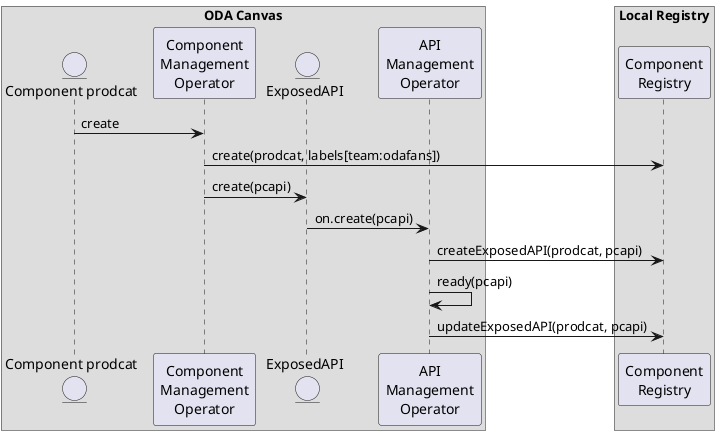

## Data Model

### Registry

* name
* type - upstream/downstream/self
* url
* arrayOfLabels
* arrayOfComponents

### Component

* registryName
* name
* arrayOfLabels
* arrayOfExposedAPIs

### ExposedAPI

* registryName
* componentName
* name
* url
* oasSpecification
* status - pending/ready
* arrayOfLabels

### Label

A label is a simple Key-Value Pair

* key
* value

## Events

# Sequence Diagram

