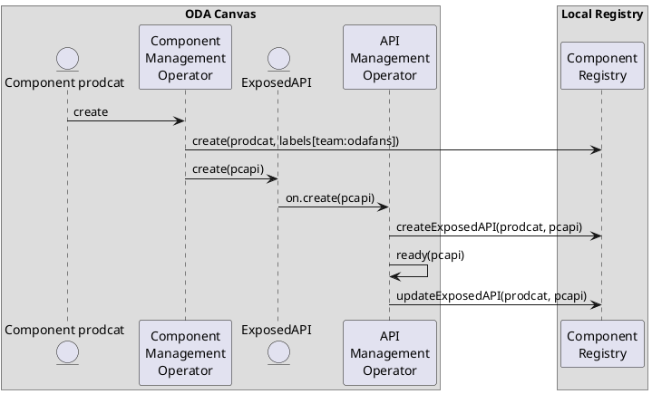

# Component Registry

The Component Registry is a service for registering and querying components.

## Usage

## Data Model

### componentRegistry

* url
* upstream/downstream/self

### Component

* componentName
* arrayOfLabels
** labelName
** labelValue
* owningComponentRegistryRef

### Exposed API

* componentRef
** canvasIdRef
** componentNameRef
* oasSpecification
* url
* visibility

### Upstream Registries

* componentRegistryURL

## Methods

* create/updateComponent
* deleteComponent
* [opt] getComponent
* create/updateExposedAPI
* deleteExposedAPI
* [opt] getExposedAPI
* searchExposedAPI
** oasSpecification
** [opt] labelsSelector
* requestConnection
* registerUpstreamRegistry
* unregisterUpstreamRegistry
* syncToUpstream
* syncFromDownstream

## Events

# Sequence Diagram

