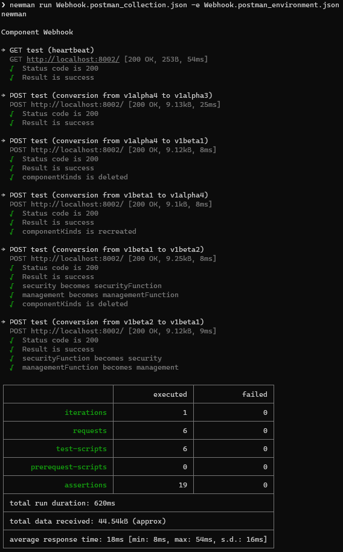

# Unit tests for Webhook

In development mode, you can unit-test the webhook as a standalone Node application. To test, run the webhook in test mode. In the installation folder, run:

```
npm install
npm test
```

This will run the webhook in test mode running a http server on `localhost:8002`. You can then load the PostmanCollection and PostmanEnvironment in this folder and execute the tests. You can also run the tests from the command line using Newman. Open a second terminal window and run the following command:


To install newman (if not already installed):
```
npm install -g newman
```

To run the tests:
```
newman run Webhook.postman_collection.json -e Webhook.postman_environment.json
```

You should see the following output:




