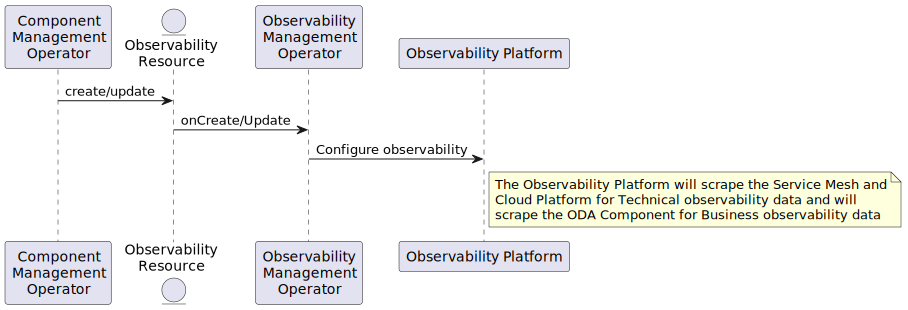

# Configure Observability use case

When a component is deployed, configure the observability service such that it is subsequently possible to view metrics on the observability service management dashboard that comes with the Canvas implementation. 

The use case uses the following assumptions:

* As part of the Canvas installation, the Service Mesh and Operators supporting OpenMetrics API standard are deployed. 
* As part of the Canvas installation, the API Operator is configured to support various observabilty services that conforms to the OpenMetrics standard e.g., Prometheus, Datadog, Public Cloud managed observability service
* The requirement is for the ODA Canvas to correctly configure an observability service the based on the meta-data described in the Component specification. 

[plantUML code](pumlFiles/configure-observability.puml)